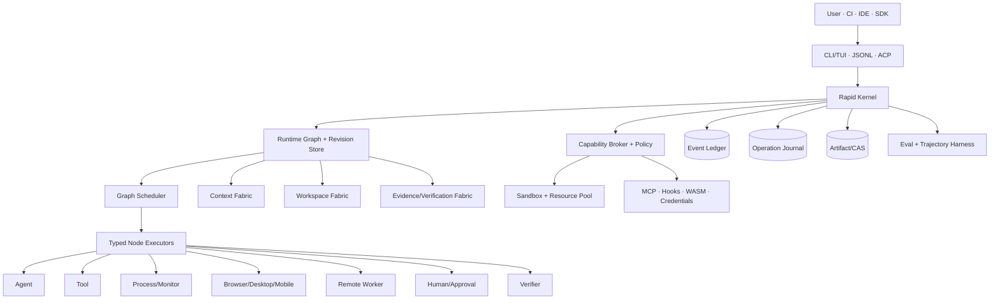

# RapidLM CLI / TUI — V3 Production Development Dossier

**Version:** 3.0  
**Baseline date:** 2026-08-24  
**Status:** implementation specification  
**Primary implementation:** Rust-first runtime; TypeScript SDK/schema tooling only where ecosystem integration benefits  
**Architecture migration rule:** preserve working V2 primitives and evolve them; do not create parallel authorities.

RapidLM V3 is a **graph-native engineering execution platform** exposed through a fast terminal UI, headless CLI/JSONL, daemon, ACP, MCP and SDK. It is not a chat loop with shell access. The authoritative unit of long-running work is a **versioned dynamic Runtime Graph**. Models operate inside typed graph nodes; the host owns scheduling, policy, state, recovery, invalidation and completion.

## Product thesis

At a fixed model, RapidLM should improve **verified task success per token** by combining better context selection, narrow and repairable tool contracts, graph-native parallelism, independent verification, durable recovery and policy-aware execution. Strong models should become more reliable; local/smaller models should become substantially more useful because the harness carries more of the operational burden.

## Normative hierarchy

1. compiled safety invariants and explicit user requirements;
2. `PRD.md`;
3. accepted ADRs under `docs/adrs/`;
4. `SDD.md`;
5. module architecture documents;
6. API/data contracts;
7. `tasks.md` and `prompts.md`.

If repository truth conflicts with this dossier during implementation, **Phase 0 audit records the discrepancy and the design is migrated deliberately**. An agent must not create a second workflow engine, event store, policy engine or context authority just to satisfy stale prose.

## Required root files

- `README.md` — dossier entry point.
- `PRD.md` — product requirements and measurable release criteria.
- `SDD.md` — complete system/software design.
- `development-plan.md` — phased delivery and gates.
- `tasks.md` — complete hierarchical implementation work breakdown.
- `prompts.md` — atomic execution prompts; one fresh context per task.
- `task-manifest.json` — machine-readable dependency graph.
- `development-ledger.md` — task status/evidence ledger.
- `agents.md` / `AGENTS.md` — repository agent governance.
- `skills.md` / `SKILLS.md` — skill selection and execution rules.
- `MANIFEST.md`, `requirements-traceability.md`, `validation-report.md`, `SHA256SUMS`.

## Core V3 invariants

1. Runtime Graph state is host-owned; models submit proposals, not authoritative mutations.
2. A model/ReAct loop is an `AgentNodeExecutor`, not the orchestration architecture.
3. Historical graph revisions are immutable; repair/replan appends/supersedes/invalidate edges.
4. No acknowledged durable transition precedes Event Ledger append.
5. Every side effect is policy-classified and executor-enforced through a scoped lease.
6. Uncertain external effects are reconciled, never blindly replayed.
7. Parallel write-capable agents never share a mutable `WorkspaceView`.
8. Goal completion is derived from criteria + fresh evidence + required verifier verdicts.
9. Stale code/context/evidence/computer observations are explicitly invalidated.
10. Tool outputs and external content are bounded, provenance-tagged and treated as untrusted data.
11. Secrets remain handles until the executor boundary whenever possible.
12. Subagents receive minimal typed task/context envelopes, not the full parent transcript.
13. Hooks, skills, MCP, plugins, playbooks and external agents can request capabilities but never grant them.
14. Active autonomous goals recover as paused after process restart unless a trusted automation explicitly starts a new run.
15. UI is a projection of kernel state, not an alternative source of truth.

## Frontier capability set

**Graph:** dynamic graph IR, revisions, joins/barriers, shards, repair/replan, invalidation, checkpoints, background/waiting nodes, triggers, graph diff/why-ready/why-blocked.  
**Context:** rg/FTS, Tree-sitter, LSP, code graph, semantic/vector retrieval, MMR, Context Scouts, negative findings, freshness, lineage, visibility generations, compaction, test selection.  
**Harness:** role registry, isolated agents, persistent read-only specialists, tool contract repair, cross-tool invariant engine, progressive capability projection, per-subtask routing, loop detectors, recovery protocol.  
**Execution:** transactional workspace views, semantic patches, VCS provenance, process supervisor, event-driven monitors, warm resource pools, sandbox ladder, remote workers.  
**Computer use:** browser/CDP/DOM/AX, native accessibility, TUI semantics, vision/coordinate fallback, normalization, batching, settle detection, screenshot-on-failure, preview supervisor, mobile, remote desktop, human takeover.  
**Durability:** Event Ledger, Operation Journal, artifact CAS, session checkpoints, graph/workspace rewind/fork, handoff generation leases, cron/job leases.  
**Security:** project trust, capability leases, restrictive policy precedence, egress receipts, short-lived credentials, prompt-injection boundaries, supply-chain controls.  
**Extensibility:** MCP client/server, ACP, SDK, WASM plugins, lifecycle hooks, skills, graph templates/playbooks, external ACP-agent adapters.  
**Learning/eval:** production-compatible eval harness, deterministic/replay/live models, chaos/fault injection, long-horizon suites, trajectory store, preference learning, Session Insights and governed experiment promotion.

## Primary CLI surface

`rapid`, `rapid exec`, `rapid run`, `rapid goal`, `rapid resume`, `rapid fork`, `rapid rewind`, `rapid daemon`, `rapid acp`, `rapid graph`, `rapid context`, `rapid evidence`, `rapid trace`, `rapid agents`, `rapid process`, `rapid computer`, `rapid sandbox`, `rapid mcp`, `rapid plugins`, `rapid hooks`, `rapid skills`, `rapid eval`, `rapid export`, `rapid doctor`, `rapid update`.

## Research synthesis

V3 deliberately synthesizes ideas rather than cloning products. The V2 dossier already covered Grok Build, Kimi, Qwen, Atomic, Muse, Devin, Claude, Augment and Cursor. V3 additionally incorporates production lessons from Command Code (localized tool repair, cross-tool state invariants, recovery-oriented read tools, context dedup semantics, background monitors and rewind) and OpenVibeCoding (warm environment pools, durable suspend/resume, preview feedback, ephemeral credentials and deployment/artifact events). See `docs/research/feature-inspiration-matrix.md`.
