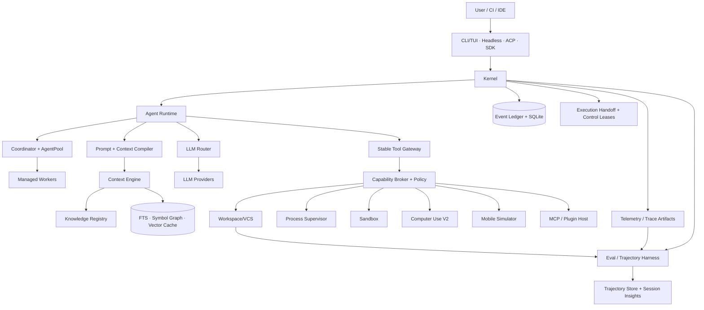
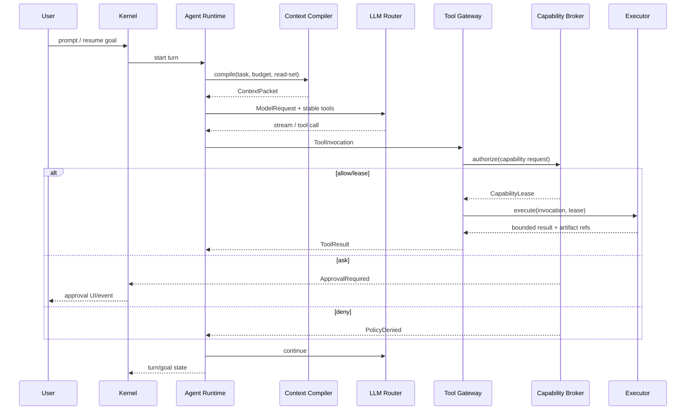
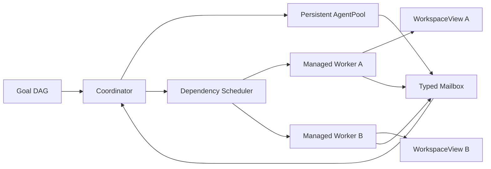
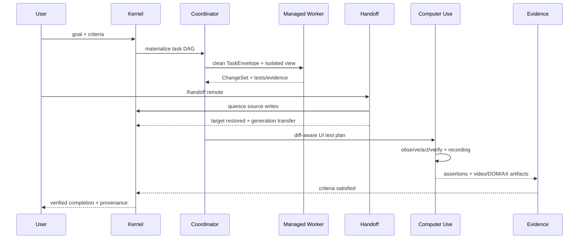

# System / Software Design Document — RapidLM CLI / TUI

**Architecture baseline:** V2.0 (2026-08-14)

## 1. Architecture summary

RapidLM V2 is a layered event-driven runtime with durable local/remote execution ownership, a managed-agent mesh, trigger-scoped Knowledge, trajectory learning, and first-class full Computer Use. The **Kernel** owns lifecycle and durability. The **Agent Runtime** converts user turns/goals into model steps. A narrow **Tool Gateway** exposes stable schemas to models. Every tool request enters the **Capability Broker**, which evaluates policy and issues a scoped lease. Execution is performed by specialized supervisors (workspace, process, sandbox, browser, mobile, MCP). Results and state transitions are appended to the **Event Ledger**. The TUI, headless CLI, ACP server, and SDK are projections/clients of this kernel.



## 2. Why Rust-first

The runtime manages terminal rendering, process trees, filesystem watchers, SQLite persistence, parsers, sandbox boundaries, network streams, and long-lived async jobs. Rust provides a strong fit for a single-binary, low-startup, memory-safe control plane. The public TypeScript SDK exists because the agent ecosystem and application integrations are heavily TypeScript-oriented; it speaks stable IPC/RPC contracts rather than linking runtime internals.

The design intentionally avoids a split where “UI logic” becomes the real runtime. `apps/rapid` is only a composition root. Crates expose interfaces and can be hosted in-process or by `rapid daemon`.

## 3. Process model

### 3.1 Default interactive mode

One `rapid` process hosts kernel + TUI. The TUI communicates through an in-memory implementation of the same `KernelClient` interface used by IPC. This minimizes startup overhead.

### 3.2 Daemon mode

`rapid daemon` hosts the kernel and listens on:

- Unix domain socket on macOS/Linux;
- named pipe on Windows;
- optional loopback HTTP/WebSocket when explicitly enabled.

Clients authenticate with an OS-user-bound local token. Daemon mode owns background goals/jobs and permits TUI reconnect.

### 3.3 Remote workers

Remote workers are not trusted peers. They receive a signed `WorkLease` containing sandbox spec, artifact inputs, repo snapshot/view reference, capability scope, expiry, and trace parent. mTLS identifies worker and controller. Worker results are content-addressed and verified before import.

## 4. Service graph

The kernel initializes services in dependency order:

```text
Config → Identity/Auth → EventLedger → ProjectRegistry → PolicyEngine
      → CapabilityBroker → WorkspaceManager → ProcessSupervisor → SandboxManager
      → ContextEngine → KnowledgeRegistry → LLMRouter → ToolGateway → AgentRuntime
      → AgentPool/ManagedAgents → ComputerUse/Mobile/MCP/PluginHost
      → Handoff/ControlLease → Trajectory/Insights → Telemetry → Frontends
```

Each service implements:

```rust
#[async_trait]
pub trait LifecycleService: Send + Sync {
    async fn start(&self, ctx: ServiceContext) -> Result<(), ServiceError>;
    async fn quiesce(&self, deadline: Instant) -> Result<(), ServiceError>;
    async fn stop(&self) -> Result<(), ServiceError>;
    fn health(&self) -> HealthSnapshot;
}
```

Kernel shutdown order is the reverse dependency order after it first stops accepting new user/model work.

## 5. Canonical identifiers

IDs are UUIDv7 for sortable uniqueness, encoded as lowercase canonical strings at API boundaries.

```rust
pub struct SessionId(Uuid);
pub struct AgentId(Uuid);
pub struct GoalId(Uuid);
pub struct EvidenceId(Uuid);
pub struct EventId(Uuid);
pub struct WorkspaceViewId(Uuid);
pub struct JobId(Uuid);
pub struct LeaseId(Uuid);
pub struct ArtifactId(String); // sha256:<hex>
pub struct KnowledgeId(Uuid);
pub struct HandoffId(Uuid);
pub struct ControlLeaseId(Uuid);
pub struct TrajectoryId(Uuid);
```

IDs are internal facts, not prompt semantics. The model generally receives short stable aliases (`agent:reviewer-1`, `evidence:test-3`) rather than raw UUIDs unless a tool contract requires an opaque handle.

## 6. Session/event model

### 6.1 Event sourcing boundary

All user-visible and security-relevant state is derived from an append-only event stream. SQLite is the durability engine; JSONL is an export/transport representation, not the primary database.

An event has:

```rust
pub struct EventEnvelope {
    pub schema: u16,
    pub event_id: EventId,
    pub session_id: SessionId,
    pub seq: u64,
    pub recorded_at: DateTime<Utc>,
    pub actor: ActorRef,
    pub trace_id: TraceId,
    pub kind: EventKind,
    pub payload: serde_json::Value,
    pub redaction: RedactionClass,
}
```

`(session_id, seq)` is unique. Append and projection-critical updates share one SQLite transaction.

### 6.2 Crash recovery

On startup:

1. verify schema/migrations;
2. read last checkpoint per session;
3. replay events after checkpoint;
4. inspect running-job tombstones;
5. mark impossible-to-still-be-running model/tool steps as interrupted;
6. convert any `active` autonomous top-level goal to `paused(reason=process_recovered)`;
7. reconcile workspace/sandbox/process resources;
8. emit recovery events.

No autonomous work resumes without an explicit user/automation resume trigger.

## 7. Agent loop



### 7.1 Model step contract

A turn contains one or more model steps. Every step is cancellable. Tool results are structured and bounded. Raw large outputs are spooled to artifacts; the model receives excerpts plus a cursor/artifact handle.

### 7.2 Stable tools

Initial model-visible tool set:

- `repo.search`
- `repo.read`
- `workspace.patch`
- `workspace.status`
- `shell.exec`
- `agent.spawn`
- `agent.result`
- `goal.update`
- `browser.act`
- `mobile.act`
- `external.call` (MCP/plugin gateway)
- `evidence.record`

Optional capabilities are arguments behind these gateways. Model adapters may hide a gateway if a provider has no tool support, but tools are not dynamically reordered/renamed within a session.

## 8. Context pipeline

### 8.1 Ingestion

`FileWatcher -> ContentHasher -> LanguageDetector -> TreeSitterParser -> SymbolExtractor -> Chunker -> FTS Index -> optional Embedding Queue -> GraphBuilder -> LSP Enricher`.

Indexes are rebuildable caches. Canonical source remains repository content + content hashes + event metadata.

### 8.2 Retrieval

Candidate generators:

1. explicit file/symbol references;
2. current goal/task lexical query (FTS/BM25);
3. vector semantic query when enabled;
4. symbol graph neighborhood;
5. current diff/test failure links;
6. session read-set changed items;
7. durable memories and applicable rules.

Scores are normalized and fused with weighted reciprocal rank. Hard filters apply repo/path/trust. MMR reduces redundancy.

### 8.3 Context budgeting

The compiler divides the provider context window:

```text
reserved_output
+ static_system_and_tool_prefix
+ user_turn_and_goal
+ active_diff/error evidence
+ retrieved code/docs
+ durable memory/rules
+ recent conversation summary
+ safety margin
<= model_context_limit
```

No component may “borrow” reserved output tokens. Every included context block carries `estimated_tokens` and `reason`.

## 9. Workspace and patch transaction model

A `WorkspaceView` is an isolated logical filesystem version. Backends:

- `direct` — current checkout with patch journal (interactive only);
- `git-worktree` — default for parallel/autonomous agents;
- `overlay` — sandbox filesystem overlay;
- `remote` — content-addressed worker snapshot.

All first-party file edits use semantic patch operations with preimage hashes. Shell commands may still mutate files; after each command the workspace manager computes changed paths and records unattributed byte-level mutations as `ExternalMutation` until the agent links/explains them.

Applying child-agent changes into a parent view is a transaction:

1. verify source view is quiescent;
2. compute semantic and textual patch set;
3. detect overlapping operations and precondition failures;
4. optionally run merge model only for unresolved semantic conflicts;
5. apply to staging overlay;
6. run required verification hooks;
7. commit view transaction and provenance edges;
8. expose review/apply to base checkout.

## 10. Goal DAG and evidence

Top-level goal fields:

```rust
pub struct Goal {
    id: GoalId,
    statement: String,
    completion_criteria: Vec<Criterion>,
    status: GoalStatus,
    budgets: GoalBudgets,
    stats: GoalStats,
    stop_reason: Option<StopReason>,
}
```

Child nodes form a DAG with edge types: `decomposes_to`, `depends_on`, `blocked_by`, `verified_by`, `produced_change`, `supersedes`.

`complete` is accepted only if all mandatory criteria evaluate `satisfied` and each criterion that requires proof has at least one fresh, passing evidence node. The runtime—not the model—performs this check.

## 11. Policy and capabilities

### 11.1 Capability examples

```text
fs.read(path-glob)
fs.write(path-glob)
proc.exec(command-family)
net.connect(host,port,scheme)
git.write(ref-scope)
secret.use(secret-id,target)
browser.navigate(origin)
browser.download(path)
desktop.input(app)
mobile.control(device-id)
mcp.invoke(server,tool)
plugin.invoke(plugin,capability)
```

### 11.2 Policy precedence

High to low trust:

1. compiled safety invariants;
2. organization policy;
3. user global policy;
4. trusted project policy;
5. session mode/temporary approvals;
6. agent request.

A lower layer can only narrow. An explicit higher-layer deny cannot be overridden. “Ask” may be satisfied by a lease if the lease exactly covers the normalized action.

### 11.3 Lease

```rust
pub struct CapabilityLease {
    pub lease_id: LeaseId,
    pub subject: AgentId,
    pub capability: Capability,
    pub action_hash: [u8; 32],
    pub issued_at: DateTime<Utc>,
    pub expires_at: DateTime<Utc>,
    pub remaining_uses: u32,
    pub constraints: LeaseConstraints,
    pub signature: Vec<u8>,
}
```

The executor validates the lease, not just the Tool Gateway. This prevents bypass if a compromised upper layer calls a supervisor directly.

## 12. Sandbox architecture

`SandboxManager` chooses the backend from policy, host capability, task risk, and requested features.

| Tier | Backend | Use |
|---|---|---|
| 0 | host-restricted | read-only/low-risk interactive commands under process limits |
| 1 | container/rootless | normal isolated builds/tests |
| 2 | gVisor | untrusted Linux workloads needing stronger kernel separation |
| 3 | Firecracker remote | high-risk/hosted workloads with hardware VM boundary |
| 4 | dedicated remote worker | macOS simulator, GPU, special architecture, enterprise network |

The user can demand a stronger tier; policy can forbid weaker tiers.

## 13. Computer and mobile use

Browser control is based on Playwright-compatible abstractions. Observations prioritize accessibility tree/DOM and stable locators. Screenshots are artifacts and may be sent to vision models only when policy allows. Desktop uses accessibility adapters: macOS AX, Windows UI Automation, Linux AT-SPI. Coordinate clicks are fallback-only and always verified by a fresh observation.

Mobile is a supervisor, not a special model loop. Android uses emulator/ADB; iOS uses `xcrun simctl` on macOS. Both expose normalized operations to `mobile.act` and produce the same evidence types as browser actions.

## 14. LLM Router

Routing is deterministic before optional prediction. `RouteRequest` includes:

- required capabilities: tools, vision, reasoning class, structured output;
- max context and expected output;
- privacy/data residency constraints;
- latency class;
- task class;
- cost budget;
- user/provider/model pin;
- fallback policy.

Candidates that fail hard constraints are removed. Remaining candidates are scored using a versioned policy. Router decisions emit `llm.route.selected` with features and model metadata, not hidden chain-of-thought.

## 15. Extensibility

### MCP

MCP is treated as an external capability source. Tool catalogs are cached and deterministically ordered. Each invocation still passes through RapidLM policy. MCP output is untrusted content.

### ACP

`rapid acp` exposes RapidLM to editors over JSON-RPC stdio. ACP frontend maps session/update/diff/permission semantics to kernel events. It never bypasses kernel policy.

### Plugins

Default plugin format is WASM component + manifest. Capabilities are declared statically and approved at install/enable time, then action policy still applies at runtime. Native executables can be launched only as explicitly configured hooks/MCP servers under sandbox/policy.

## 16. Observability

Three layers:

- **events** — durable user/security facts;
- **traces** — high-cardinality execution diagnostic spans;
- **metrics** — aggregated health/performance.

Secrets and sensitive code are redacted at source. Telemetry export is opt-in by default for individual users. Enterprise deployment may define managed policy.

## 17. Error taxonomy

```rust
pub enum RapidErrorClass {
    UserInput,
    PolicyDenied,
    ApprovalRequired,
    ProviderTransient,
    ProviderPermanent,
    ToolFailed,
    SandboxFailed,
    ResourceExhausted,
    Conflict,
    Corruption,
    Unsupported,
    Cancelled,
    Internal,
}
```

Errors cross boundaries as typed `ErrorEnvelope { code, class, retryable, safe_message, details_ref, trace_id }`. Raw provider/shell errors are artifacts/logs and are not blindly shown to the model if they can contain secrets.

## 18. Compatibility/versioning

- Rust internal APIs: no stability promise inside v0 development.
- Event schema: `schema` field; readers support current and previous minor schema.
- JSONL: semantic version in `rapid.schema` startup event.
- SDK: semver.
- Plugin ABI: versioned capability manifest + WIT interfaces.
- Database: forward-only migrations with pre-migration backup; downgrade is restore-from-backup, not reverse migration.
- Tool contracts: versioned internally but model-facing names remain stable within a major product version.

## 19. Key invariants

1. No privileged action without a valid broker decision/lease.
2. No parallel write-capable agents share a workspace view.
3. No top-level goal auto-resumes after process restart.
4. No completion without runtime-validated criteria/evidence.
5. No acknowledged state transition before durable event append.
6. No unbounded tool output is placed directly into model context.
7. No project-controlled code executes before project trust is established.
8. No secret value enters telemetry by default.
9. No UI frontend owns business state independently of kernel events.
10. No remote worker result is imported without artifact digest and lease validation.


## 20. V2 managed-agent mesh

V2 distinguishes **persistent background agents** and **managed workers**.

Persistent agents are session-long read-only specialists such as Explorer/Context Curator. They keep bounded summaries/read-sets and use typed mailboxes. Managed workers are spawned from clean `TaskEnvelope`s for independently verifiable work and receive isolated writable WorkspaceViews when they mutate code.



The scheduler's delegation decision accounts for expected speed/quality gain, duplicated context cost, model spawn overhead and merge-conflict risk. Child results are not authoritative until evidence/ChangeSet verification succeeds.

Normative details: `architecture/agent-pool-and-managed-agents.md` and `api-contracts/managed-agent-api.md`.

## 21. Execution Handoff and session ownership

A V2 session may move between local and remote runtimes without forking its logical identity. Handoff is a durable state machine, not “copy some files and start another agent.”

`HandoffBundle` carries portable state and content-addressed references. Capability leases and secret values are deliberately excluded. Source execution quiesces; target restores and validates; only then does a generation-based `SessionExecutionLease` transfer write ownership.

```text
local gen=7 ACTIVE → PARKING → bundle/restore → COMMIT → remote gen=8 ACTIVE
```

Any failed/partitioned path must prove at most one valid writer. Remote results and browser/desktop surfaces are revalidated on target.

Normative details: `architecture/execution-handoff.md`.

## 22. Human/agent control ownership

Interactive control is represented separately from security capabilities. `ControlLease` selects the current holder for workspace-write, terminal-input, desktop-input and mobile-input domains.

During human takeover, conflicting agent writes/input pause while read-only observation/background agents may continue. On resume, Workspace mutation detection and fresh Computer Use Observation prevent stale assumptions. MFA/CAPTCHA is a primary takeover use case.

Normative details: `architecture/human-agent-control-handoff.md`.

## 23. Knowledge, memory, skills, playbooks and policy

V2 makes these concepts explicit:

```text
Memory   = what happened
Knowledge= what engineers should know
Rule     = what instruction applies
Skill    = how to perform a procedure
Playbook = how a repeatable multi-step workflow executes
Policy   = what is allowed
```

Knowledge is trigger/scoped/freshness-governed and enters the Context Compiler under its own token budget. Playbooks compile into Goal/Task DAG runs and never grant permissions. Automations bind Playbooks to schedules/events with durable cursor/idempotency state.

Normative details: `architecture/knowledge-registry.md` and `architecture/playbooks-and-automations.md`.

## 24. Computer Use V2

Computer Use is a kernel subsystem, not a browser plugin. It normalizes browser, native desktop, TUI, Android/iOS simulator and remote desktop surfaces.

Targeting order:

```text
DOM/test-id → accessibility/native control → TUI semantic region
→ bounded visual target → raw coordinate fallback
```

Every action is tied to a fresh Observation and an expected postcondition. Secret entry resolves from SecretHandle at the executor boundary. Sensitive UI actions have dedicated capability classes. Full/annotated video, before/after screenshots, DOM/AX snapshots and application logs can become Goal evidence.

Browser/desktop/mobile tasks can explicitly transfer pointer/keyboard control to the human. A target/runtime restart always invalidates observations and forces re-observation.

Normative details: `architecture/computer-use.md` and `api-contracts/computer-mobile-api.md`.

## 25. Eval Harness as learning infrastructure

The V2 harness runs the production kernel and adds Scenario/Fixture control, scripted/replay/live models, fault injection, graders, candidate ranking, trajectory collection and experiment registry.

It serves three roles:

1. deterministic regression testing;
2. model/prompt/router/context/delegation benchmarking;
3. privacy-governed trajectory generation for system optimization.

The trajectory model records observable runtime events, context selections, patches, evidence and metrics—never a requirement for hidden chain-of-thought.

Long-horizon suites run 1h/4h/12h/24h with restart, compaction, provider throttling, background-agent restart, sandbox restart and execution handoff faults. At least one release suite exceeds 1,000 tool calls.

Normative details: `architecture/eval-and-agent-harness.md` and `architecture/trajectory-learning-and-optimization.md`.

## 26. Session Insights

Post-session analysis reads Event Ledger + metrics and emits deterministic findings for context waste, tool loops, agent topology, policy friction, verification gaps, Computer Use inefficiency and recovery. Optional LLM summarization may improve readability but every recommendation remains evidence-linked.

Improvement proposals create candidates for Knowledge/Playbook/prompt/router/context experiments; they never silently mutate production behavior.

## 27. V2 runtime flow — repository task with visual verification and handoff



## 28. Additional V2 invariants

11. No managed worker receives the whole parent transcript by default.
12. No persistent background agent has ambient write privilege.
13. No execution handoff transfers a CapabilityLease or plaintext secret.
14. No handoff can leave two valid write-capable session owners.
15. No human takeover and agent write action can own the same control domain concurrently.
16. No Knowledge item can grant security permission.
17. No trajectory export leaves its authorized data boundary without explicit data-policy classification.
18. No Computer Use coordinate target survives a stale surface generation.
19. No CAPTCHA/MFA bypass is attempted by Computer Use; human takeover is the escalation path.
20. No visual “proof” satisfies a deterministic criterion when the required deterministic assertion failed.
