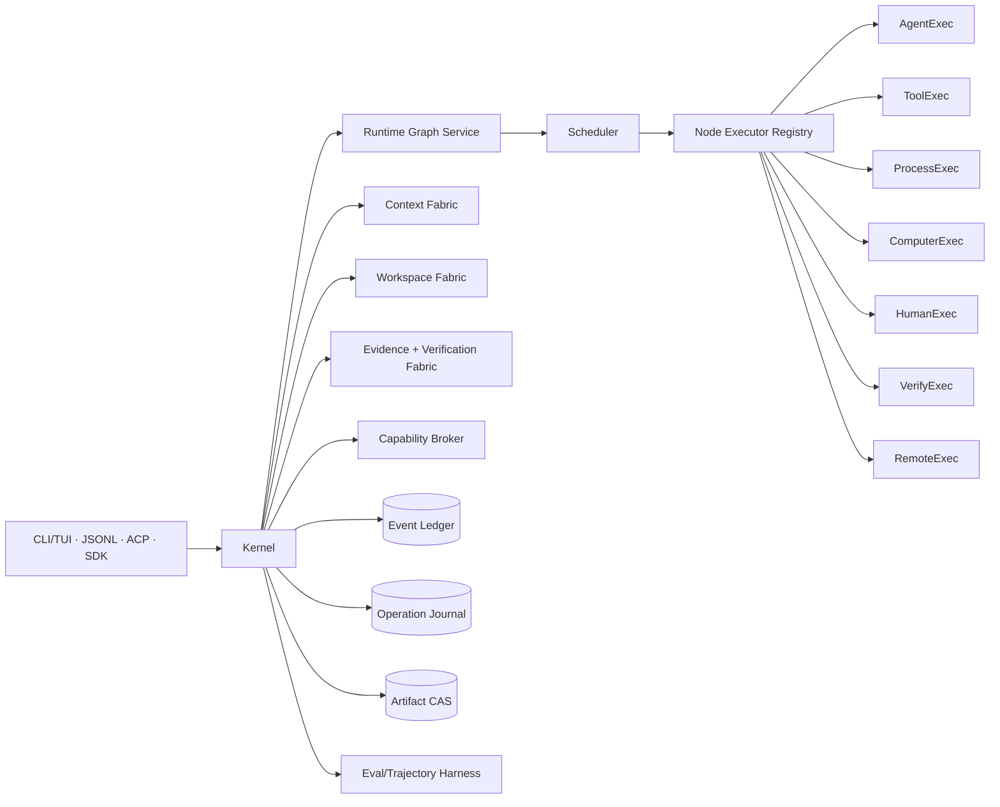
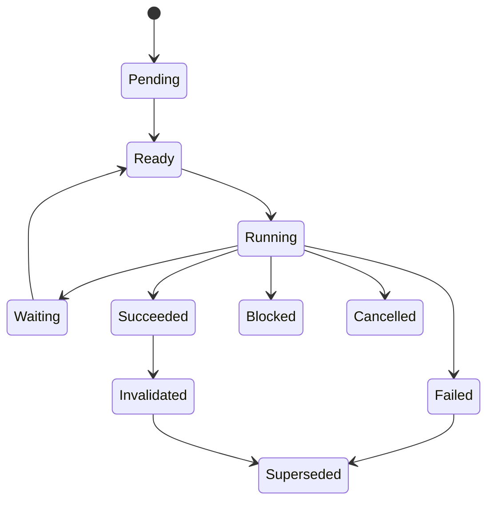

# System / Software Design Document — RapidLM CLI / TUI V3

**Architecture baseline:** V3.0  
**Date:** 2026-08-24

## 1. Executive architecture

RapidLM V3 is a Rust-first, event-sourced execution kernel. V2's kernel, Event Ledger, Capability Broker, sandbox ladder, WorkspaceViews, context engine, managed agents, handoff and Computer Use are preserved conceptually. The architectural promotion is that a **versioned dynamic Runtime Graph** becomes the canonical orchestration substrate. Coordinator/agent-loop logic is demoted into planning/executor roles.



## 2. Process topology

### 2.1 Interactive
`rapid` can host kernel + TUI in one process through an in-memory `KernelClient`. Indexing/resource work runs asynchronously so the first frame is not blocked.

### 2.2 Daemon
`rapid daemon` owns durable sessions, graphs, processes, schedules, resource leases, approvals and remote handoff. Local transports are UDS on Unix/macOS and named pipe on Windows; authenticated loopback HTTP/WS is opt-in.

### 2.3 Remote worker
A worker is an untrusted execution principal. It receives a signed `WorkLease` with immutable artifact/snapshot inputs, sandbox requirements, capability ceiling, expiry and trace parent. Results are CAS-addressed and verified before import.

## 3. Canonical identifiers

Operational IDs are UUIDv7 newtypes; immutable artifacts use `sha256:<hex>`.

`SessionId, RunId, GraphId, GraphRevisionId, NodeId, NodeAttemptId, AgentId, GoalId, CriterionId, ClaimId, EvidenceId, VerificationId, WorkspaceId, WorkspaceViewId, TransactionId, ProcessId, ResourceLeaseId, CapabilityLeaseId, ObservationId, ArtifactId, HandoffId, ControlLeaseId, TriggerId, JobId`.

Models normally see short aliases, not raw UUIDs.

## 4. Runtime Graph IR

```rust
pub struct RuntimeGraph {
    pub graph_id: GraphId,
    pub run_id: RunId,
    pub revision: u64,
    pub root: NodeId,
    pub nodes: BTreeMap<NodeId, Node>,
    pub edges: Vec<Edge>,
    pub created_from: GraphOrigin,
}

pub enum NodeKind {
    Goal, Criterion, Plan, Task, Agent,
    ContextQuery, ContextPacket,
    ToolInvocation, Process, Monitor,
    ResourceAcquire, WorkspaceTransaction,
    ComputerObservation, ComputerAction, Preview,
    Approval, AskUser, Trigger,
    Artifact, Claim, Evidence, Verification,
    Handoff, HumanControl, Join, Barrier,
}

pub enum EdgeKind {
    DecomposesInto, DependsOn, Blocks, ScheduledAfter, JoinsAt,
    ProvidesContextTo, Reads, Writes, Mutates, Produces,
    Supports, Contradicts, Verifies, RequiresApproval,
    DelegatedTo, Supersedes, Invalidates, TriggeredBy,
}
```

Every node declares typed inputs/outputs, capability/resource needs, workspace scope, context need, retry/idempotency class, budget, timeout and evidence obligations. Model graph edits are `GraphProposal`s validated for schema, cycles, write conflicts, policy/resource feasibility, budget and verification coverage.

## 5. Graph revision and scheduling

Graph history is append-only. A repair does not rewind history; it creates a new revision that can supersede/invalidate old nodes and add diagnose/repair/retest nodes. Scheduler computes a READY set from dependency state plus resources, policy, workspace locks and budgets. Parallel fan-out is allowed only when constraints permit.



Node attempts are separate from logical nodes so retries preserve history. Backoff/retry classes distinguish pure/idempotent operations from external non-idempotent effects.

## 6. Event Ledger and Operation Journal

The Event Ledger contains durable facts. `(session_id, seq)` is unique; critical projection writes share the append transaction. The Operation Journal is specifically for side-effect correctness:

`prepared → executing → committed | failed | uncertain → reconciled`.

A stable effect fingerprint incorporates normalized action, principal, target and relevant preconditions. On recovery, safe idempotent effects may replay; uncertain non-idempotent effects require reconciliation or attention.

## 7. Context Fabric

Ingestion: watcher/hash → language → Tree-sitter → symbols/chunks → FTS → optional embedding → code graph → LSP enrichment. Retrieval ladder:

1. exact path/symbol/user attachment/read-set;
2. `rg`/FTS/BM25;
3. Tree-sitter structural results;
4. LSP definition/reference/type/diagnostics;
5. git/manifests/build/test links;
6. bounded code/knowledge graph expansion;
7. optional semantic/vector candidates;
8. rerank + MMR + token-budget packing.

A `ContextPacket` includes provenance, content hash/revision, trust, token estimate, reason and visibility generation. Context Scouts use `InformationNeed` and return structured coverage/references/negative-findings/open-questions. Read dedup is valid only while the exact content remains visible in the active context generation.

## 8. Prompt Runtime

Prompt composition is layered and versioned:

`core constitution → host/product policy → role prompt → repository AGENTS hierarchy → selected skills → mode/node contract → goal/criteria → bounded ContextPacket → current user/task message`.

Lower layers cannot override higher authority. Prompt versions/hashes are recorded in trajectories. Tool surfaces are capability-projected; plan/research roles do not see mutation tools unless the node contract requires them.

## 9. Agent Harness

An Agent node is executed by a clean `AgentExecutionContext`: role, goal/task, acceptance criteria, ContextPacket, tool projection, workspace view, policy ceiling, model route, budget and parent graph refs. Persistent background specialists are read-only by default. Subagents do not receive full parent transcripts.

The Tool Contract Engine follows `validate → localized repair on validator issue paths → revalidate`. Repairs are recorded and visible as harness telemetry. Cross-tool invariants (e.g. write requires a fresh read/preimage) are evaluated against execution state.

Tool results use:

```rust
pub enum ToolOutcome<T> {
    Success(T),
    Recovered { value: T, recovery: RecoveryRecord },
    Partial { value: T, continuation: Continuation },
    Retryable { reason: FailureReason, suggestion: RecoveryAction },
    Denied(PolicyDecision),
    Failed(ToolError),
}
```

Large outputs are artifacts + excerpts. Background completion uses events/Monitor nodes, not LLM polling.

## 10. Goals, evidence and verification

Goal is a graph root. Criteria define observable end states and proof requirements. Claims link to evidence with freshness/provenance. Verification nodes are independent oracles: repository tests, static analyzers, scanners, deterministic probes, browser assertions, or—where deterministic checks are unavailable—separate rubric graders.

Completion predicate:

`all mandatory criteria satisfied AND required evidence current AND required verification PASS AND no blocking contradiction`.

A model emits `CompletionCandidate`, never a proof-required terminal state directly.

## 11. Workspace Fabric

`WorkspaceView` backends: direct, git worktree, overlay/sandbox, remote snapshot. Edits are `WorkspaceTransaction`s with preimage hashes and semantic intent metadata. Shell/process modifications are discovered and attributed as external mutations. Child-agent changes are integrated through staging, conflict checks, verification and provenance edges.

Rewind/fork operates on session/graph/workspace checkpoints without destructive Git history rewrite.

## 12. Capability Broker and policy

Precedence: compiled safety → org → user → trusted project → session mode/temporary approvals → agent request. Lower layers only narrow. Capability examples include fs read/write, proc exec, net connect, git write, secret use, browser navigate/download, desktop/mobile input, MCP/plugin invoke, external publish.

`CapabilityLease` is short-lived, action-bound and executor-validated. `dont-ask` automation mode converts interactive Ask into denial rather than blocking unattended jobs.

## 13. Sandbox and Resource Pool

Sandbox tier is selected by required isolation, host capabilities and policy: host-restricted → rootless/container → stronger kernel isolation → microVM → dedicated remote worker. No silent downgrade.

`ResourcePool` may keep sanitized warm containers/microVMs/browser desktops/mobile snapshots/remote workers. Acquisition is a lease with identity, image/snapshot digest, generation, cleanup policy and health proof. Pool misses may provision synchronously if policy/budget permit. Release always sanitizes or destroys according to trust class.

## 14. Process, monitor and trigger runtime

Process Supervisor owns process groups/trees, PTY, output spooling, limits, cancellation and detached daemon jobs. Foreground returns bounded head/tail; complete output is CAS. `MonitorNode`s subscribe to structured conditions (exit, regex/event, port ready, file change, test result) and wake graph dependencies. Cron/event triggers use job leases, durable cursors and idempotency keys.

## 15. Computer Use and Preview

Observation is generation-bound. Targeting priority: DOM/test-id → AX/native control → TUI semantic region → bounded vision → raw coordinate. Backends include browser/CDP, macOS AX, Windows UIA, Linux AT-SPI/X11/Wayland-specific drivers as available, Android ADB/emulator and iOS simctl on macOS workers.

Computer executor owns coordinate normalization, pointer/key state, safe batching, settle/reobserve, screenshot-on-failure and action metrics. `PreviewSupervisor` owns dev-server startup/health, dynamic ports, HTTP, console/network error capture and optional HMR health; failures can create evidence/repair nodes automatically.

Human takeover transfers `ControlLease`; conflicting agent input pauses. Resume reconciles workspace/surface state and requires fresh observation.

## 16. MCP, ACP, hooks, plugins, external agents

MCP catalogs are normalized and deterministic; every call still passes policy and untrusted-output fencing. ACP stdio owns stdout strictly. Hooks are lifecycle observers/gates with timeouts/process-group control; hook output cannot grant privilege. WASM components are the default plugin sandbox. External coding agents may execute Agent nodes through ACP/CLI adapters, but RapidLM remains graph/policy/workspace/evidence authority.

## 17. Memory, Knowledge, Preference

- **Memory:** what happened to this user/session.
- **Knowledge:** scoped durable engineering facts/decisions with source/freshness.
- **Rule:** instruction that applies.
- **Skill:** procedure.
- **Playbook:** parameterized initial graph template.
- **Policy:** what is allowed.
- **Preference:** evidence-backed soft tendency learned from accept/reject/edit, scoped and decaying.

Preference can influence ranking/planning but cannot override explicit instruction/rule/policy.

## 18. LLM Router

Hard filters: required tool/vision/structured-output/context support, privacy/residency, provider availability and user pin. Soft score: task-class quality, latency, cost, observed repair/tool reliability and preference. Routing is versioned and observable. Per-subtask routes can use cheaper context scouts/verifiers where evaluation supports it.

## 19. TUI/CLI

TUI views include Transcript, Plan/Graph, Activity, Agents, Context, Browser/Computer, Files/Diff, Terminal/Processes, Approvals, Evidence, Resources, Memory/Knowledge, Trace. Narrow terminals collapse panels to tabs. Headless JSONL and ACP receive the same events/state.

## 20. Evaluation and learning

Eval harness runs the production kernel under versioned scenarios with fixtures, scripted/replay/live models, fault injection and deterministic graders. Metrics include success/tokens, repair rate, context redundancy/freshness, graph repair, false completion, safety, recovery, Computer Use efficiency and background polling avoided. Observable trajectories may feed experiments and Preference Fabric under data policy; hidden chain-of-thought is not required or reconstructed.

## 21. Build and supply chain

Rust runtime remains the deployable core; TypeScript SDK/docs/schema tooling cannot become a runtime dependency. Project toolchain pins are retained during Phase 0 unless an explicit upgrade task verifies compatibility. CI gates formatting, lint, targeted/unit/integration, schema fixtures, deterministic replay, security/supply-chain scanning, cross-platform builds and artifact signing/SBOM/provenance.

## 22. Migration from V2

V3 is additive/migratory:
- Event Ledger remains authoritative durable fact store.
- Goal DAG data migrates into Runtime Graph Goal/Criterion/Evidence nodes.
- coordinator/scheduler responsibilities consolidate under Graph Scheduler; agent-specific planning remains a node.
- Context Engine becomes Context Fabric without duplicate indexing authority.
- AgentPool/managed workers become Agent node executors plus read-only specialist lifecycle.
- existing WorkspaceView/CapabilityLease/Sandbox/Handoff/ControlLease/Computer Use/Eval contracts are adapted, not replaced unless audit proves incompatibility.

Phase 0 must produce a KEEP/ADAPT/REPLACE/DELETE map against actual source before implementation.
