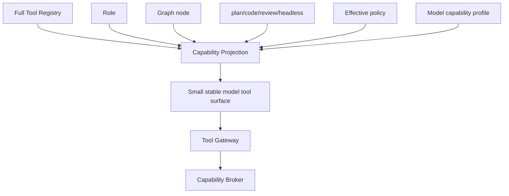

# Agent Harness — Production Architecture

## 1. Definition

The production Agent Harness is the layer that executes Agent nodes using a model, prompt, bounded context, projected tool surface, workspace and capability ceiling. It does not own the Runtime Graph, policy or workspace truth.

## 2. AgentExecutionContext

Contains `NodeId/AttemptId`, role, objective, acceptance criteria, ContextPacket, applicable rules/skills, tool projection, workspace view, model route, token/cost/time/tool budgets, parent graph refs and evidence obligations. Parent transcript is excluded unless a small explicitly selected excerpt is necessary.

## 3. Roles

Built-ins: main, context-scout, planner/architect, coder, debugger, reviewer, tester, independent-verifier, security-reviewer, performance-reviewer, browser/computer operator, release-manager, session-insights. Persistent specialists: Explorer, Context Curator, Test/Dependency watcher; read-only by default.

## 4. Capability Projection

Schema projection reduces tokens and bad calls but is not a security boundary; execution still rechecks policy/leases.

## 5. Delegation

Delegation is a graph proposal. Host decides model, workspace, resources, tool projection and scheduling. Utility score can consider expected quality/latency gain, context duplication, spawn cost, merge-conflict risk and verification independence. Nested delegation is depth/budget bounded; built-in Context Scouts are read-only and do not recursively spawn unless explicitly allowed.

## 6. Loop robustness

Per Agent attempt implement: empty-response retry within budget, repeated exact tool-call detector, repeated streaming/message detector, provider truncation → compact then retry, malformed tool repair feedback, budget convergence prompt, cancellation. None may loop indefinitely.

## 7. Result contract

`AgentResult { outcome, summary, claims, evidence_refs, artifact_refs, workspace_transaction, open_questions, blockers, usage, context_lineage, tool_repair_stats }`. Results are observations/proposals until host accepts required workspace/evidence actions.

## 8. System prompt philosophy

Prompts synthesize Muse-style evidence/verification discipline, Claude-style concise layered instruction/tool boundaries, and Augment-style exhaustive scoped context gathering. Prompt text is newly authored for RapidLM; competitor wording is not copied. See `system-prompts/`.

## 9. Model routing

Each role/node can route separately. Cheap capable models should handle retrieval/scouting/classification where evals show parity; high-reasoning models reserved for planning, hard coding or verification as configured. Routing includes measured tool-repair reliability rather than benchmark quality alone.

## 10. Harness observability

Track per attempt: prompt hash, model route, ContextPacket, tools exposed/called, validation/repairs, policy decisions, tokens/cost, wall time, output/claims, evidence, stop reason, graph mutation proposals and final host verdict. No hidden chain-of-thought is required.
