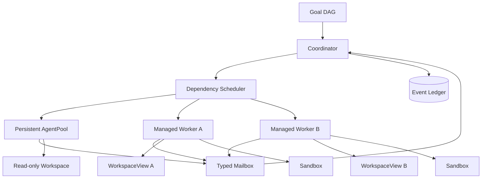

# Architecture — Agent Pool and Managed Agents

## 1. Responsibility and boundaries

Own the lifecycle, scheduling and communication model for two distinct multi-agent classes:

1. **Persistent background agents** — session-long, low-latency, primarily read-only specialists that continuously maintain useful state and send findings to the coordinator.
2. **Managed workers** — clean-context task agents created for a bounded piece of work, normally with an isolated WorkspaceView and Sandbox.

The module does **not** own model-provider calls (LLM Router), filesystem mutation (Workspace), privilege decisions (Capability Broker), or top-level goal completion (Goal Service).

### Design motivation

Muse Code's public architecture describes persistent async background agents that remain active for a session, reducing redundant information gathering. Devin's managed-agent model demonstrates coordinator-driven decomposition into independent isolated workers with clean contexts and inspectable trajectories. RapidLM combines the two while keeping write ownership explicit.

## 2. Component architecture

- `AgentPoolService` — creates/warms/parks/restarts persistent background agents.
- `ManagedAgentService` — creates bounded child agents from typed TaskEnvelopes.
- `Coordinator` — converts Goal DAG nodes into runnable TaskEnvelopes and consumes AgentResults.
- `DependencyScheduler` — READY/RUNNING/BLOCKED graph, priority/fairness, provider and worker concurrency.
- `SpawnPolicy` — decides whether delegation is worthwhile using expected parallel benefit, context duplication, model cost and write conflict risk.
- `AgentMailbox` — ordered, typed messages with artifact/evidence references and bounded payloads.
- `TrajectorySummaryService` — compacts child observable events into inspectable summary without copying hidden reasoning.
- `BudgetController` — token/cost/time/tool-call ceilings per worker and global goal.
- `WorkspaceAllocator` — read-only view for persistent background agents; isolated writable view for managed writer agents.

### Component diagram



## 3. Agent classes and invariants

### Persistent background agent

```rust
pub struct BackgroundAgentSpec {
    pub role: BackgroundRole,
    pub scope: ScopeRef,
    pub model_policy: ModelPolicyRef,
    pub max_context_tokens: u32,
    pub budget_per_hour: AgentBudget,
    pub mailbox_topics: Vec<MailboxTopic>,
    pub restart_policy: RestartPolicy,
}

pub enum BackgroundRole {
    Explorer,
    ContextCurator,
    TestWatcher,
    DependencyWatcher,
}
```

Invariants:

- default WorkspaceAccess is `ReadOnly`;
- cannot call `goal.complete`, issue leases, modify policy or approve itself;
- state is bounded and compactable; no unbounded transcript mirroring;
- can be parked when idle and resumed from its durable summary;
- every message to the coordinator includes `why_now`, evidence refs and freshness.

### Managed worker

```rust
pub struct TaskEnvelope {
    pub task_id: TaskId,
    pub parent_agent_id: AgentId,
    pub goal_node_id: GoalNodeId,
    pub objective: String,
    pub acceptance_criteria: Vec<CriterionRef>,
    pub context_packet: ContextPacketRef,
    pub knowledge_refs: Vec<KnowledgeId>,
    pub workspace_access: WorkspaceAccess,
    pub capability_ceiling: CapabilitySet,
    pub model_policy: ModelPolicyRef,
    pub budget: AgentBudget,
    pub result_schema: ResultSchema,
}
```

A managed worker starts from the TaskEnvelope and applicable system/project policy—not a raw clone of the parent chat transcript.

## 4. Interfaces / contracts

```rust
#[async_trait]
pub trait AgentPool {
    async fn ensure_background(&self, session: SessionId, spec: BackgroundAgentSpec) -> Result<AgentId>;
    async fn park(&self, agent: AgentId, reason: ParkReason) -> Result<()>;
    async fn send(&self, msg: AgentMessage) -> Result<MessageId>;
    async fn receive(&self, agent: AgentId, cursor: MailCursor) -> Result<MessagePage>;
}

#[async_trait]
pub trait ManagedAgents {
    async fn spawn(&self, envelope: TaskEnvelope) -> Result<AgentId>;
    async fn pause(&self, agent: AgentId) -> Result<()>;
    async fn resume(&self, agent: AgentId) -> Result<()>;
    async fn cancel(&self, agent: AgentId, reason: String) -> Result<()>;
    async fn result(&self, agent: AgentId) -> Result<Option<AgentResult>>;
}
```

`AgentResult` MUST contain structured status, evidence IDs, changed WorkspaceView/ChangeSet refs, artifacts, residual blockers and usage. A prose summary alone is invalid.

## 5. Scheduling algorithm

1. Recompute READY nodes from Goal/Task DAG.
2. Filter by dependencies, policy, worker platform, per-provider concurrency and global budgets.
3. Compute delegation score:

```text
delegation_value = expected_parallel_speedup
                 + specialist_quality_gain
                 - context_duplication_cost
                 - expected_merge_conflict_cost
                 - model_spawn_overhead
```

4. Prefer persistent background agents for read-only discovery with ongoing value.
5. Prefer managed workers for bounded, independently verifiable work.
6. Never schedule sibling writers into the same writable WorkspaceView.
7. On result, validate evidence and ChangeSet before unblocking dependents.

## 6. Failure modes and recovery

| Failure | Recovery |
|---|---|
| background agent crashes | restart from last durable summary if restart budget allows; never replay privileged action automatically |
| managed worker provider error | park agent; route/fallback only within model policy |
| child hangs | budget controller cancels descendants, collects trace and marks task blocked/retryable |
| parent crashes | child event streams remain durable; coordinator reconstruction reattaches by parent/task IDs |
| child produces conflicting patch | keep isolated; conflict resolver or a new integration worker resolves, never last-writer-wins |
| mailbox flood | per-topic quotas, backpressure and artifact refs; oversized payloads rejected |
| subagent attempts top-level goal mutation | goal service rejects based on actor role |
| provider throttling | scheduler lowers concurrency and re-prioritizes independent work |

## 7. Security considerations

- Child capability ceiling can only be narrower than parent/user/org policy.
- Persistent agents are read-only unless a user/policy explicitly grants a bounded write view.
- Child messages are untrusted data and cannot become system policy.
- No capability lease is transferable through mailbox messages.
- `AgentResult` content must be treated as potentially adversarial until verifier checks evidence.
- Managed remote workers receive only task-relevant secrets through opaque handles after target-side policy evaluation.

## 8. Observability

Emit:

- `agent.spawned`, `agent.started`, `agent.parked`, `agent.resumed`, `agent.completed`, `agent.failed`;
- `agent.mail.sent`, `agent.mail.dropped`, `agent.budget.warning`;
- spawn/delegation score features, excluding hidden reasoning;
- per-agent tokens, cost, tool calls, active time, wait time, sandbox time and context bytes;
- trajectory summary artifact ID.

## 9. TUI/Agents Panel projection

The panel must show:

```text
COORDINATOR  RUNNING   goal 64% verified
├─ explorer-bg       WARM/READ-ONLY   12k tok  $0.03
├─ context-curator   WARM/READ-ONLY    9k tok  $0.02
├─ backend-worker    RUNNING view:17  31k tok  $0.51  verify 3/5
├─ frontend-worker   PAUSED  view:18  22k tok  $0.38  human control
└─ security-review   QUEUED            depends: backend-worker
```

Selecting an agent opens its observable trajectory timeline, TaskEnvelope, budget, context packet summary, capabilities, WorkspaceView, artifacts and evidence.

## 10. Example implementation pattern

```rust
let envelope = coordinator.build_task(TaskId::new(), goal_node).await?;
let agent = scheduler.spawn_if_worthwhile(envelope).await?;

while let Some(event) = events.next_for(agent).await? {
    projection.apply(event)?;
    if projection.is_terminal() {
        let result = managed.result(agent).await?.ok_or(Error::MissingResult)?;
        verifier.verify_agent_result(&result).await?;
        coordinator.accept(result).await?;
        break;
    }
}
```

## 11. Acceptance evidence

- deterministic test proves parent context is not blindly copied into child prompt;
- two sibling writers always receive different writable views;
- persistent Explorer survives ten parent turns without re-reading unchanged repository bootstrap context;
- crash/restart reconstructs child topology and mail cursors;
- parent can inspect a child trajectory without exposing hidden model chain-of-thought;
- per-agent budget exhaustion blocks only the worker/task unless goal policy says otherwise;
- malicious child result cannot grant capability or mark the top-level goal complete.

## 12. Evolution rules

- New agent roles must declare capability ceiling, context policy, result schema and evaluation suite.
- Persistent roles require a measured latency/token benefit before becoming default-on.
- Any shared writable-state proposal requires an ADR; default remains isolated writers.
