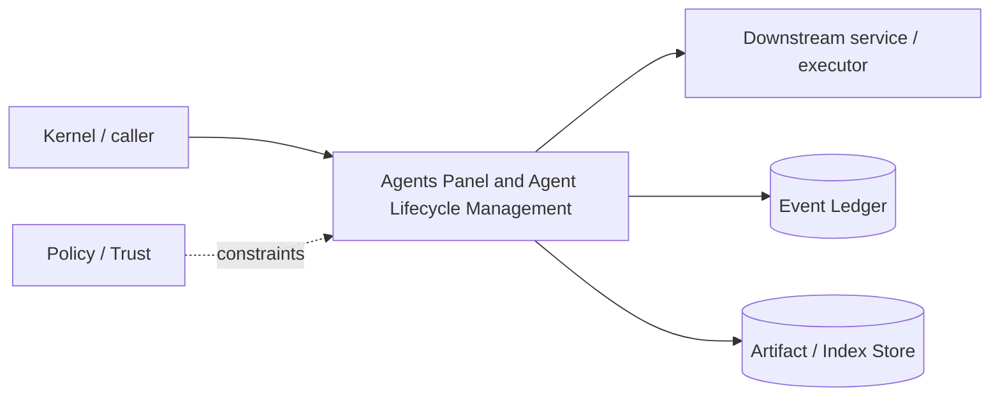

# Architecture — Agents Panel and Agent Lifecycle Management

## 1. Responsibility

Expose and control multi-agent execution while keeping scheduling, task scope, workspace isolation, budgets, and evidence explicit.

## 2. Boundaries and non-responsibilities

- Panel is UI; lifecycle authority lives in Agent Runtime/Scheduler.
- Subagents cannot mutate top-level goal state directly.
- Agent-to-agent communication uses typed task/result/evidence messages, not shared mutable prompt history.

## 3. Component architecture

- `AgentRegistry` — immutable identity + lifecycle projection.
- `AgentScheduler` — concurrency, priority, dependencies, provider limits.
- `TaskEnvelope` — scoped objective, refs, budget, allowed capabilities, expected result contract.
- `AgentMailbox` — bounded messages/results.
- `WorkspaceAllocator` — separate view for every write-capable parallel agent.
- `AgentsPanelView` — tree/table of active, queued, paused, blocked, complete agents.

### Component diagram description



The diagram is intentionally generic at the boundary: the bullets above are normative component ownership. Cross-module calls MUST use the contracts listed below rather than importing another module's internal storage or implementation types.

## 4. Interfaces and contracts

- `spawn(SubagentSpec) -> AgentId`; `cancel/pause/resume`.
- Consumes Goal DAG child tasks and Scheduler resource limits.
- Returns `AgentResult { summary, evidence_refs, change_set?, blockers }` to parent.
- Emits lifecycle/cost/action events to ledger/TUI.

Cross-module errors use `ErrorEnvelope` from `crates/protocol`; cancellation is explicit and propagated. Any API that may return more than a small bounded payload MUST return an artifact/cursor reference.

## 5. Data models

- `AgentSpec { role, parent, task, model_policy, budget, capabilities, workspace_mode, expected_output_schema }`
- `AgentState = queued|starting|running|waiting_tool|waiting_approval|paused|blocked|completed|failed|cancelled`
- `AgentResult` and `AgentStats`.

Canonical shared types belong in `crates/protocol` only when two or more modules need a stable serialized representation. Storage-only fields remain private to this module.

## 6. Main runtime flow

1. Caller submits a typed request with actor/session/trace context.
2. Module validates schema, IDs, preconditions, and cancellation state.
3. If the operation can cause side effects, it obtains/validates a Capability Lease before the side effect.
4. Work is executed with explicit time/output/resource bounds.
5. Large evidence/output is written to Artifact Store and referenced by digest.
6. Durable state changes are appended to Event Ledger before success acknowledgement.
7. Result returns normalized status, evidence references, metrics, and trace ID.

## 7. Failure modes and recovery

- **Subagent provider failure** → retry within task policy or return blocked/failed result; parent continues.
- **Workspace allocation failure** → keep queued/blocked, never fall back to shared write view.
- **Parent cancellation** → structured cancellation cascades unless child explicitly detached as background job by user.
- **Result schema invalid** → one repair attempt, then treat as failed structured result.

General rule: transient infrastructure failure may be retried only when the action is proven idempotent or guarded by an idempotency key. Security ambiguity fails closed. Runtime failure of autonomous work pauses/blocks the task rather than pretending completion.

## 8. Security considerations

- Child capability scope is intersection(parent lease scope, task scope, policy).
- No child may read secrets or repos not needed by task just because parent can.
- Panel never exposes raw secret-bearing tool outputs.
- Agent spawn count and cost are resource-controlled to prevent denial-of-wallet.

All attacker-controlled strings are treated as data. A model request, repository file, browser page, MCP result, hook output, or scanner output can never grant itself more privilege.

## 9. Implementation notes

- Use Tokio tasks only as implementation detail; each agent is a durable logical actor with event state.
- Prefer many read-only explorer/verifier agents and fewer write agents.
- Scheduler predicts write sets from task/file scope; uncertain overlapping write agents serialize or use separate branches then conflict-check.

### Example code pattern

```rust
pub async fn spawn(&self, parent: AgentId, spec: SubagentSpec) -> Result<AgentId> {
    let caps = self.broker.derive_child_scope(parent, &spec.requested_caps)?;
    let view = self.workspaces.allocate(spec.workspace_mode, parent).await?;
    self.registry.create(parent, spec, caps, view).await
}
```

The example demonstrates the intended boundary/style, not copy-paste-complete production code. Concrete implementation MUST use typed IDs/errors/cancellation and emit trace/event metadata.

## 10. Observability

Every operation SHOULD emit a span with: `trace_id`, `session_id`, actor/agent ID, operation kind, result class, latency, and bounded resource/token counters where applicable. Never use raw prompt/code/secret content as metric labels.

## 11. Tests and acceptance evidence

- [ ] Concurrency limit tests.
- [ ] Capability narrowing property test.
- [ ] Two write agents never receive same view ID.
- [ ] Parent cancellation propagation test.
- [ ] Panel projection replay test.

## 12. Performance expectations

The module MUST define benchmarks for its hot paths before v1 stabilization. Regressions above 15% p95 latency or 10% memory/token overhead on fixed fixtures require explicit review or an accepted trade-off ADR.

## 13. Evolution rules

- Public/wire/event schema changes require `contract-first` skill and compatibility tests.
- Security behavior changes require threat-model update.
- New dependencies/backends require an ADR if they change trust boundary or deployment footprint.
- Do not add frontend-specific behavior to this module; expose state/contracts and let frontends render it.

## V2 addendum — Engineering operations console

The Agents Panel expands from a list of subagents into a coordinator/worker operations console. Required fields per row:

- hierarchy/Task DAG position;
- persistent vs managed worker class;
- state and current operation;
- model route;
- tokens, cost, tool calls and active time;
- WorkspaceView and sandbox/remote worker;
- verification progress (`3/5 criteria`);
- current control holder (agent/human);
- last evidence/artifact;
- blockers/dependencies.

Selecting an agent exposes TaskEnvelope, context/knowledge summary, capability ceiling, observable trajectory, diff/ChangeSet, child messages and budget. The panel provides pause/resume/cancel/sleep/priority controls subject to policy.

Human takeover is visibly distinct from agent pause. A user must never believe an agent is idle while it still owns write/input control.
