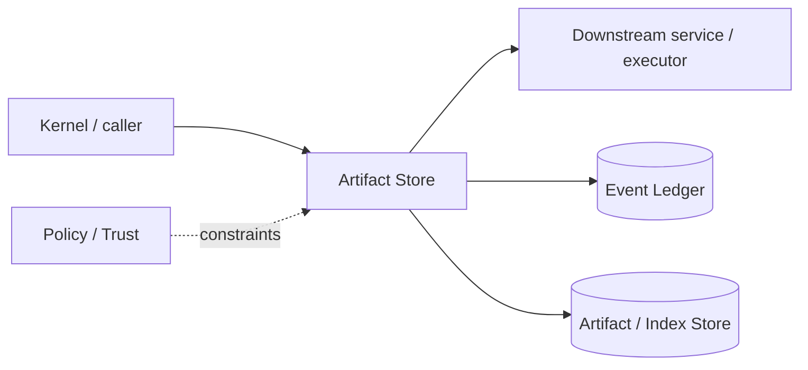

# Architecture — Artifact Store

## 1. Responsibility

Store large outputs, screenshots, traces, preimages, scanner reports, and replay fixtures content-addressably with retention and redaction metadata.

## 2. Boundaries and non-responsibilities

- Not the event ledger; events reference artifact IDs.
- Not a generic user file store; artifacts are runtime evidence/diagnostics/cache inputs.

## 3. Component architecture

- `ArtifactStore` content-addressed blobs.
- `MetadataStore` media type, size, redaction, retention, producer.
- `ArtifactReader` range/cursor reads.
- `GcManager` reachability/retention cleanup.
- `Encryptor` optional sensitive-class encryption.

### Component diagram description



The diagram is intentionally generic at the boundary: the bullets above are normative component ownership. Cross-module calls MUST use the contracts listed below rather than importing another module's internal storage or implementation types.

## 4. Interfaces and contracts

- `put(stream, metadata) -> ArtifactId`; `open(id, range)`; `pin/unpin`; `gc`.
- Used by process, browser, mobile, scanners, ledger, eval harness.

Cross-module errors use `ErrorEnvelope` from `crates/protocol`; cancellation is explicit and propagated. Any API that may return more than a small bounded payload MUST return an artifact/cursor reference.

## 5. Data models

- `ArtifactId = sha256:<hex>`
- `ArtifactMetadata { media_type, size, created_at, producer, redaction, retention, encryption, refs }`.

Canonical shared types belong in `crates/protocol` only when two or more modules need a stable serialized representation. Storage-only fields remain private to this module.

## 6. Main runtime flow

1. Caller submits a typed request with actor/session/trace context.
2. Module validates schema, IDs, preconditions, and cancellation state.
3. If the operation can cause side effects, it obtains/validates a Capability Lease before the side effect.
4. Work is executed with explicit time/output/resource bounds.
5. Large evidence/output is written to Artifact Store and referenced by digest.
6. Durable state changes are appended to Event Ledger before success acknowledgement.
7. Result returns normalized status, evidence references, metrics, and trace ID.

## 7. Failure modes and recovery

- **Write interrupted** → temp file never published before digest+atomic rename.
- **Digest mismatch** → reject.
- **GC race** → refcount/reachability snapshot prevents deleting newly referenced artifact.
- **Encrypted key unavailable** → explicit locked artifact.

General rule: transient infrastructure failure may be retried only when the action is proven idempotent or guarded by an idempotency key. Security ambiguity fails closed. Runtime failure of autonomous work pauses/blocks the task rather than pretending completion.

## 8. Security considerations

- Sensitive artifacts encrypted when configured.
- Path layout derives only from digest, not user filename.
- Exports enforce redaction/authorization.

All attacker-controlled strings are treated as data. A model request, repository file, browser page, MCP result, hook output, or scanner output can never grant itself more privilege.

## 9. Implementation notes

- Use streaming hashing and atomic publish.
- Large stdout and binary preimages belong here.

### Example code pattern

```rust
pub async fn put<R: AsyncRead + Unpin>(&self, mut r: R, meta: ArtifactMetadata) -> Result<ArtifactId, ArtifactError> {
    let staged = self.stage_and_hash(&mut r).await?;
    let id = ArtifactId::sha256(staged.digest());
    self.publish_atomically(&id, staged, meta).await?;
    Ok(id)
}
```

The example demonstrates the intended boundary/style, not copy-paste-complete production code. Concrete implementation MUST use typed IDs/errors/cancellation and emit trace/event metadata.

## 10. Observability

Every operation SHOULD emit a span with: `trace_id`, `session_id`, actor/agent ID, operation kind, result class, latency, and bounded resource/token counters where applicable. Never use raw prompt/code/secret content as metric labels.

## 11. Tests and acceptance evidence

- [ ] Atomic publish crash test.
- [ ] Digest mismatch test.
- [ ] GC reachability test.
- [ ] Encrypted artifact access policy test.

## 12. Performance expectations

The module MUST define benchmarks for its hot paths before v1 stabilization. Regressions above 15% p95 latency or 10% memory/token overhead on fixed fixtures require explicit review or an accepted trade-off ADR.

## 13. Evolution rules

- Public/wire/event schema changes require `contract-first` skill and compatibility tests.
- Security behavior changes require threat-model update.
- New dependencies/backends require an ADR if they change trust boundary or deployment footprint.
- Do not add frontend-specific behavior to this module; expose state/contracts and let frontends render it.
