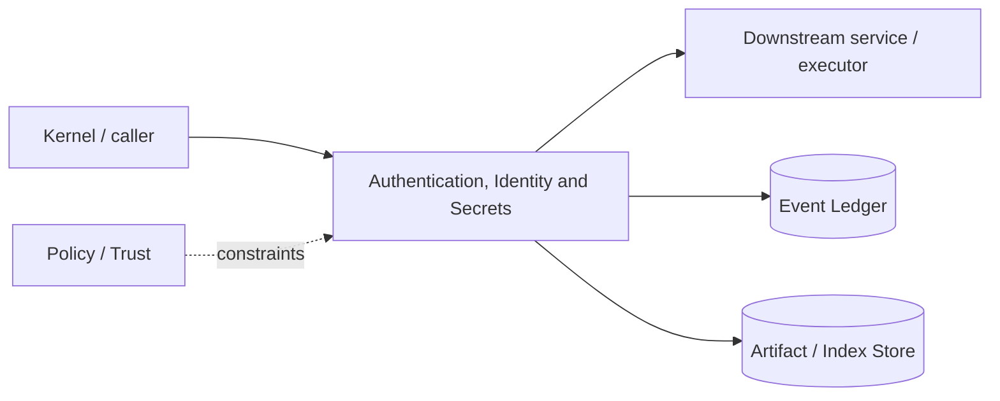

# Architecture — Authentication, Identity and Secrets

## 1. Responsibility

Manage local user identity, provider credentials, OAuth/device flows, secret storage/handles, daemon/worker authentication, and redaction boundaries.

## 2. Boundaries and non-responsibilities

- Models receive secret handles or broker-mediated values, not credential-store APIs.
- Auth does not decide action policy beyond identity/credential ownership.
- Enterprise identity federation is post-v1 control-plane work; local contracts must support it.

## 3. Component architecture

- `IdentityService` — local/user/org actor identity.
- `CredentialStore` — OS keychain/keyring + encrypted fallback.
- `OAuthManager` — PKCE/device flows and refresh.
- `SecretBroker` — opaque secret handles and target-scoped use.
- `DaemonAuth` — local OS-user token/pipe permissions.
- `WorkerPKI` — mTLS enrollment/cert rotation.
- `Redactor` — known-secret fingerprints + structured secret fields.

### Component diagram description



The diagram is intentionally generic at the boundary: the bullets above are normative component ownership. Cross-module calls MUST use the contracts listed below rather than importing another module's internal storage or implementation types.

## 4. Interfaces and contracts

- `login(provider)`, `logout`, `credential_status`.
- `secret_handle(name) -> SecretRef`; `materialize(ref, target, lease)` only inside authorized executor.
- LLM Router transport requests provider credential handle.

Cross-module errors use `ErrorEnvelope` from `crates/protocol`; cancellation is explicit and propagated. Any API that may return more than a small bounded payload MUST return an artifact/cursor reference.

## 5. Data models

- `SecretRef` opaque UUID/alias; `CredentialMetadata` never contains value.
- `ActorRef { kind, id, org_id?, device_id? }`
- `AuthSession { provider, scopes, expires_at, refreshable }`.

Canonical shared types belong in `crates/protocol` only when two or more modules need a stable serialized representation. Storage-only fields remain private to this module.

## 6. Main runtime flow

1. Caller submits a typed request with actor/session/trace context.
2. Module validates schema, IDs, preconditions, and cancellation state.
3. If the operation can cause side effects, it obtains/validates a Capability Lease before the side effect.
4. Work is executed with explicit time/output/resource bounds.
5. Large evidence/output is written to Artifact Store and referenced by digest.
6. Durable state changes are appended to Event Ledger before success acknowledgement.
7. Result returns normalized status, evidence references, metrics, and trace ID.

## 7. Failure modes and recovery

- **Keychain unavailable** → encrypted file fallback only with explicit setup/passphrase; otherwise block credential persistence.
- **OAuth refresh fails** → provider unavailable, do not expose refresh token.
- **Worker cert expired/revoked** → reject work/results.
- **Redactor error** → sensitive event export fails closed if classification requires redaction.

General rule: transient infrastructure failure may be retried only when the action is proven idempotent or guarded by an idempotency key. Security ambiguity fails closed. Runtime failure of autonomous work pauses/blocks the task rather than pretending completion.

## 8. Security considerations

- No credentials in CLI args when avoidable due process listing/history.
- Secret values never included in model/tool logs by default.
- Scope secret materialization to destination process/domain and lifetime.
- Credential files mode 0600 equivalent and encrypted at rest where platform supports.

All attacker-controlled strings are treated as data. A model request, repository file, browser page, MCP result, hook output, or scanner output can never grant itself more privilege.

## 9. Implementation notes

- Provider configuration refers to credential aliases.
- Support environment-variable credentials as ephemeral input, but do not persist unless user imports.
- Use constant-time comparisons for local auth tokens where relevant.

### Example code pattern

```rust
pub async fn materialize(&self, secret: &SecretRef, target: &SecretTarget, lease: &CapabilityLease)
    -> Result<SecretMaterial, SecretError> {
    self.lease_validator.validate_secret_use(lease, secret, target)?;
    self.store.fetch(secret).await.map(SecretMaterial::ephemeral)
}
```

The example demonstrates the intended boundary/style, not copy-paste-complete production code. Concrete implementation MUST use typed IDs/errors/cancellation and emit trace/event metadata.

## 10. Observability

Every operation SHOULD emit a span with: `trace_id`, `session_id`, actor/agent ID, operation kind, result class, latency, and bounded resource/token counters where applicable. Never use raw prompt/code/secret content as metric labels.

## 11. Tests and acceptance evidence

- [ ] Secret absent from events/logs snapshots.
- [ ] OAuth token refresh fixture.
- [ ] Daemon token wrong-user rejection.
- [ ] Secret lease target mismatch.

## 12. Performance expectations

The module MUST define benchmarks for its hot paths before v1 stabilization. Regressions above 15% p95 latency or 10% memory/token overhead on fixed fixtures require explicit review or an accepted trade-off ADR.

## 13. Evolution rules

- Public/wire/event schema changes require `contract-first` skill and compatibility tests.
- Security behavior changes require threat-model update.
- New dependencies/backends require an ADR if they change trust boundary or deployment footprint.
- Do not add frontend-specific behavior to this module; expose state/contracts and let frontends render it.
