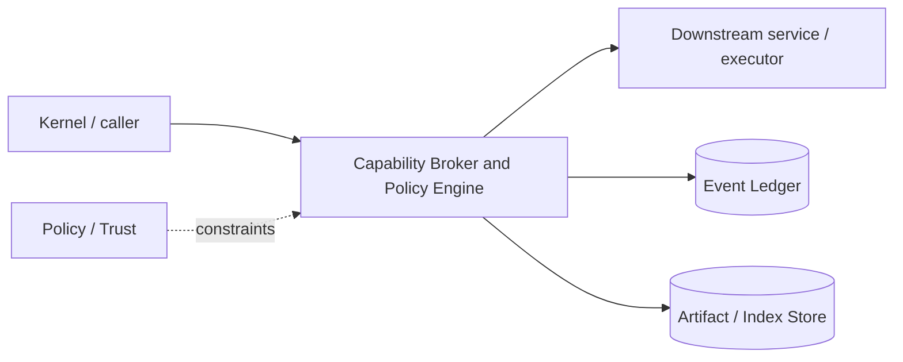

# Architecture — Capability Broker and Policy Engine

## 1. Responsibility

Convert requested actions into normalized capabilities, evaluate layered policy, obtain user approval when necessary, and issue short-lived executor-verifiable leases.

## 2. Boundaries and non-responsibilities

- Model/tool code requests capability; it never self-authorizes.
- Policy files express constraints but cannot execute code.
- Executors independently validate leases.

## 3. Component architecture

- `ActionNormalizer` — canonical command/path/origin/tool identity.
- `PolicyLoader` — compiled/org/user/trusted-project/session layers.
- `PolicyEvaluator` — deny/ask/allow with explanation.
- `ApprovalManager` — interactive/headless decision and remembered narrow scopes.
- `LeaseIssuer` — signed/nonce leases.
- `LeaseValidator` — executor-side validation/replay protection.
- `AuditEmitter` — requested/decided/used/expired events.

### Component diagram description



The diagram is intentionally generic at the boundary: the bullets above are normative component ownership. Cross-module calls MUST use the contracts listed below rather than importing another module's internal storage or implementation types.

## 4. Interfaces and contracts

- `authorize(Actor, Action) -> Decision`.
- `issue(decision, Approval?) -> CapabilityLease`.
- Executors call `validate(lease, normalized_action)`.
- Project trust service controls whether project policy can be loaded.

Cross-module errors use `ErrorEnvelope` from `crates/protocol`; cancellation is explicit and propagated. Any API that may return more than a small bounded payload MUST return an artifact/cursor reference.

## 5. Data models

- `Capability` algebra for fs/proc/net/git/secret/browser/mobile/mcp/plugin.
- `PolicyRule { effect, subjects, capability_pattern, resource_pattern, conditions, source }`
- `Decision { effect, matched_rules, risk, alternatives }`
- `CapabilityLease` as defined in SDD.

Canonical shared types belong in `crates/protocol` only when two or more modules need a stable serialized representation. Storage-only fields remain private to this module.

## 6. Main runtime flow

1. Caller submits a typed request with actor/session/trace context.
2. Module validates schema, IDs, preconditions, and cancellation state.
3. If the operation can cause side effects, it obtains/validates a Capability Lease before the side effect.
4. Work is executed with explicit time/output/resource bounds.
5. Large evidence/output is written to Artifact Store and referenced by digest.
6. Durable state changes are appended to Event Ledger before success acknowledgement.
7. Result returns normalized status, evidence references, metrics, and trace ID.

## 7. Failure modes and recovery

- **Policy parse error at higher-trust layer** → fail closed for affected capability and surface diagnostics.
- **Approval frontend disconnected** → action stays pending/denied per headless mode.
- **Clock skew** → use monotonic deadline in-process and signed UTC expiry for remote.
- **Lease replay/use exhaustion** → reject and audit.

General rule: transient infrastructure failure may be retried only when the action is proven idempotent or guarded by an idempotency key. Security ambiguity fails closed. Runtime failure of autonomous work pauses/blocks the task rather than pretending completion.

## 8. Security considerations

- Normalize paths after symlink resolution and command AST before matching.
- Project rules can restrict only; any attempted grant beyond parent policy is ignored/reported.
- Approval “for session” is still capability/resource scoped, not blanket auto mode.
- Action hash binds exact normalized high-risk request.

All attacker-controlled strings are treated as data. A model request, repository file, browser page, MCP result, hook output, or scanner output can never grant itself more privilege.

## 9. Implementation notes

- Use a small declarative TOML policy language, compile to internal matchers.
- Do not use regex alone for shell safety; parse supported shells, degrade to ASK/DENY when analysis fails for high-risk commands.
- Separate policy decision from sandbox selection: both must succeed.

### Example code pattern

```rust
match evaluator.evaluate(&ctx, &action)? {
    Effect::Deny => Err(AuthzError::Denied),
    Effect::Ask => approval.request(action).await.and_then(|a| issuer.issue(a)),
    Effect::Allow => issuer.issue_without_prompt(ctx.actor, action),
}
```

The example demonstrates the intended boundary/style, not copy-paste-complete production code. Concrete implementation MUST use typed IDs/errors/cancellation and emit trace/event metadata.

## 10. Observability

Every operation SHOULD emit a span with: `trace_id`, `session_id`, actor/agent ID, operation kind, result class, latency, and bounded resource/token counters where applicable. Never use raw prompt/code/secret content as metric labels.

## 11. Tests and acceptance evidence

- [ ] Layer precedence truth table.
- [ ] Symlink/path traversal tests.
- [ ] Shell normalization tests.
- [ ] Lease action-mismatch/replay/expiry tests.
- [ ] Project cannot broaden global deny property test.

## 12. Performance expectations

The module MUST define benchmarks for its hot paths before v1 stabilization. Regressions above 15% p95 latency or 10% memory/token overhead on fixed fixtures require explicit review or an accepted trade-off ADR.

## 13. Evolution rules

- Public/wire/event schema changes require `contract-first` skill and compatibility tests.
- Security behavior changes require threat-model update.
- New dependencies/backends require an ADR if they change trust boundary or deployment footprint.
- Do not add frontend-specific behavior to this module; expose state/contracts and let frontends render it.
