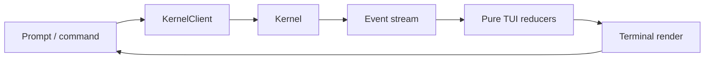

# CLI / TUI Architecture and UX

The TUI is a projection/client of Kernel state, sharing `KernelClient` contracts with headless/ACP. It must never become the durable control plane.

## Layout

Primary transcript stays central. Inspectors are keyboard-toggleable tabs/drawers: **Graph, Activity, Agents, Context, Files/Diff, Terminal/Processes, Browser/Computer, Evidence, Approvals, Resources, Memory/Knowledge, Trace**. At <100 columns inspectors collapse; 80 columns remains usable. `NO_COLOR` and plain transcript modes are supported.

## Interaction principles

- first usable frame does not wait for index/model/resource warmup;
- progressive disclosure: default view concise, inspectors expose internals on demand;
- approvals show normalized action, target, principal, scope/duration and safer alternatives;
- graph nodes show state/attempt/cost/evidence, not hidden reasoning;
- background work emits meaningful state changes rather than spinner noise;
- clickable file links degrade to copyable `path:line` text;
- diff accept/reject maps to WorkspaceTransaction, never raw UI state;
- human takeover visibly identifies control owner.

## Slash/CLI parity

Interactive commands map to stable Kernel APIs: `/plan`, `/goal`, `/graph`, `/context`, `/agents`, `/diff`, `/approvals`, `/process`, `/computer`, `/evidence`, `/trace`, `/compact`, `/rewind`, `/fork`, `/skills`, `/mcp`, `/sandbox`, `/model`, `/doctor`. Headless equivalents use subcommands/flags and versioned JSONL.

## Performance

Render reducers are pure/bounded; high-volume process/model deltas are coalesced; durable semantic events are not dropped. Large transcripts use virtualized/segmented storage and on-demand artifact expansion. Benchmark startup, resize, 10k-event replay and sustained stream render.
