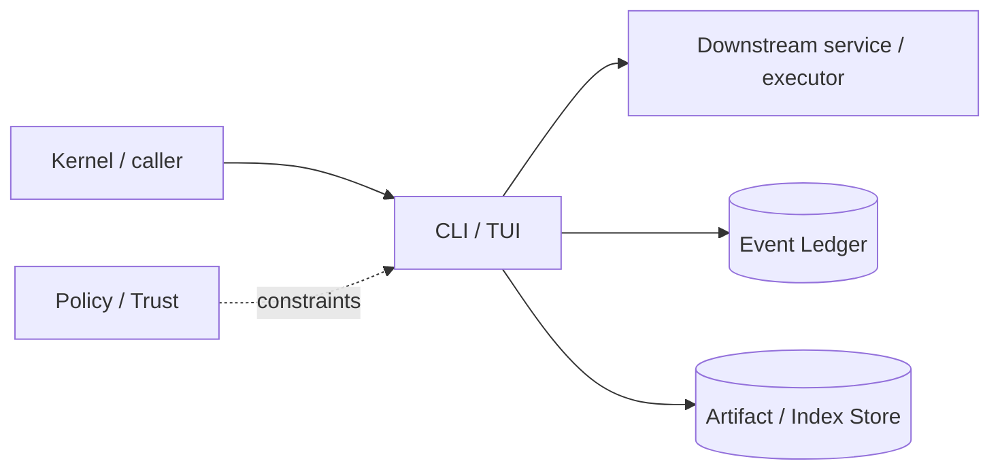

# Architecture — CLI / TUI

## 1. Responsibility

Own all human-facing terminal interaction and command-line entry points while remaining a pure client/projection of Kernel state.

## 2. Boundaries and non-responsibilities

- Does not call providers, filesystems, shell, sandboxes, or MCP directly.
- Does not persist domain state except local UI preferences/history.
- All actions are Kernel commands; all displayed domain state comes from event-derived projections.

## 3. Component architecture

- `CliParser` — clap-based subcommands/flags and environment normalization.
- `TuiApp` — event loop, terminal lifecycle, suspend/resume.
- `UiReducer` — pure `(UiState, KernelEvent) -> UiState`.
- `LayoutEngine` — responsive panel/tab layout at 80/120/200+ columns.
- `TranscriptView` — streaming assistant/tool/event blocks.
- `Composer` — multiline input, @-context picker, slash command palette.
- `ApprovalModal` — normalized risk/capability decision UI.
- `DiffViewer` — file list, intra-line diff, semantic operation metadata, apply/rollback commands.
- `Inspectors` — context, memory, model route, trace, goal/evidence, job/agent state.

### Component diagram description



The diagram is intentionally generic at the boundary: the bullets above are normative component ownership. Cross-module calls MUST use the contracts listed below rather than importing another module's internal storage or implementation types.

## 4. Interfaces and contracts

- Consumes `KernelEventStream` and `SessionProjection`.
- Sends `KernelCommand` (`SubmitPrompt`, `Approve`, `PauseGoal`, `ApplyChangeSet`, etc.).
- Uses `ArtifactReader` only through kernel client for large outputs/diffs.
- ACP/headless frontends share the same command/event contracts but not terminal view types.

Cross-module errors use `ErrorEnvelope` from `crates/protocol`; cancellation is explicit and propagated. Any API that may return more than a small bounded payload MUST return an artifact/cursor reference.

## 5. Data models

- `UiState { route, focused_panel, viewport, composer, modal_stack, cached_projection_version }`
- `UiIntent { Submit, Cancel, OpenPanel, Approve(ApprovalChoice), Apply(ChangeSetId), ... }`
- `RenderBlock` discriminated union for user/assistant/tool/evidence/error/system events.

Canonical shared types belong in `crates/protocol` only when two or more modules need a stable serialized representation. Storage-only fields remain private to this module.

## 6. Main runtime flow

1. Caller submits a typed request with actor/session/trace context.
2. Module validates schema, IDs, preconditions, and cancellation state.
3. If the operation can cause side effects, it obtains/validates a Capability Lease before the side effect.
4. Work is executed with explicit time/output/resource bounds.
5. Large evidence/output is written to Artifact Store and referenced by digest.
6. Durable state changes are appended to Event Ledger before success acknowledgement.
7. Result returns normalized status, evidence references, metrics, and trace ID.

## 7. Failure modes and recovery

- **Terminal resize storms** → debounce layout recompute; never drop input.
- **Kernel disconnect in daemon mode** → enter read-only reconnect screen and replay from last event seq.
- **Malformed event from incompatible daemon** → display protocol error and stop mutating actions.
- **Panic while terminal raw mode active** → panic hook restores terminal before printing crash ID.
- **Huge transcript** → virtualize blocks and lazy-load artifacts.

General rule: transient infrastructure failure may be retried only when the action is proven idempotent or guarded by an idempotency key. Security ambiguity fails closed. Runtime failure of autonomous work pauses/blocks the task rather than pretending completion.

## 8. Security considerations

- Never render secret payloads; honor redaction class before formatting.
- Approval UI MUST show normalized action from broker, not model-supplied prose alone.
- OSC8 links and terminal escape sequences from untrusted output must be sanitized.
- Clipboard writes and opening external URLs are explicit user intents/capabilities.

All attacker-controlled strings are treated as data. A model request, repository file, browser page, MCP result, hook output, or scanner output can never grant itself more privilege.

## 9. Implementation notes

- Use `ratatui` + `crossterm` or equivalent with a strict reducer/render split.
- Stdout in interactive mode belongs to TUI; headless JSONL is a separate frontend.
- Preserve keyboard-only operation and `NO_COLOR`.
- Implement `/context`, `/agents`, `/diff`, `/trace`, `/memory`, `/jobs`, `/models`, `/resume`, `/rewind`, `/goal`, `/policy`, `/sandbox`, `/mcp`, `/plugins`.

### Example code pattern

```rust
pub fn reduce(mut state: UiState, event: &KernelEvent) -> UiState {
    match event {
        KernelEvent::Agent(AgentEvent::StateChanged(e)) => {
            state.agents.insert(e.agent_id, e.state.clone());
        }
        KernelEvent::Approval(ApprovalEvent::Requested(a)) => {
            state.modal_stack.push(Modal::Approval(a.clone()));
        }
        _ => {}
    }
    state
}
```

The example demonstrates the intended boundary/style, not copy-paste-complete production code. Concrete implementation MUST use typed IDs/errors/cancellation and emit trace/event metadata.

## 10. Observability

Every operation SHOULD emit a span with: `trace_id`, `session_id`, actor/agent ID, operation kind, result class, latency, and bounded resource/token counters where applicable. Never use raw prompt/code/secret content as metric labels.

## 11. Tests and acceptance evidence

- [ ] Golden render tests at 80/120/200 columns.
- [ ] Reducer property test: replaying same event sequence yields identical state.
- [ ] Daemon disconnect/reconnect replay test.
- [ ] Escape-sequence sanitization fuzz test.

## 12. Performance expectations

The module MUST define benchmarks for its hot paths before v1 stabilization. Regressions above 15% p95 latency or 10% memory/token overhead on fixed fixtures require explicit review or an accepted trade-off ADR.

## 13. Evolution rules

- Public/wire/event schema changes require `contract-first` skill and compatibility tests.
- Security behavior changes require threat-model update.
- New dependencies/backends require an ADR if they change trust boundary or deployment footprint.
- Do not add frontend-specific behavior to this module; expose state/contracts and let frontends render it.
