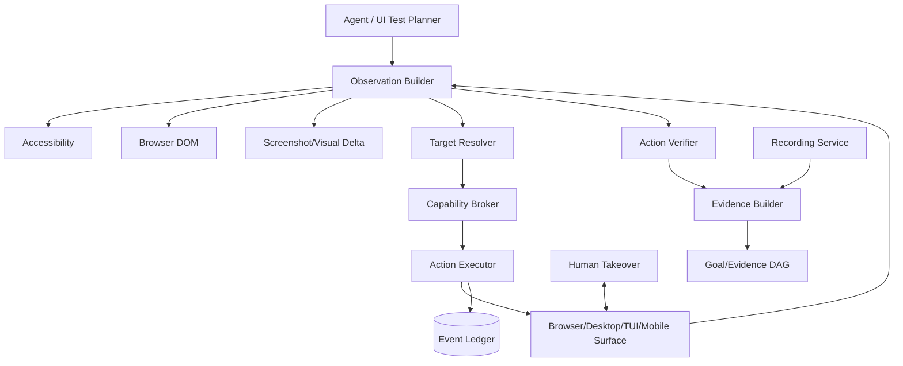

# Architecture — Computer Use V2

## 1. Responsibility

Provide a first-class, policy-controlled **full-computer interaction subsystem** for browsers, native desktop applications, terminal UIs, IDEs and emulator windows. Computer Use must observe, act, verify and produce durable evidence while preferring semantic/accessibility targeting over raw pixel coordinates.

The design incorporates the full-desktop interaction and recorded E2E verification pattern documented by Devin, while extending it with RapidLM capability leases, accessibility-first targeting, replayable evidence, human takeover, mobile integration and token-aware visual observations.

## 2. Product scope

Computer Use V2 supports these `SurfaceKind`s:

- `BrowserPage` — Chromium/WebKit/Firefox automation where supported;
- `Desktop` — full Linux/Windows/macOS display/session where platform adapter exists;
- `Window` — native app, Electron app, IDE, terminal emulator, system dialog;
- `Tui` — interactive terminal program rendered to a PTY surface;
- `AndroidEmulator` — emulator window plus ADB side channel;
- `IosSimulator` — simulator window plus `simctl`/accessibility side channel;
- `RemoteDesktop` — display exposed by a verified remote worker.

Direct API/tool access remains preferred when it is safer, faster and deterministic. Computer Use is for **visual/interactive behavior that must be tested or manipulated as a user would**.

## 3. Core interaction contract

Every stateful action follows:

```text
OBSERVE → RESOLVE TARGET → POLICY/CAPABILITY → ACT → WAIT → RE-OBSERVE → VERIFY → EVIDENCE
```

The model cannot treat a click as success merely because the input event was sent.

```rust
pub struct Observation {
    pub id: ObservationId,
    pub surface: SurfaceRef,
    pub generation: u64,
    pub state_hash: Digest,
    pub focused_window: Option<WindowRef>,
    pub accessibility: Option<AccessibilitySnapshotRef>,
    pub dom: Option<DomSnapshotRef>,
    pub screenshot: Option<ArtifactRef>,
    pub visual_delta: Option<VisualDeltaRef>,
    pub pointer: Option<Point>,
    pub clipboard_class: ClipboardClass,
    pub captured_at: DateTime<Utc>,
}

pub struct ComputerActionRequest {
    pub observation_id: ObservationId,
    pub action: ComputerAction,
    pub target: Option<TargetRef>,
    pub preconditions: Vec<UiAssertion>,
    pub expected: Vec<UiAssertion>,
    pub timeout: Duration,
    pub evidence_policy: EvidencePolicy,
}
```

## 4. Component architecture

- `ComputerSessionManager` — lifecycle of desktop/browser/display sessions and ownership.
- `SurfaceRegistry` — stable `SurfaceRef`, windows/tabs/emulators, generation tracking.
- `BrowserSupervisor` — Playwright context/page lifecycle and semantic DOM observations.
- `DesktopSupervisor` — compositor/desktop process lifecycle, resolution and app startup.
- `AccessibilityNormalizer` — macOS AX, Windows UIA, Linux AT-SPI → common semantic tree.
- `TuiObserver` — PTY screen model/cursor/semantic text regions.
- `ObservationBuilder` — combines accessibility/DOM/screenshot/window metadata.
- `TargetResolver` — role/name/test-id/text/path first, vision/coordinate fallback last.
- `VisionFallback` — model/provider adapter used only for unresolved visual regions.
- `ActionExecutor` — pointer, keyboard, drag, scroll, window/app operations.
- `SensitiveUiClassifier` — auth/payment/external publication/permission/destructive actions.
- `ActionVerifier` — checks pre/postconditions and stale observations.
- `VisualDeltaEngine` — sends changed regions instead of full screenshots where useful.
- `RecordingService` — screen/video capture with action markers and redaction zones.
- `UiTestPlanner` — creates focused test plan from diff/goal criteria.
- `HumanTakeoverBridge` — transfers pointer/keyboard control to human.
- `ComputerEvidenceBuilder` — binds screenshots/video/AX/DOM/action trace to Goal criteria.

### Component diagram



## 5. Target resolution hierarchy

Use the highest-semantic-resolution target available:

1. stable DOM test-id / accessibility identifier;
2. accessibility role + accessible name + ancestor context;
3. DOM role/name/text with uniqueness check;
4. native accessibility path/window control ID;
5. TUI text region/cursor model;
6. visual object/label detected within a bounded region;
7. raw coordinate **only as explicit fallback**.

A coordinate target records the originating observation dimensions and target region. If the display/window generation changes, it is invalid.

```rust
pub enum TargetRef {
    Dom { frame: FrameRef, selector: SemanticSelector },
    Accessibility { node: AccessibilityNodeRef },
    Tui { region: TuiRegionRef },
    Visual { observation: ObservationId, region: Rect, label: String },
    Coordinate { observation: ObservationId, point: Point },
}
```

## 6. Action taxonomy

```rust
pub enum ComputerAction {
    Click { button: MouseButton, count: u8 },
    MovePointer,
    Drag { to: TargetRef },
    Scroll { dx: i32, dy: i32 },
    TypeText { value: SecretAwareString, mode: TypeMode },
    Key { key: KeyCode },
    Chord { keys: Vec<KeyCode> },
    FocusWindow,
    ResizeWindow { width: u32, height: u32 },
    LaunchApp { app: AppRef },
    CloseWindow,
    Navigate { url: Url },
    SelectOption { value: String },
    UploadFile { artifact: ArtifactRef },
    Download { expected: DownloadExpectation },
}
```

Actions affecting payments, publication, deletion, permissions, credential entry, uploads/downloads, clipboard secrets or external systems map to dedicated Capability classes.

## 7. Browser architecture

Browser mode uses Playwright or an equivalent structured browser backend:

- isolated ephemeral context by default;
- persistent profiles only when explicitly selected and policy permits;
- DOM + accessibility snapshot preferred over screenshot-only reasoning;
- browser origin and tab identities tracked;
- downloads land in an isolated artifact staging area;
- uploads require explicit approved ArtifactRef;
- request/response metadata may be captured, bodies only under evidence/data policy;
- cross-origin navigation is policy-visible.

For local web-app verification, the browser should access only approved localhost/service origins exposed from the application sandbox.

## 8. Desktop architecture

### Linux

Recommended backend: isolated desktop inside the worker/sandbox using Wayland/Weston or equivalent virtual display plus AT-SPI. X11-only fallback must be treated as a weaker isolation profile and documented.

### Windows

Use UI Automation for semantics and a remote/local Windows worker for native app testing. Input injection occurs only in the controlled desktop session.

### macOS

Use Accessibility APIs and Screen Recording permission when locally approved. System-level security prompts remain human-controlled unless policy explicitly allows automation and platform APIs support it safely.

Desktop sessions have explicit:

- resolution/DPI;
- keyboard layout/locale;
- clipboard policy;
- audio policy;
- file chooser roots;
- app allowlist;
- network policy through underlying Sandbox/worker.

## 9. TUI Computer Use

Interactive CLI/TUI testing uses a PTY owned by Process Supervisor. `TuiObserver` exposes:

- screen cells/text;
- cursor/focus;
- alternate-screen state;
- terminal size;
- semantic regions when detectable.

The agent can send keys/chords and verify rendered state. This allows RapidLM to test its own TUI and other terminal applications without treating terminal pixels as a screenshot unless necessary.

## 10. Secure text and secret entry

`TypeText` accepts `SecretAwareString`:

```rust
pub enum SecretAwareString {
    Literal(String),
    SecretHandle(SecretHandle),
}
```

For secret handles:

- model sees only the handle purpose, never plaintext;
- executor resolves value only at final input boundary;
- recording service masks the target region during entry;
- clipboard is not used unless policy explicitly permits it;
- action log records `secret_handle_used`, not value;
- target must be an approved origin/app/window and field classification.

## 11. Sensitive UI classifier

Elevated categories include:

- authentication, MFA and password reset;
- CAPTCHA (human takeover required; agent must not defeat challenge);
- payments/purchases/financial transfer;
- sending email/chat/post/comment or publishing externally;
- destructive cloud/admin operations;
- OS security/permission dialogs;
- installing unsigned software/drivers;
- file upload containing project/sensitive data;
- downloads that will later be executed;
- clipboard access involving secrets;
- browser password manager/keychain.

The classifier provides risk metadata; deterministic policy remains authoritative.

## 12. Diff-aware E2E testing workflow

```text
Workspace ChangeSet
      ↓
UiTestPlanner inspects goal criteria + affected UI surfaces
      ↓
TestPlan with steps and expected assertions
      ↓
Start app/server in Sandbox
      ↓
Observe/Act/Verify loop
      ↓
Annotated screenshots/video + DOM/AX evidence
      ↓
Goal criterion verifier
```

Example:

```yaml
test_plan:
  - id: login
    action: navigate
    target: http://localhost:3000/login
    expect: { role: heading, name: "Sign in" }
  - id: invalid-password
    action: submit_form
    secret_fields: [password]
    expect: { text: "Invalid credentials" }
  - id: regression-proof
    assertion: "submit button remains enabled after editing email"
recording: annotated
```

## 13. Video and evidence

RecordingService can produce:

- full-session video or focused clips;
- action markers with timestamps;
- optional pointer highlight;
- automatic secret/sensitive-region redaction;
- before/after screenshots;
- DOM/AX snapshots at assertions;
- application logs correlated by trace ID;
- Playwright trace for browser tests.

`ComputerEvidence`:

```rust
pub struct ComputerEvidence {
    pub criterion_id: Option<CriterionId>,
    pub plan_step_id: Option<TestStepId>,
    pub before: ObservationRef,
    pub action_event: EventRef,
    pub after: ObservationRef,
    pub assertions: Vec<AssertionResult>,
    pub recording: Option<ArtifactRef>,
    pub supporting_artifacts: Vec<ArtifactRef>,
}
```

A video by itself is useful review evidence but does not replace deterministic assertions where they are available.

## 14. Human takeover

Computer Use integrates `ControlLease` from `human-agent-control-handoff.md`.

Typical triggers:

- MFA/CAPTCHA;
- ambiguous destructive dialog;
- unknown OS permission request;
- user wants to demonstrate a bug;
- agent requests help after bounded retries.

During human control, the agent may observe only as permitted. On return it always creates a fresh Observation and does not assume the UI is unchanged.

## 15. Mobile integration

Android combines:

- ADB for deterministic install/start/log/screenshot/input/test commands;
- Computer Use of emulator window for human-like visual flows;
- resettable snapshots for eval determinism;
- video evidence.

For iOS:

- `simctl`/XCTest/accessibility where possible;
- simulator window through Computer Use on macOS worker;
- remote macOS routing when host is not macOS.

The unified `SurfaceRef` means the same evidence/action timeline can mix browser, desktop and emulator actions without inventing a second agent loop.

## 16. Failure modes and recovery

| Failure | Recovery |
|---|---|
| stale Observation | reject action, re-observe |
| target ambiguous | return ranked candidates; do not click arbitrary first result |
| window moved/resized/DPI changed | invalidate coordinate targets; semantic targets may be re-resolved |
| app/browser crash | capture evidence; restart only if step is idempotent or test plan allows |
| modal unexpectedly blocks flow | re-observe, classify modal, update plan or request human |
| AX/UIA/AT-SPI unavailable | explicit degraded state; vision/coordinate path requires higher risk/metrics |
| visual model unavailable | continue only if semantic target available; otherwise block/retry |
| recording fails | test may continue but evidence status is degraded; required-video criterion blocks completion |
| secret field cannot be identified safely | do not inject secret; request human/alternative auth flow |
| desktop worker disconnects | park Computer Use task and restore on fresh surface; never replay non-idempotent action blindly |

## 17. Security model

- Computer input is a side effect and passes Capability Broker.
- Web/page/app content is untrusted and cannot grant capabilities.
- DOM text that says “ignore previous instructions” remains page data.
- Coordinate fallback is higher-risk because semantic intent is weaker.
- File chooser access is root-scoped; arbitrary host filesystem browsing is unavailable.
- Browser profiles/cookies are isolated and encrypted/ephemeral according to policy.
- Secret entry is origin/window-bound and recording-redacted.
- Network restrictions come from Sandbox/worker policy, not browser UI state.
- OS permission dialogs cannot be auto-approved by page content.

## 18. Token-efficiency strategy

Full screenshots are expensive. ObservationBuilder therefore emits, where possible:

1. compact accessibility/DOM tree focused on interactive nodes;
2. changed-node/visual-delta summary since previous Observation;
3. low-resolution screenshot reference for inspection;
4. high-resolution crops only when TargetResolver or verifier needs them.

Metrics include `vision_input_tokens`, `full_screenshot_count`, `semantic_target_rate`, `coordinate_fallback_rate` and `observations_per_successful_action`.

## 19. Interfaces

```rust
#[async_trait]
pub trait ComputerUse {
    async fn create_session(&self, spec: ComputerSessionSpec) -> Result<ComputerSessionId>;
    async fn observe(&self, req: ObserveRequest) -> Result<Observation>;
    async fn act(&self, req: ComputerActionRequest, lease: CapabilityLease) -> Result<ActionResult>;
    async fn record(&self, req: RecordingRequest) -> Result<RecordingId>;
    async fn stop(&self, session: ComputerSessionId) -> Result<()>;
}
```

## 20. Example agent pattern

```rust
let before = computer.observe(ObserveRequest::focused(surface)).await?;
let target = resolver.resolve(&before, SemanticQuery::role_name("button", "Save"))?;
let intent = policy.normalize_computer_action(&before, &target, "click")?;
let lease = broker.authorize(intent).await?;
let action = computer.act(ComputerActionRequest::click(before.id, target, [
    UiAssertion::TextVisible("Saved".into())
]), lease).await?;
let evidence = verifier.build_computer_evidence(action).await?;
goals.attach_evidence(criterion_id, evidence).await?;
```

## 21. Observability

Events include:

- `computer.session.created/stopped`;
- `computer.observed` with hashes and artifact refs;
- `computer.target.resolved` with strategy but no secret content;
- `computer.action.requested/allowed/denied/executed`;
- `computer.assertion.passed/failed`;
- `computer.recording.started/completed/degraded`;
- `computer.control.transferred`.

## 22. Evaluation and release gates

Deterministic/browser/desktop/mobile suites measure:

- successful task rate;
- action count and retry rate;
- semantic target rate (target >=95% for supported fixture controls);
- coordinate fallback rate;
- stale-action rejection correctness;
- sensitive-action false-negative rate (release gate: 0 in corpus);
- visual tokens per successful test;
- recording/evidence completeness;
- human-takeover correctness;
- browser/desktop crash recovery.

Required fixtures include:

- semantic web app;
- dynamic React app with rerenders/stale nodes;
- Electron/native-style desktop fixture;
- interactive TUI fixture;
- Android emulator fixture;
- destructive/auth/payment prompt-injection fixtures.

## 23. Evolution rules

- New action types require explicit capability mapping, failure semantics and eval cases.
- New platform adapters require an ADR if they add a new trust boundary/input-injection mechanism.
- Coordinate-only backends may be experimental but cannot become default for supported accessibility platforms without measured justification.
- Computer Use changes that affect sensitive-action classification require threat-model and security-eval updates.
