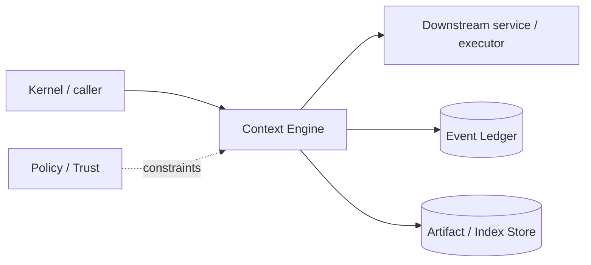

# Architecture — Context Engine

## 1. Responsibility

Maintain a local, incremental, multi-repository representation of source code, symbols, relations, reads, rules, and memory; retrieve and compile the smallest useful context packet for each model step.

## 2. Boundaries and non-responsibilities

- Canonical source is repository/files and durable memory records; indexes are rebuildable.
- Does not decide permissions; policy filters path/repo visibility before retrieval.
- Does not call LLM providers except through an embedding interface supplied by LLM Router or configured local embedder.
- Does not mutate source code.

## 3. Component architecture

- `RepoCatalog` — repository identity, aliases, roots, branch/commit metadata.
- `FileInventory` — path metadata, content hashes, ignore/trust policy.
- `ParsePipeline` — language detection, Tree-sitter parse, symbol/chunk extraction.
- `LspEnricher` — optional definitions/references/types/call hierarchy.
- `LexicalIndex` — SQLite FTS5/BM25.
- `VectorIndex` — rebuildable HNSW/USearch-style index keyed by chunk ID.
- `CodeGraph` — symbols/files/imports/calls/tests/config edges.
- `ReadTracker` — exact ranges/hashes previously shown to each agent/session.
- `MemoryStore` — user/project/session memories with provenance/TTL.
- `HybridRetriever` — candidate generators + score fusion + MMR.
- `ContextCompiler` — token budgets, stable ordering, deduplication, cache-aware packet assembly.

### Component diagram description



The diagram is intentionally generic at the boundary: the bullets above are normative component ownership. Cross-module calls MUST use the contracts listed below rather than importing another module's internal storage or implementation types.

## 4. Interfaces and contracts

- `IndexService::upsert_file(FileSnapshot)` / `remove_file`.
- `SearchService::search(SearchQuery) -> SearchPage`.
- `ReadService::read(ReadRequest) -> ReadResult` with line/range hashes.
- `ContextService::compile(ContextRequest) -> ContextPacket`.
- Consumes workspace change events and project manifest updates.
- Produces evidence references for every retrieved block.

Cross-module errors use `ErrorEnvelope` from `crates/protocol`; cancellation is explicit and propagated. Any API that may return more than a small bounded payload MUST return an artifact/cursor reference.

## 5. Data models

- `Chunk { id, repo_id, path, kind, language, symbol_id?, byte_range, line_range, content_hash, text_hash, embedding_version? }`
- `Symbol { id, fq_name, kind, signature, range, parent_id? }`
- `GraphEdge { from, to, kind, confidence, source }`
- `ReadRecord { session_id, agent_id, chunk/range, content_hash, first_seen_seq, last_seen_seq }`
- `ContextItem { source_ref, text/artifact_ref, estimated_tokens, priority, freshness, reason, trust }`

Canonical shared types belong in `crates/protocol` only when two or more modules need a stable serialized representation. Storage-only fields remain private to this module.

## 6. Main runtime flow

1. Caller submits a typed request with actor/session/trace context.
2. Module validates schema, IDs, preconditions, and cancellation state.
3. If the operation can cause side effects, it obtains/validates a Capability Lease before the side effect.
4. Work is executed with explicit time/output/resource bounds.
5. Large evidence/output is written to Artifact Store and referenced by digest.
6. Durable state changes are appended to Event Ledger before success acknowledgement.
7. Result returns normalized status, evidence references, metrics, and trace ID.

## 7. Failure modes and recovery

- **Parser timeout/error** → store lexical chunks and mark structural confidence degraded.
- **LSP crash** → restart with backoff; continue without enrichment.
- **Vector index corrupt/missing** → rebuild asynchronously; lexical/graph retrieval remains available.
- **Watcher overflow** → content-hash reconciliation scan.
- **Embedding provider unavailable** → skip vector candidate generator, emit degraded metric.
- **Token estimator mismatch** → final tokenizer guard truncates at item boundaries, never mid-schema.

General rule: transient infrastructure failure may be retried only when the action is proven idempotent or guarded by an idempotency key. Security ambiguity fails closed. Runtime failure of autonomous work pauses/blocks the task rather than pretending completion.

## 8. Security considerations

- Apply ignore/path policy before reading content into index.
- .gitignored is not a security boundary; dedicated `.rapidlmignore` and policy are.
- Mark repo/web/MCP text as untrusted data; never elevate retrieved instructions above configured rule scope.
- Memory writes require explicit runtime tool and provenance; model cannot overwrite org/system rules via memory.
- Encrypt sensitive local memory/index fields when policy requires.

All attacker-controlled strings are treated as data. A model request, repository file, browser page, MCP result, hook output, or scanner output can never grant itself more privilege.

## 9. Implementation notes

- Tier-1 parsers are explicit Cargo features; unsupported languages use line/paragraph chunking.
- Chunk identity derives from repo stable ID + path + structural locator + content hash.
- Use weighted reciprocal-rank fusion then MMR. Suggested initial weights: explicit 1.0, symbol 0.85, lexical 0.75, vector 0.70, graph 0.65, recency/read-delta 0.35; tune only through eval.
- Read tracking can send a short unchanged reference instead of resending exact code when provider/prompt semantics permit.

### Example code pattern

```rust
pub fn fuse(mut candidates: Vec<Candidate>, cfg: &RankConfig) -> Vec<Candidate> {
    for c in &mut candidates {
        c.score = cfg.weight(c.source) * reciprocal_rank(c.rank)
            + cfg.explicit_boost(c.explicit)
            + cfg.freshness_boost(c.freshness);
    }
    mmr_deduplicate(candidates, cfg.lambda, cfg.max_items)
}
```

The example demonstrates the intended boundary/style, not copy-paste-complete production code. Concrete implementation MUST use typed IDs/errors/cancellation and emit trace/event metadata.

## 10. Observability

Every operation SHOULD emit a span with: `trace_id`, `session_id`, actor/agent ID, operation kind, result class, latency, and bounded resource/token counters where applicable. Never use raw prompt/code/secret content as metric labels.

## 11. Tests and acceptance evidence

- [ ] Golden retrieval corpus with labeled relevant symbols/files.
- [ ] Incremental index test proves one-file edit touches only affected chunks/edges.
- [ ] Offline mode eval with embeddings disabled.
- [ ] Context packet token accounting within ±2% of provider tokenizer on fixtures.
- [ ] Prompt-injection retrieval tests verify trust labels and policy precedence.

## 12. Performance expectations

The module MUST define benchmarks for its hot paths before v1 stabilization. Regressions above 15% p95 latency or 10% memory/token overhead on fixed fixtures require explicit review or an accepted trade-off ADR.

## 13. Evolution rules

- Public/wire/event schema changes require `contract-first` skill and compatibility tests.
- Security behavior changes require threat-model update.
- New dependencies/backends require an ADR if they change trust boundary or deployment footprint.
- Do not add frontend-specific behavior to this module; expose state/contracts and let frontends render it.

## V2 addendum — Knowledge and multi-agent context economics

V2 adds `KnowledgeRegistry` as a separate retrieval source. The Context Compiler receives approved Knowledge hits with trigger reasons, freshness and independent token budget; Knowledge never becomes policy authority.

For managed agents, context construction is **task-scoped**:

```text
TaskEnvelope
+ applicable system/project rules
+ goal criterion/evidence dependencies
+ selected code/context
+ approved Knowledge
+ parent-provided explicit artifacts
- unrelated parent transcript
```

The compiler tracks duplication across sibling agents and reports `cross_agent_duplicate_tokens`. Persistent background agents maintain compact durable summaries/read-sets so the coordinator can reuse discovery without re-sending raw source repeatedly.
