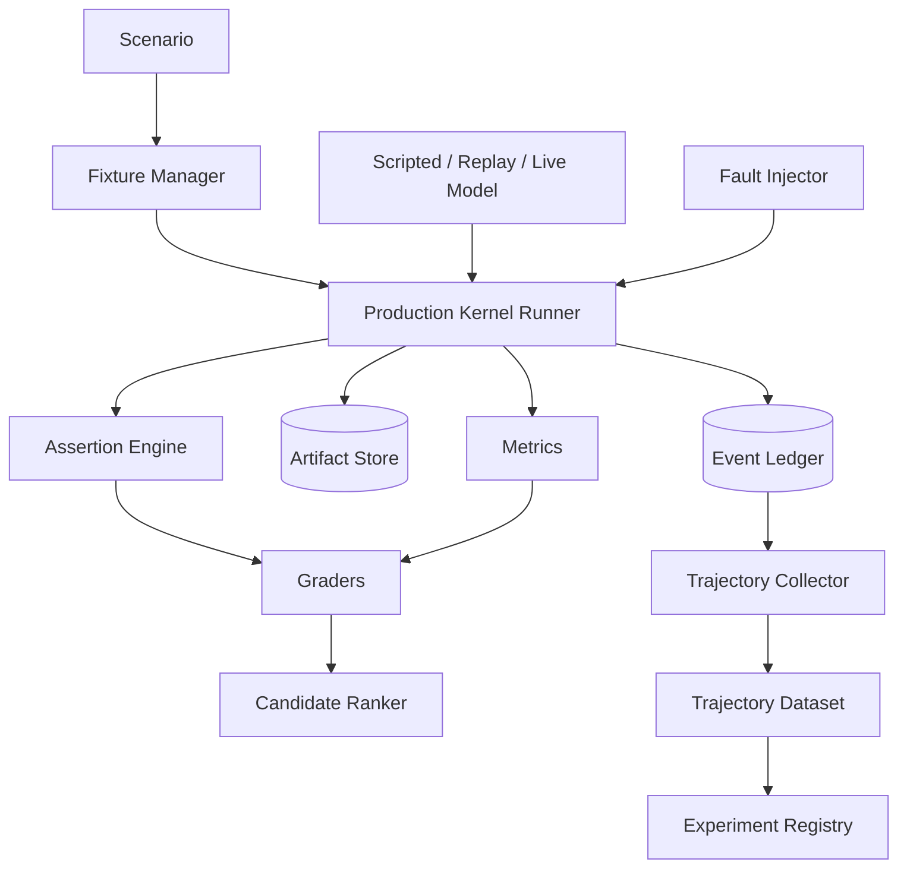

# Architecture — Evaluation and Agent Harness V2

## 1. Responsibility

Provide the **production-compatible flight simulator, regression framework and learning-data factory** for RapidLM. The harness evaluates the same kernel, tools, policy, sandbox, Context Engine, agent scheduler and Computer Use contracts used in production. It supports deterministic scripted runs, exact replay, model-live experiments, long-horizon endurance and privacy-governed trajectory generation.

Muse Code's published harness/model co-training is a major V2 inspiration: the harness must not be a thin test wrapper. It is a core system for optimizing the agent runtime.

## 2. Two meanings of “agent harness”

### Production Agent Harness

The production path that runs an agent loop:

```text
Goal/Task → Prompt Runtime → LLM Router → Tool Gateway → Capability Broker
→ Context/Workspace/Sandbox/Computer Use → Event Ledger → Evidence → continue/block/complete
```

### Eval Harness

A controller that instantiates the **same production graph** under a versioned Scenario and measures correctness, safety, cost and efficiency. Eval code cannot replace production policy with permissive mocks unless a scenario explicitly tests a mocked layer.

## 3. Component architecture

- `ScenarioRegistry` — immutable YAML/JSON case definitions and suite metadata.
- `FixtureManager` — content-addressed repositories, service images, browser apps, desktop images and mobile snapshots.
- `ScriptedModel` — deterministic response/tool sequence.
- `ReplayProvider` — recorded model boundary stream for contract replay.
- `LiveProvider` — real LLM Router with experiment pinning.
- `KernelRunner` — in-process/daemon/remote production kernel execution.
- `FaultInjector` — crash, network, provider, worker, sandbox and persistence failures.
- `AssertionEngine` — event, file, patch, process, policy, evidence, browser/desktop/mobile and artifact assertions.
- `MetricCollector` — task success, tokens, cost, latency, context efficiency, tool actions, approvals, agent topology and privilege exposure.
- `DeterministicGraders` — tests/lint/build/scanners/diff/evidence/property checks.
- `JudgeAdapter` — optional LLM rubric grading only where deterministic grading is insufficient.
- `TrajectoryCollector` — observable production events + artifacts under data policy.
- `CandidateRanker` — pairwise/multi-objective comparison, rejection sampling.
- `TaskEnvironmentGenerator` — optional synthetic challenge generation with hidden verifier.
- `ExperimentRegistry` — baseline/candidate versions, seeds, suite splits and promotion decisions.
- `FailureBundler` — minimum artifact set needed to reproduce.



## 4. Scenario contract

```yaml
apiVersion: rapidlm.eval/v2
id: RLM-E2E-AUTH-001
fixture:
  repo: sha256:...
  services: [auth-db-v2]
mode: goal
prompt: |
  Replace legacy auth with the new verifier and prove the UI still logs in.
model:
  policy: coding-standard-v4
policy:
  profile: isolated
agents:
  max_workers: 4
  persistent_roles: [explorer, context_curator]
budgets:
  max_tokens: 150000
  max_cost_usd: 2.0
  max_wall_time: 20m
faults: []
assertions:
  - event: goal.completed
  - command: { argv: ["cargo", "test", "--workspace"], exit_code: 0 }
  - evidence: { criterion: ui-login, kind: computer_use, required: true }
  - security: { bypasses: 0 }
metrics:
  - total_tokens
  - context_tokens
  - repeated_read_tokens
  - tool_calls
  - computer_actions
  - semantic_target_rate
  - approvals
  - cost_usd
```

## 5. Deterministic model pattern

```rust
let model = ScriptedModel::builder()
    .step(tool("repo.search", json!({"query":"verifyToken"})))
    .step(tool("repo.read", json!({"path":"src/auth.rs"})))
    .step(tool("workspace.patch", patch_fixture("auth-v2.patch")))
    .step(tool("shell.exec", json!({"argv":["cargo","test"]})))
    .step(goal_update("complete"))
    .build();
```

The harness can assert the exact observable event digest. This tests runtime sequencing without spending model tokens.

## 6. Exact replay

Replay fidelity covers:

- model request/response stream boundary;
- tool request/result envelope;
- policy decision inputs/results;
- workspace preimage/change hashes;
- event ordering and projection state;
- artifact digests;
- Computer Use observations/actions where fixture supports deterministic rendering.

External side effects are not replayed blindly. Replay mode uses recorded results or idempotent fixture services.

## 7. Multi-agent evaluation

Scenarios can assert:

- clean TaskEnvelope does not copy irrelevant parent transcript;
- persistent background agents reduce redundant searches;
- sibling writers use separate views;
- scheduler obeys dependencies and concurrency;
- per-agent budget exhaustion behaves correctly;
- child result/evidence is validated before integration;
- coordinator can recover after child/parent crash;
- conflict resolution is explicit.

Metrics include `spawn_count`, `parallel_efficiency`, `duplicate_context_tokens_across_agents`, `merge_conflict_cost`, `agent_idle_time`, `coordinator_overhead_tokens`.

## 8. Computer Use evaluation

Computer-use scenarios run against deterministic surfaces wherever possible:

- local semantic web fixtures;
- dynamic DOM/rerender fixtures;
- virtual Linux desktop fixture app;
- PTY/TUI fixture;
- Android emulator clean snapshot;
- remote Windows/macOS workers for platform-specific suites.

Assertions cover semantic target selection, stale-state rejection, sensitive-action gating, video/evidence completeness, human takeover and replay.

## 9. Long-horizon endurance

The harness must support 1h/4h/12h/24h runs with configurable minimum tool-call counts. Fault schedules intentionally inject restart, compaction, model throttling, worker migration and flaky dependencies.

The release endurance report includes:

- constraint retention;
- goal/evidence consistency;
- repeated discovery rate over time;
- compaction loss rate;
- session recovery fidelity;
- background-agent memory drift;
- cost/token slope;
- unverified completion attempts;
- tool-call failure/retry amplification.

## 10. Trajectory generation and candidate ranking

After grading, eligible runs produce `TrainingTrajectory` artifacts. Candidate configurations are ranked by a vector, not one score:

```text
hard gates: correctness, security, required evidence
then optimize: tokens, cost, latency, tool count, approval count, context precision
```

Rejection sampling can retain high-quality trajectories for prompt/context/router/specialist-model development. Production user data remains excluded unless explicit data policy permits it.

## 11. Statistical discipline

- Pair baseline and candidate on the same case/seed where possible.
- Use repeated live-model trials for stochastic cases.
- Report confidence intervals and raw counts.
- Separate infrastructure failure from agent failure.
- Do not promote on aggregate score if any hard security gate regresses.
- Keep hidden held-out suites to prevent benchmark overfitting.

## 12. Failure modes

| Failure | Behavior |
|---|---|
| fixture checksum mismatch | abort case as invalid |
| non-deterministic dependency in deterministic suite | classify harness failure |
| judge disagreement | report uncertainty; deterministic gates retain authority |
| runner timeout | capture trace/process tree/artifacts then teardown |
| video recorder failure | mark evidence degraded; required recording assertion fails |
| fault injector corrupts beyond declared boundary | case invalid, not agent failure |
| trajectory privacy label missing | local-only quarantine; no export |

## 13. Security

- All malicious fixtures run at their declared sandbox tier.
- Synthetic credentials only.
- External network is absent unless explicitly part of a live test.
- Harness does not contain a bypass path around Capability Broker.
- Prompt-injection suites include repository text, shell output, web/desktop UI, MCP results and plugin content.
- GUI fixtures include fake payment, password, permission and destructive dialogs to ensure policy gates hold.

## 14. Release metrics

Minimum suite metrics:

- task success / verified completion;
- security violations (must be 0 in release corpus);
- tokens per verified task;
- repeated unchanged code tokens;
- context precision/recall;
- cost per verified task;
- p50/p95 latency;
- tool calls / retries;
- approval count and requested privilege width;
- multi-agent parallel efficiency;
- Computer Use semantic-target and coordinate-fallback rates;
- crash/handoff recovery success;
- flake rate.

## 15. Acceptance evidence

- scripted run produces byte-stable observable event digest;
- V1 replay fixtures remain readable;
- harness detects an injected 20% token regression at equal correctness;
- managed-agent scenario proves isolated writer views;
- handoff fault injection proves no split-brain writer;
- Computer Use fixture catches an attempted stale coordinate click;
- long-horizon runner completes >=1,000 tool-call test with injected restart and preserves goal constraints;
- privacy-disallowed trajectory cannot leave local artifact store.
