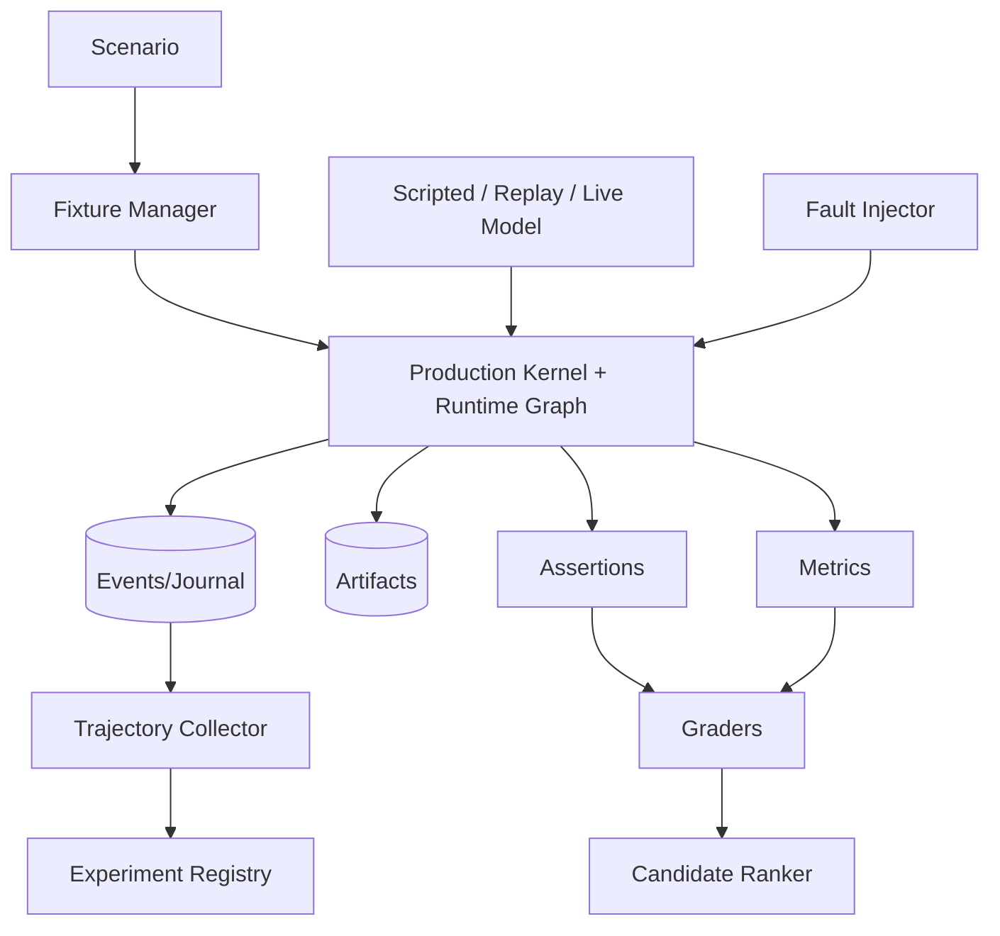

# Evaluation and Agent Harness — Flight Simulator and Learning Infrastructure

## 1. Principle

Evals execute the **same production kernel, Runtime Graph, Tool Gateway, policy, context, workspace, sandbox and Computer Use contracts**. Eval-only shortcuts may inject fixtures/models/faults but cannot silently bypass production semantics.

## 2. Components

- `ScenarioRegistry` — versioned YAML/JSON scenarios.
- `FixtureManager` — CAS repos/services/browser apps/desktop/mobile snapshots.
- `ScriptedModel` — deterministic model/tool streams.
- `ReplayProvider` — replays recorded model boundary data.
- `LiveProvider` — real Router under experiment pins.
- `KernelRunner` — in-process/daemon/remote modes.
- `FaultInjector` — process/provider/network/persistence/sandbox/worker/handoff/resource/credential/preview faults.
- `AssertionEngine` — events, graph, files, transactions, policy, process, evidence, browser/mobile/artifact assertions.
- `MetricCollector` — correctness, safety, tokens/cost, context, tool repair, graph behavior, resources.
- `DeterministicGraders` — tests/build/lint/scanners/goldens/properties.
- `JudgeAdapter` — optional rubric model after deterministic gates.
- `TrajectoryCollector` — observable events/context selections/actions/evidence; no hidden reasoning requirement.
- `CandidateRanker` / `ExperimentRegistry` — baseline/candidate, held-out splits, promotion decisions.
- `FailureBundler` — minimal reproducible trace/artifact bundle.

## 3. Required suite families

1. graph IR/scheduler/revision/invalidation;
2. context retrieval/coverage/freshness/token efficiency;
3. tool schemas/repair/cross-tool invariants/open-model robustness;
4. agent delegation/role/tool projection/model routing;
5. goals/evidence/false completion/independent verification;
6. workspace/semantic patch/conflict/rewind;
7. policy/sandbox/secret/prompt injection/egress;
8. process/background monitors/cron/resource pools;
9. browser/desktop/TUI/mobile/preview/human takeover;
10. headless JSONL/ACP/MCP/hooks/WASM compatibility;
11. crash/restart/handoff/remote worker chaos;
12. TUI usability/performance;
13. long-horizon 1h/4h/12h/24h, including >=1,000 tool calls.

## 4. Harness metrics

North-star: verified success per 1M tokens. Supporting: false-completion rate, tool-invalid/repair rate by model×tool, valid-input repair mutation (must be zero), turns to recover tool error, repeated-read ratio, duplicate/stale context tokens, retrieval evidence recall, graph replan success, unnecessary node/spawn rate, merge conflicts, polling turns avoided, time-to-first-useful-action, approval count, capability exposure, crash recovery, uncertain-effect resolution, Computer Use action efficiency, cost/latency.

## 5. Preference and learning

Explicit accept/reject/edit feedback and repeated review outcomes may produce `PreferenceCandidate`s. Promotion to active preference requires sufficient evidence/confidence and retains source/scope/decay. Harness evaluates whether preference use improves held-out tasks without violating rules. Session Insights can propose experiments; it never silently changes production prompts/router/context.

## 6. Release gate philosophy

A higher aggregate benchmark cannot compensate for a security bypass, data loss, duplicate external effect, false completion or required-platform regression. Hard correctness/security gates run before weighted quality ranking.
