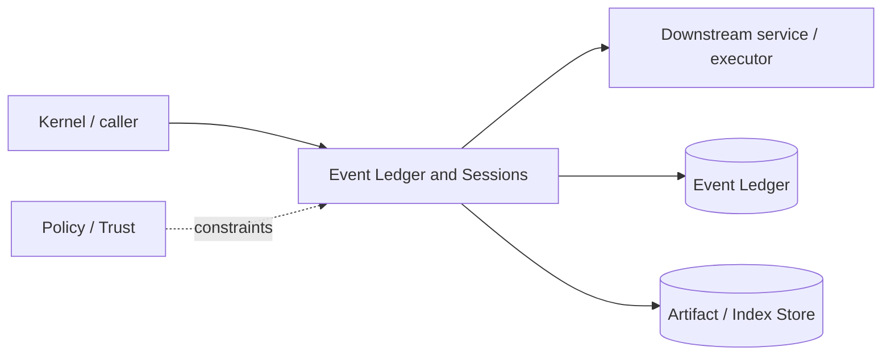

# Architecture — Event Ledger and Sessions

## 1. Responsibility

Persist append-only session/security events, transactional projections, snapshots, artifacts references, and recovery metadata so every frontend can resume/replay consistently.

## 2. Boundaries and non-responsibilities

- SQLite is primary local durability; JSONL is export/transport.
- Ledger stores event facts, not arbitrary mutable service blobs.
- Large binary/text payloads go to Artifact Store and events hold digests/metadata.

## 3. Component architecture

- `EventStore` — append/query sequence.
- `ProjectionStore` — transactional materialized views for fast startup.
- `Snapshotter` — periodic projection checkpoints.
- `ArtifactStore` — content-addressed blobs with metadata/redaction.
- `SessionIndex` — titles/workspace/status/search metadata.
- `ReplayEngine` — rebuild projection.
- `MigrationManager` — DB and event schema migration.

### Component diagram description



The diagram is intentionally generic at the boundary: the bullets above are normative component ownership. Cross-module calls MUST use the contracts listed below rather than importing another module's internal storage or implementation types.

## 4. Interfaces and contracts

- `append(session, expected_seq, events) -> committed_range`.
- `stream(session, from_seq)`.
- `load_projection(session)`.
- `put_artifact(bytes, metadata) -> ArtifactId`.
- Kernel is the only normal writer; read-only tooling can inspect.

Cross-module errors use `ErrorEnvelope` from `crates/protocol`; cancellation is explicit and propagated. Any API that may return more than a small bounded payload MUST return an artifact/cursor reference.

## 5. Data models

- SQLite tables documented in `data-models/sqlite-schema.sql.md`.
- Event envelope in `data-models/event-schema.md`.
- `SessionRecord { id, project, created, updated, title, archived, last_seq, schema }`.

Canonical shared types belong in `crates/protocol` only when two or more modules need a stable serialized representation. Storage-only fields remain private to this module.

## 6. Main runtime flow

1. Caller submits a typed request with actor/session/trace context.
2. Module validates schema, IDs, preconditions, and cancellation state.
3. If the operation can cause side effects, it obtains/validates a Capability Lease before the side effect.
4. Work is executed with explicit time/output/resource bounds.
5. Large evidence/output is written to Artifact Store and referenced by digest.
6. Durable state changes are appended to Event Ledger before success acknowledgement.
7. Result returns normalized status, evidence references, metrics, and trace ID.

## 7. Failure modes and recovery

- **Expected sequence mismatch** → optimistic concurrency error; caller reloads.
- **SQLite busy** → bounded retry with busy timeout; never drop event.
- **Disk full** → stop accepting state-mutating commands, keep read-only UI alive.
- **Checksum mismatch/corruption** → quarantine DB/artifact, enter recovery mode.
- **Migration failure** → restore pre-migration backup.

General rule: transient infrastructure failure may be retried only when the action is proven idempotent or guarded by an idempotency key. Security ambiguity fails closed. Runtime failure of autonomous work pauses/blocks the task rather than pretending completion.

## 8. Security considerations

- Artifact redaction/encryption class is immutable metadata.
- Filesystem permissions restrict local DB to user.
- Do not persist raw secret values in events.
- Session export applies redaction and explicit include-sensitive flag.

All attacker-controlled strings are treated as data. A model request, repository file, browser page, MCP result, hook output, or scanner output can never grant itself more privilege.

## 9. Implementation notes

- WAL mode, foreign keys, busy timeout, durable `synchronous` setting appropriate to platform.
- Projection tables are caches derivable from events but updated in same transaction for ordinary writes.
- Checkpoint every N events/size threshold, not every turn blindly.

### Example code pattern

```rust
pub fn append_tx(conn: &mut Connection, sid: SessionId, expected: u64, events: &[NewEvent]) -> Result<SeqRange> {
    let tx = conn.transaction()?;
    ensure_last_seq(&tx, sid, expected)?;
    let range = insert_events(&tx, sid, expected, events)?;
    apply_projection_updates(&tx, events)?;
    tx.commit()?;
    Ok(range)
}
```

The example demonstrates the intended boundary/style, not copy-paste-complete production code. Concrete implementation MUST use typed IDs/errors/cancellation and emit trace/event metadata.

## 10. Observability

Every operation SHOULD emit a span with: `trace_id`, `session_id`, actor/agent ID, operation kind, result class, latency, and bounded resource/token counters where applicable. Never use raw prompt/code/secret content as metric labels.

## 11. Tests and acceptance evidence

- [ ] Replay equals projection hash.
- [ ] Disk-full fault injection.
- [ ] Migration fixtures from every released schema.
- [ ] Concurrent expected-seq conflict test.
- [ ] Artifact digest corruption detection.

## 12. Performance expectations

The module MUST define benchmarks for its hot paths before v1 stabilization. Regressions above 15% p95 latency or 10% memory/token overhead on fixed fixtures require explicit review or an accepted trade-off ADR.

## 13. Evolution rules

- Public/wire/event schema changes require `contract-first` skill and compatibility tests.
- Security behavior changes require threat-model update.
- New dependencies/backends require an ADR if they change trust boundary or deployment footprint.
- Do not add frontend-specific behavior to this module; expose state/contracts and let frontends render it.
