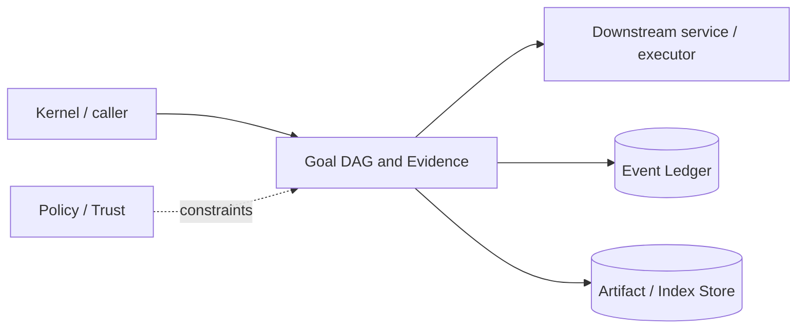

# Architecture — Goal DAG and Evidence

## 1. Responsibility

Represent autonomous work as durable goals with explicit completion criteria, dependencies, budgets, stop states, evidence, verification, and change attribution.

## 2. Boundaries and non-responsibilities

- Only main agent/user/system goal controller can mutate top-level goal lifecycle.
- Subagents own child task state and return evidence/results.
- Completion is a runtime predicate, not a model statement.

## 3. Component architecture

- `GoalController` — create/replace/pause/resume/cancel/update.
- `GoalDriver` — one turn at a time while active.
- `BudgetTracker` — turns/tokens/active time/cost.
- `GoalGraph` — child tasks and dependency edges.
- `EvidenceStore` — typed proof nodes.
- `CriterionEvaluator` — deterministic criterion/evidence checks.
- `Attestor` — final goal/session summary of changes, models, tokens, cost, verification.

### Component diagram description



The diagram is intentionally generic at the boundary: the bullets above are normative component ownership. Cross-module calls MUST use the contracts listed below rather than importing another module's internal storage or implementation types.

## 4. Interfaces and contracts

- `create_goal`, `update_goal`, `set_budget`, `record_evidence`.
- Consumes usage events from LLM Router, active intervals from Kernel, verification results from harness/workspace/scanners.
- Emits `goal.updated`, `goal.blocked`, `goal.completed`, `goal.cleared`, evidence events.

Cross-module errors use `ErrorEnvelope` from `crates/protocol`; cancellation is explicit and propagated. Any API that may return more than a small bounded payload MUST return an artifact/cursor reference.

## 5. Data models

- `GoalStatus = active|paused|blocked`; completion is event/archive state.
- `Criterion { id, text, kind, required_evidence_types, evaluator, status }`
- `Evidence { id, kind, subject_ref, artifact_ref?, result, freshness, producer, command/tool, timestamp }`
- Edges: `decomposes_to`, `depends_on`, `blocked_by`, `verified_by`, `produced_change`, `supersedes`.

Canonical shared types belong in `crates/protocol` only when two or more modules need a stable serialized representation. Storage-only fields remain private to this module.

## 6. Main runtime flow

1. Caller submits a typed request with actor/session/trace context.
2. Module validates schema, IDs, preconditions, and cancellation state.
3. If the operation can cause side effects, it obtains/validates a Capability Lease before the side effect.
4. Work is executed with explicit time/output/resource bounds.
5. Large evidence/output is written to Artifact Store and referenced by digest.
6. Durable state changes are appended to Event Ledger before success acknowledgement.
7. Result returns normalized status, evidence references, metrics, and trace ID.

## 7. Failure modes and recovery

- **Provider/runtime error during active goal** → pause with technical reason.
- **Real external/user dependency** → blocked.
- **Budget reached** → blocked with budget reason.
- **Crash/restart active** → paused(process_recovered).
- **Stale evidence after relevant file change** → criterion returns unsatisfied until rerun.

General rule: transient infrastructure failure may be retried only when the action is proven idempotent or guarded by an idempotency key. Security ambiguity fails closed. Runtime failure of autonomous work pauses/blocks the task rather than pretending completion.

## 8. Security considerations

- Goal text is untrusted user data relative to system/policy and cannot alter permissions.
- Evidence artifact redaction still applies.
- Subagents cannot call top-level lifecycle tools.
- Completion evaluator never treats skipped/error scanner as pass.

All attacker-controlled strings are treated as data. A model request, repository file, browser page, MCP result, hook output, or scanner output can never grant itself more privilege.

## 9. Implementation notes

- Inject goal reminder at turn boundaries, not every model step.
- At ≥75% of any configured budget, prompt compiler adds converge guidance.
- Cancel clears active goal and emits context invalidation marker so old reminders are not honored.
- Forked session does not inherit active goal by default.

### Example code pattern

```rust
pub fn can_complete(goal: &Goal, graph: &EvidenceGraph) -> CompletionCheck {
    let results = goal.criteria.iter().map(|c| evaluate(c, graph)).collect::<Vec<_>>();
    CompletionCheck { allowed: results.iter().all(|r| r.satisfied), results }
}
```

The example demonstrates the intended boundary/style, not copy-paste-complete production code. Concrete implementation MUST use typed IDs/errors/cancellation and emit trace/event metadata.

## 10. Observability

Every operation SHOULD emit a span with: `trace_id`, `session_id`, actor/agent ID, operation kind, result class, latency, and bounded resource/token counters where applicable. Never use raw prompt/code/secret content as metric labels.

## 11. Tests and acceptance evidence

- [ ] Active goal restores paused after crash.
- [ ] Budget accounting excludes paused time.
- [ ] Stale evidence invalidation test.
- [ ] Subagent top-level update denied.
- [ ] Completion impossible with missing mandatory proof.

## 12. Performance expectations

The module MUST define benchmarks for its hot paths before v1 stabilization. Regressions above 15% p95 latency or 10% memory/token overhead on fixed fixtures require explicit review or an accepted trade-off ADR.

## 13. Evolution rules

- Public/wire/event schema changes require `contract-first` skill and compatibility tests.
- Security behavior changes require threat-model update.
- New dependencies/backends require an ADR if they change trust boundary or deployment footprint.
- Do not add frontend-specific behavior to this module; expose state/contracts and let frontends render it.
