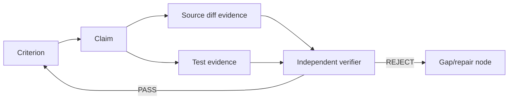

# Goals, Evidence and Verification

## Goal contract

A durable Goal expresses the end state, proof, boundaries and stop rule. Budgets are explicit/opt-in unless organization/automation policy supplies them. Goal lifecycle preserves V2 semantics: active, paused, blocked; completion is terminal event/graph state. After process recovery, previously active user-launched autonomous goals park paused.

```rust
pub struct GoalContract {
    pub statement: String,
    pub criteria: Vec<Criterion>,
    pub boundaries: Vec<Boundary>,
    pub proof_policy: ProofPolicy,
    pub budgets: GoalBudgets,
    pub stop_rules: Vec<StopRule>,
}
```

## Evidence graph

A Criterion is satisfied by Claims. Claims are supported/contradicted by Evidence. Evidence has provenance, revision/freshness, source trust and observation method. Verification edges record an oracle/verifier verdict against claim/criterion and the exact evidence set.



## Completion candidate

Models can emit `CompletionCandidate { criterion_claims, evidence_refs, residual_risks }`. Host runs `GoalCompletionGate`. Proof-required goals use a fresh verifier context containing contract + relevant diff/evidence, not the coder's self-justification transcript.

## Freshness

Changing a code/config/runtime dependency referenced by evidence marks that evidence stale and recursively invalidates verification/criterion satisfaction. A historical PASS remains audit history but cannot satisfy the current graph revision.

## Verification hierarchy

Prefer: repository-native tests/static analyzers/typecheck/build → deterministic domain probes → independent differential/golden tests → structured browser/mobile assertions → security scanners → separate rubric model only where deterministic proof is unavailable. Visual proof never overrides a failing required deterministic assertion.

## Goal UX

`rapid goal create|show|pause|resume|cancel|budget|evidence|verify`. `/goal` TUI card displays criteria, evidence freshness, budgets, current graph branch, blockers and independent verifier history.
