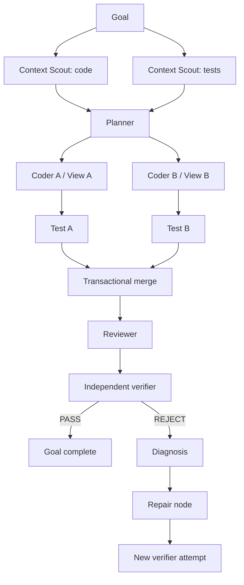
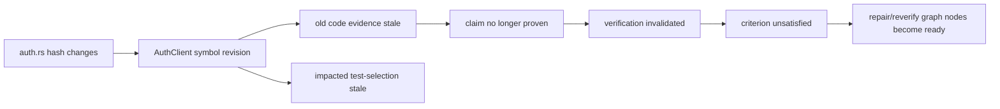

# Graph Engineering — RapidLM V3 Production Specification

## 1. Purpose

The Runtime Graph is the **host-owned execution IR** for autonomous work. It replaces the V2 mental model in which a coordinator/agent loop was the orchestration center. Agent loops remain useful, but only as node executors. The graph exists so execution can be parallel, durable, inspectable, invalidatable and independently verifiable without relying on a model remembering workflow state.

## 2. Graph families

RapidLM exposes one logical Graph Fabric but uses specialized physical projections:

1. **Runtime Graph** — tasks, agents, tools, processes, waits, approvals, retries and dependencies.
2. **Goal Graph** — goal/criterion structure and completion obligations.
3. **Context/Knowledge Graph** — files, symbols, imports/calls/tests/config/decisions and retrieval relations.
4. **Workspace Graph** — views, transactions, file/symbol revisions and change attribution.
5. **Evidence Graph** — claims, sources, artifacts, provenance and contradiction.
6. **Verification Graph** — independent oracle/verifier verdicts and criterion coverage.
7. **Preference Graph** — soft learned tendencies with confidence/scope/decay.

They share typed IDs/refs but are not forced into one graph database. SQLite/event projections + specialized in-memory/FTS/vector indexes are the default until measurement proves another store is necessary.

## 3. Canonical graph contracts

```rust
pub struct Node {
    pub id: NodeId,
    pub kind: NodeKind,
    pub state: NodeState,
    pub inputs: Vec<TypedRef>,
    pub outputs: Vec<TypedRef>,
    pub capabilities: Vec<CapabilityRequest>,
    pub resource_spec: Option<ResourceSpec>,
    pub workspace: Option<WorkspaceRequirement>,
    pub context_need: Option<InformationNeed>,
    pub budget: NodeBudget,
    pub retry: RetryPolicy,
    pub idempotency: IdempotencyClass,
    pub evidence_obligations: Vec<EvidenceObligation>,
}

pub struct Edge {
    pub from: NodeId,
    pub to: NodeId,
    pub kind: EdgeKind,
    pub condition: Option<EdgeCondition>,
    pub created_revision: u64,
}
```

Required states: `Pending, Ready, Running, Waiting, Blocked, Succeeded, Failed, Cancelled, Superseded, Invalidated`.

## 4. Proposal vs authority

A planner/model emits `GraphProposal { base_revision, add_nodes, add_edges, supersede, invalidate, rationale_refs }`. Host validation rejects:
- schema-invalid nodes/edges;
- dependency cycles in executable dependency edges;
- write-sharing conflicts;
- capability/resource requirements above policy ceiling;
- budget overflow;
- invalid refs/stale base revision;
- completion paths lacking required verification;
- unbounded shard/traversal fan-out.

The host may normalize IDs/default safe metadata, but never invent semantic task intent that changes user scope.

## 5. Scheduling

The scheduler computes readiness from dependency conditions + resource availability + workspace locks + policy/approval state + budgets. Deterministic tie-breaking is required for replay tests. Runtime may use weighted fairness for concurrent runs while preserving per-run dependency semantics.



## 6. Revisioning and repair

Graph revision N is immutable. Revision N+1 may add nodes, add edges, supersede failed strategy nodes, invalidate stale results and update non-historical scheduling metadata through events. A logical node can have multiple `NodeAttempt`s; retry history is never collapsed.

Repair/replan should be **localized**: only affected subgraphs are replaced. Global replan requires an explicit reason (goal change, foundational assumption invalidation, broad conflict).

## 7. Invalidation engine

Invalidation triggers include:
- file/symbol content hash change;
- workspace base revision change;
- config/dependency lock change;
- expired external evidence/credential/resource;
- failed verifier contradicting a claim;
- computer surface generation change;
- superseded decision/requirement;
- user goal/criterion change.

Propagation is bounded and typed. Example:



## 8. Waiting and interruption nodes

Approvals, AskUser, process monitors, cron times and external callbacks are `Waiting` nodes with durable resume tokens/conditions. They do not occupy a model turn while waiting. Pending continuation metadata is persisted without serializing hidden reasoning.

## 9. Graph observability

Required commands/TUI operations:
- `rapid graph show [run]`;
- `rapid graph watch`;
- `rapid graph diff <revA> <revB>`;
- `rapid graph why-ready <node>`;
- `rapid graph why-blocked <node>`;
- `rapid graph retry <node>` subject to policy;
- `rapid graph export --format json|dot|mermaid`;
- inspect inputs/outputs, attempts, budgets, capability/resource leases and evidence obligations.

## 10. Performance and correctness gates

- 100k-node synthetic graph load/replay benchmark with bounded memory target established in Phase 0/1.
- deterministic ready-set property tests.
- cycle/revision/conflict fuzz tests.
- crash after each node-state transition and operation-journal transition.
- scheduler starvation/fairness tests.
- invalidation correctness corpus proving stale evidence cannot satisfy completion.
