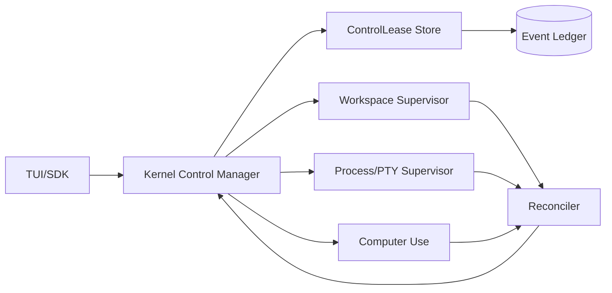

# Architecture — Human / Agent Control Handoff

## 1. Responsibility

Safely transfer interactive control of mutable resources—workspace, terminal, browser/desktop surface and mobile simulator—between an AI agent and a human while preserving an auditable session and preventing concurrent conflicting writes.

This is inspired by Devin's interactive IDE/Desktop takeover pattern but implemented as an explicit runtime ownership protocol.

## 2. Control domains

A control lease is scoped independently:

- `workspace_write` — file mutations and VCS operations;
- `terminal_input` — sending input to interactive processes;
- `computer_pointer_keyboard` — mouse/keyboard control of a desktop surface;
- `browser_sensitive_input` — typing into auth/payment/secret fields;
- `mobile_input` — touch/keyboard gestures;
- `approval_authority` — never delegated to an agent automatically.

Read-only observation may remain shared.

## 3. Data model

```rust
pub struct ControlLease {
    pub id: ControlLeaseId,
    pub session_id: SessionId,
    pub holder: ControlActor,       // Human(user) | Agent(agent_id)
    pub domains: BTreeSet<ControlDomain>,
    pub acquired_at: DateTime<Utc>,
    pub expires_at: Option<DateTime<Utc>>,
    pub generation: u64,
}
```

The control lease is not a CapabilityLease. A human/agent still needs normal policy authorization for privileged actions.

## 4. Takeover flow

1. Human requests Take Over.
2. Kernel stops new agent write/tool dispatch for requested domains.
3. Running non-idempotent actions finish or are cancelled according to explicit policy.
4. Workspace baseline/diff and current UI Observation are checkpointed.
5. Kernel transfers `ControlLease` generation to human.
6. Human may edit, run commands or interact with desktop.
7. Events are still recorded as `actor=human`.
8. On Resume Agent, mutation detector computes workspace/process/UI deltas.
9. Agent receives a bounded `HumanTakeoverSummary` plus evidence refs and must re-observe mutable UI surfaces.
10. Agent control generation is re-issued only after reconciliation succeeds.

## 5. Special cases

### MFA / CAPTCHA

Agent cannot bypass or solve CAPTCHA protection. The runtime may request human control. After human completion, the browser is re-observed and secret values are not copied into the model transcript.

### OAuth / identity provider

Prefer host/browser-mediated authentication. A human may take over browser control. Tokens are stored through Auth/Secret Store, not copied from page text.

### Human writes files while agent has background workers

Read-only background agents may continue. All write-capable managed workers affecting the same WorkspaceView are paused. Isolated sibling workers may continue only if their output cannot be merged automatically until human reconciliation completes.

## 6. Failure/recovery

- Human closes client during takeover → lease remains human-held until timeout or explicit reclaim policy; agent does not silently resume writes.
- Process continues producing output → output is observable; terminal input remains owned by lease holder.
- External IDE changes files → mutation journal marks `actor=external_human` and reconciles before agent writes.
- Browser page navigates asynchronously → previous observation invalid; resume requires fresh Observation.

## 7. Security

- Human takeover is never equivalent to granting the agent broader permissions.
- Agent cannot fabricate a human control-release event.
- Sensitive screen regions may be locally redacted from recording while remaining visible to the human.
- OS security prompts that change system trust/permissions require human or explicit elevated policy.

## 8. TUI

```text
CONTROL
 Workspace write:  HUMAN (mohsin)      since 20:14
 Desktop input:    HUMAN               MFA requested
 Agent:            PAUSED-WRITES       observing only
 [Resume agent] [Keep control] [View mutations]
```

## 9. Acceptance evidence

- concurrent human/agent write test proves single write owner;
- user file edits appear as human-attributed ledger events;
- resume detects unexpected mutations and forces context refresh;
- CAPTCHA/MFA takeover does not expose entered secret text to model logs;
- agent cannot self-release a human-held control lease.


## 10. Component architecture and interfaces



```rust
#[async_trait]
pub trait ControlManager {
    async fn acquire_human(&self, req: TakeoverRequest) -> Result<ControlLease>;
    async fn release_human(&self, lease: ControlLeaseId) -> Result<ReconciliationPlan>;
    async fn resume_agent(&self, req: AgentResumeRequest) -> Result<ControlLease>;
    async fn current(&self, session: SessionId) -> Result<Vec<ControlLease>>;
}
```

Boundary rule: this service owns **control ownership**, not authorization. Any privileged operation performed by either holder still goes through normal policy/capability checks.

## 11. Implementation notes / code pattern

Use compare-and-swap on `(session_id, domain, generation)` when transferring ownership. Persist the lease-transition event before exposing the new controller. Resume must fail if reconciliation detects unresolved workspace mutations or if Computer Use cannot produce a fresh observation. Avoid implicit timeout-based agent reclaim for sensitive UI domains.
