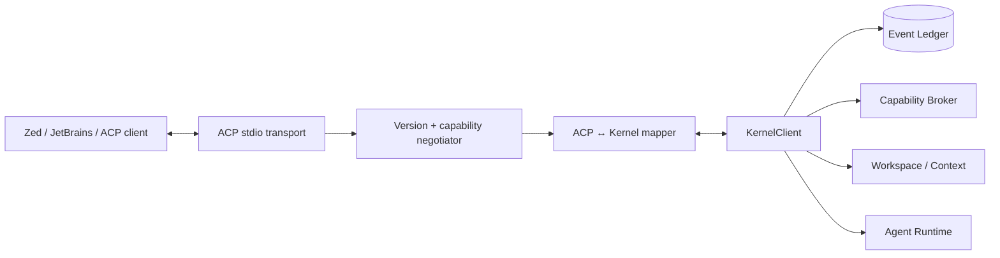

# Architecture — IDE / Editor Integration

## 1. Responsibility

IDE Integration lets editor clients drive and observe the same RapidLM session used by the TUI/headless clients. The primary protocol is ACP over stdio; embedded products may use the TypeScript SDK. This module translates editor protocol capabilities to `KernelClient` calls and translates kernel events to editor updates. It does **not** own agent logic, permissions, workspace mutation, model routing, or persistence.

## 2. Boundaries and non-responsibilities

Owned here: ACP process entrypoint, protocol negotiation, editor/session ID mapping, client capability discovery, projection of transcript/tool/diff/approval/terminal/session events, cancellation and reconnect semantics.

Not owned here: session state (`kernel`), tool execution (`tool-gateway`), approval/policy (`capability-broker`), repository truth (`workspace`/`context-engine`), TUI state, or provider adapters. An editor-provided path, text selection, diagnostic, terminal result, or file content is client-supplied data and does not bypass project/path/trust policy.

## 3. Architecture and component diagram



The `rapid acp` composition root creates a normal kernel client, starts the ACP transport, negotiates v1/v2, then maps protocol requests to the kernel. No ACP request directly calls filesystem/process/provider code.

## 4. Interfaces / contracts

Normative wire behavior is in `api-contracts/mcp-acp-sdk.md` and kernel behavior in `api-contracts/kernel-api.md`.

```rust
pub trait EditorAdapter {
    async fn negotiate(&mut self, hello: ClientHello) -> Result<NegotiatedEditorSession, EditorError>;
    async fn handle(&mut self, request: EditorRequest) -> Result<(), EditorError>;
    async fn project_event(&mut self, event: &EventEnvelope) -> Result<(), EditorError>;
}

pub struct NegotiatedEditorSession {
    pub protocol: AcpVersion,
    pub client_capabilities: ClientCapabilities,
    pub server_capabilities: ServerCapabilities,
}
```

Required mappings: new/resume session, user prompt, cancel/interrupt, assistant stream, tool lifecycle, permission/approval request, diff/change notification, terminal output reference, agent/goal status, and session completion/error. Unsupported editor capabilities degrade by omitting the feature while preserving kernel semantics.

## 5. Data models

```rust
pub struct EditorSessionBinding {
    pub client_session_id: String,
    pub rapid_session_id: SessionId,
    pub protocol: AcpVersion,
    pub event_cursor: u64,
}

pub enum EditorContextItem {
    Selection { path: RepoPath, start: Position, end: Position, content_hash: Option<String> },
    Diagnostic { path: RepoPath, range: Option<Range>, severity: String, message: String },
    ClientResource { uri: String, media_type: Option<String>, content: ArtifactOrInline },
}
```

Bindings are transport/session metadata, not an alternative source of truth. Editor context items are normalized into context-engine inputs with `source=editor_client` and a trust label.

## 6. Runtime flow

1. Editor starts `rapid acp` over stdio.
2. Transport parses only protocol frames on stdout/stdin; diagnostics use stderr.
3. Negotiator selects supported ACP v1/v2 capabilities.
4. New or resumed editor conversation maps to a kernel session.
5. Editor context is normalized and submitted as user/client context; filesystem paths are validated against project scopes.
6. Prompt invokes ordinary kernel turn flow.
7. Kernel events are projected to ACP updates; approvals remain kernel policy decisions.
8. Client cancel invokes kernel cancellation, not process killing from the ACP layer.
9. On transport close, client-lifetime work is cancelled according to kernel policy; daemon-owned work can persist.

## 7. Failure modes and recovery

| Failure | Behavior |
|---|---|
| malformed JSON-RPC/ACP frame | protocol error; keep kernel alive; close transport only if framing cannot recover |
| unsupported ACP version | negotiate common version or return explicit incompatible-version error |
| editor disconnect | preserve durable session; do not fabricate cancellation/completion events |
| event projection failure | advance cursor only after successful frame write; reconnect/restart can replay from durable sequence |
| editor path outside workspace | reject/ignore context item with safe diagnostic; never expand filesystem authority |
| approval unsupported by client | expose blocked/approval-required state and allow approval through another attached client |
| duplicate/retried client request | use request/session concurrency semantics; never blindly replay non-idempotent turn submissions |

## 8. Security considerations

- ACP is a client transport, not a trusted authorization source.
- Editor-supplied file contents, diagnostics, terminal output, URI resources, and metadata are untrusted data.
- Client claims cannot grant capabilities; effective policy remains the intersection enforced by Capability Broker.
- Stdout is protocol-only. Raw repository/tool text is JSON encoded and size bounded.
- Local ACP child-process inheritance must not expose unrelated credential environment variables; provider credentials remain brokered handles.
- External URI/resource fetches requested by an editor go through network policy rather than direct adapter I/O.
- Permission results are tied to kernel approval IDs/action hashes; the adapter cannot synthesize a broad lease.

## 9. Implementation notes

Keep ACP versions in separate adapters sharing a tiny normalized editor event model. Avoid encoding v2-only assumptions into kernel types. The server capability list is derived from kernel capability plus protocol mapping availability, not hard-coded marketing claims.

Example mapping pattern:

```rust
async fn cancel(&self, binding: &EditorSessionBinding) -> Result<(), EditorError> {
    self.kernel.interrupt(Interrupt {
        session_id: binding.rapid_session_id,
        reason: InterruptReason::ClientRequested,
    }).await.map_err(EditorError::kernel)
}
```

A diff notification should carry a kernel/workspace patch summary or artifact reference; do not ask the editor to become the authoritative mutation journal.

## 10. Observability

Record protocol version, request type, latency, event lag/cursor, disconnect reason, projection errors, and safe client capability names. Do not record raw editor selections, code, prompts, terminal text, or credentials in default telemetry.

## 11. Acceptance tests

- ACP v1 and v2 negotiate against protocol fixtures.
- A TUI and ACP client can observe the same session event stream without divergent state.
- ACP cancellation interrupts a running model/tool through kernel cancellation.
- Editor-supplied out-of-workspace path cannot cause a read/write.
- Approval rendered/resolved through ACP produces the same action-bound lease as TUI approval.
- Protocol stdout contains no logger/progress prose.
- Disconnect/restart can resume from durable session/event cursor.

## 12. Evolution rules

ACP protocol revisions are adapter changes. Kernel APIs change only when the underlying RapidLM product semantics change. A new editor protocol must implement `KernelClient` projection rather than adding a parallel agent runtime.
