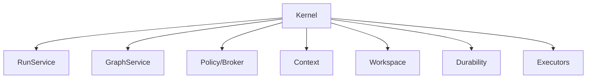

# Architecture — Kernel and Runtime Ownership

## 1. Responsibility
Own service lifecycle, session/run creation, Runtime Graph authority, client projections and cross-service shutdown/recovery ordering.

## 2. Non-negotiable design rules
- Kernel is the single local authority for durable run state.
- Frontends communicate through KernelClient; renderer/TUI state is never authoritative.
- Long-lived work belongs to daemon when interactive process lifetime is insufficient.

## 3. Architecture

## 4. Components
- **Kernel** — composition/lifecycle root
- **RunService** — creates/cancels/resumes runs
- **GraphService** — owns graph revisions and scheduler
- **ClientGateway** — in-process/IPC/API transports
- **HealthService** — dependency-aware health snapshots

## 5. Canonical contracts
`KernelClient`, `RunSpec`, `RunSnapshot`, `LifecycleService`, `HealthSnapshot`. Service start follows dependency topology; quiesce stops new work before draining owned operations.

## 6. Failure and recovery
Partial startup rolls back started services in reverse order. Shutdown records interrupted node/process state before releasing resources. Kernel crash recovery rebuilds from Event Ledger/checkpoints and Operation Journal.

## 7. Security and trust
Local IPC authenticates OS user; loopback network transport opt-in. No frontend bypass to supervisors.

## 8. Implementation notes
Migrate V2 service ownership into GraphService without moving execution into the TUI. Use structured cancellation and bounded channels.

## 9. Required verification
- Unit/contract tests for typed boundaries.
- At least one negative/recovery test for every mutable or privileged path.
- Event/evidence assertions for user-visible state.
- No release claim without the acceptance evidence named by the implementation task.
