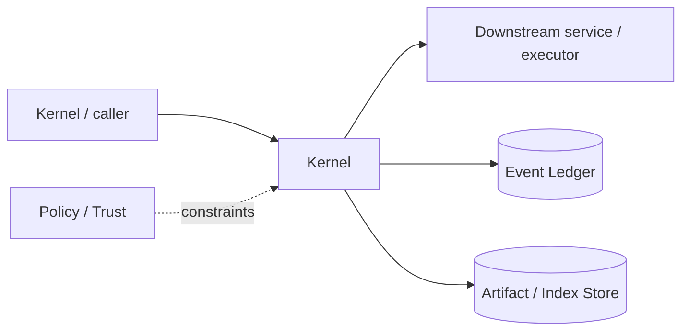

# Architecture — Kernel

## 1. Responsibility

Own service lifecycle, session state, command dispatch, event ordering, cancellation, recovery, background ownership, and frontend transport independence.

## 2. Boundaries and non-responsibilities

- Kernel orchestrates but delegates domain logic to services.
- No TUI types or provider-specific types cross into kernel domain contracts.
- Ledger is the source of durable truth.

## 3. Component architecture

- `Kernel` composition and command router.
- `ServiceRegistry` dependency-ordered lifecycle.
- `SessionManager` create/resume/fork/archive.
- `CommandBus` validated user/system commands.
- `EventBus` bounded live event fan-out after durable append.
- `CancellationTree` structured turn/agent/job cancellation.
- `RecoveryManager` projection replay and orphan reconciliation.
- `KernelClient` in-memory/IPC facade.

### Component diagram description



The diagram is intentionally generic at the boundary: the bullets above are normative component ownership. Cross-module calls MUST use the contracts listed below rather than importing another module's internal storage or implementation types.

## 4. Interfaces and contracts

- `execute(KernelCommand) -> CommandAck`.
- `subscribe(SessionId, from_seq) -> EventStream`.
- Services receive `KernelContext` with ledger, telemetry, cancellation, clock, artifact store.
- Daemon transport serializes same commands/events.

Cross-module errors use `ErrorEnvelope` from `crates/protocol`; cancellation is explicit and propagated. Any API that may return more than a small bounded payload MUST return an artifact/cursor reference.

## 5. Data models

- `KernelCommand` tagged union; `CommandAck { command_id, accepted_seq?, status }`.
- `SessionProjection` combines goal, agents, jobs, workspace, usage, approvals.
- `ServiceHealth { status, last_error, since }`.

Canonical shared types belong in `crates/protocol` only when two or more modules need a stable serialized representation. Storage-only fields remain private to this module.

## 6. Main runtime flow

1. Caller submits a typed request with actor/session/trace context.
2. Module validates schema, IDs, preconditions, and cancellation state.
3. If the operation can cause side effects, it obtains/validates a Capability Lease before the side effect.
4. Work is executed with explicit time/output/resource bounds.
5. Large evidence/output is written to Artifact Store and referenced by digest.
6. Durable state changes are appended to Event Ledger before success acknowledgement.
7. Result returns normalized status, evidence references, metrics, and trace ID.

## 7. Failure modes and recovery

- **Service start failure** → unwind already-started services in reverse order.
- **Event subscriber slow** → disconnect subscriber with resume cursor, never block ledger append indefinitely.
- **Ledger corruption** → read-only recovery mode; do not mutate.
- **Shutdown timeout** → force-cancel children then write dirty-shutdown marker.

General rule: transient infrastructure failure may be retried only when the action is proven idempotent or guarded by an idempotency key. Security ambiguity fails closed. Runtime failure of autonomous work pauses/blocks the task rather than pretending completion.

## 8. Security considerations

- Authenticate IPC client in daemon mode.
- Kernel validates command actor/session ownership before dispatch.
- No frontend can forge capability lease or durable event actor.
- Sensitive debug endpoints disabled unless explicit local/admin policy.

All attacker-controlled strings are treated as data. A model request, repository file, browser page, MCP result, hook output, or scanner output can never grant itself more privilege.

## 9. Implementation notes

- Use structured concurrency and bounded channels.
- Event publish order equals committed ledger seq.
- A service may emit proposed events only through kernel/ledger transaction APIs.

### Example code pattern

```rust
pub async fn dispatch(&self, actor: Actor, cmd: KernelCommand) -> Result<CommandAck> {
    self.authz.validate_actor(&actor, &cmd)?;
    let handler = self.handlers.for_command(&cmd)?;
    handler.handle(CommandContext::new(actor, self.clone()), cmd).await
}
```

The example demonstrates the intended boundary/style, not copy-paste-complete production code. Concrete implementation MUST use typed IDs/errors/cancellation and emit trace/event metadata.

## 10. Observability

Every operation SHOULD emit a span with: `trace_id`, `session_id`, actor/agent ID, operation kind, result class, latency, and bounded resource/token counters where applicable. Never use raw prompt/code/secret content as metric labels.

## 11. Tests and acceptance evidence

- [ ] Service start/stop order test.
- [ ] Slow subscriber backpressure test.
- [ ] Kill/restart at event boundaries.
- [ ] Daemon/in-process client conformance test.

## 12. Performance expectations

The module MUST define benchmarks for its hot paths before v1 stabilization. Regressions above 15% p95 latency or 10% memory/token overhead on fixed fixtures require explicit review or an accepted trade-off ADR.

## 13. Evolution rules

- Public/wire/event schema changes require `contract-first` skill and compatibility tests.
- Security behavior changes require threat-model update.
- New dependencies/backends require an ADR if they change trust boundary or deployment footprint.
- Do not add frontend-specific behavior to this module; expose state/contracts and let frontends render it.
