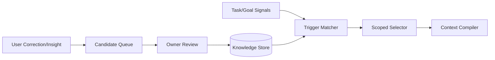

# Architecture — Knowledge Registry

## 1. Responsibility

Store small, durable, governed facts/conventions that should be recalled when a matching task/context trigger is present. Knowledge is explicitly separate from episodic Memory, Skills, Playbooks, Rules and Policy.

The trigger-scoped retrieval concept is inspired by Devin Knowledge.

## 2. Semantic distinction

| Construct | Question answered | Typical lifetime | Authority |
|---|---|---|---|
| Session memory | What happened earlier? | session/project | low/medium |
| Knowledge | What should engineers know about this system? | months | owner-reviewed |
| Rule | What instruction always/conditionally applies? | project/org | instruction |
| Skill | How do I perform a procedure? | reusable | instructional resource |
| Playbook | How do multiple steps/agents/tools execute a recurring workflow? | reusable/versioned | orchestration |
| Policy | What is allowed? | org/user/project | security authority |

Knowledge can inform decisions but **cannot grant privileges**.

## 3. Data model

```rust
pub struct KnowledgeItem {
    pub id: KnowledgeId,
    pub title: String,
    pub body: String,
    pub scope: KnowledgeScope,
    pub triggers: Vec<KnowledgeTrigger>,
    pub tags: BTreeSet<String>,
    pub evidence: Vec<EvidenceSourceRef>,
    pub owner: PrincipalRef,
    pub confidence: Confidence,
    pub status: KnowledgeStatus, // Draft | Approved | Deprecated
    pub created_at: DateTime<Utc>,
    pub reviewed_at: Option<DateTime<Utc>>,
    pub verify_after: Option<DateTime<Utc>>,
    pub supersedes: Option<KnowledgeId>,
}
```

Example:

```yaml
id: know-auth-017
title: Auth token verification boundary
scope: { repo: payments-api }
triggers:
  - "authentication or JWT verification"
  - "changes under src/auth/**"
body: |
  All token validation must go through AuthGateway. Direct jose::decode calls
  bypass organization revocation checks.
evidence:
  - docs/security/auth.md
  - src/auth/gateway.rs
owner: security-team
status: approved
verify_after: 2026-11-01
```

## 4. Retrieval

Candidate score combines:

```text
trigger_match + scope_match + path_match + semantic_similarity
+ explicit_tag_match + owner_trust - staleness_penalty
```

Hard filters run before ranking:

- repository/org/user scope;
- status;
- data policy;
- expiry/deprecation;
- task visibility.

The Context Compiler receives Knowledge as typed context items with a separate budget. It must show the model that Knowledge is organization/user data, not system-level policy.

## 5. Knowledge suggestion loop

Session Insights or explicit user correction may propose a `KnowledgeCandidate`:

```text
User correction / repeated failure
     ↓
Candidate extractor
     ↓
Evidence + trigger proposal
     ↓
Human/owner review
     ↓
Approved KnowledgeItem
```

Automatic shared/org publication is prohibited by default. Personal local knowledge may use a configurable lighter approval policy.

## 6. Interfaces

```rust
pub trait KnowledgeRegistry {
    async fn search(&self, q: KnowledgeQuery) -> Result<Vec<KnowledgeHit>>;
    async fn get(&self, id: KnowledgeId) -> Result<KnowledgeItem>;
    async fn propose(&self, candidate: KnowledgeCandidate) -> Result<KnowledgeId>;
    async fn approve(&self, id: KnowledgeId, actor: PrincipalRef) -> Result<()>;
    async fn deprecate(&self, id: KnowledgeId, reason: String) -> Result<()>;
}
```

## 7. Failure modes

- stale knowledge conflicts with code → surface conflict; code/evidence wins for implementation facts; mark candidate for review;
- duplicate items → cluster and prefer latest approved item while showing conflict;
- malicious repository attempts to create org Knowledge → repository content cannot promote itself; only candidate status;
- retrieval overload → separate Knowledge token budget and max-item limit;
- owner removed → org policy defines reassignment; no silent orphan approval.

## 8. Security/privacy

- Knowledge scopes are access-controlled independently of repository access.
- Secret values are not allowed in Knowledge bodies; use SecretHandle references if necessary.
- External/web-derived facts require source/evidence and lower trust unless approved.
- Cross-org retrieval is impossible.
- Knowledge is excluded from model-training exports unless its data policy explicitly permits it.

## 9. TUI/CLI

```text
/knowledge search auth gateway
/knowledge propose
/knowledge inspect know-auth-017
/knowledge approve know-auth-017
```

Context Inspector shows which Knowledge items were injected and why.

## 10. Acceptance evidence

- trigger-scoped retrieval selects auth knowledge for auth task but not unrelated UI work;
- deprecated item is never injected by default;
- untrusted repository content cannot self-approve Knowledge;
- Knowledge tokens are counted separately in context budget;
- proposed user correction requires configured approval before becoming shared knowledge.


## 11. Component architecture and implementation pattern



```rust
#[async_trait]
pub trait KnowledgeRegistry {
    async fn match_for(&self, q: KnowledgeQuery) -> Result<Vec<KnowledgeMatch>>;
    async fn propose(&self, candidate: KnowledgeCandidate) -> Result<CandidateId>;
    async fn review(&self, id: CandidateId, decision: KnowledgeDecision) -> Result<KnowledgeItem>;
    async fn invalidate(&self, id: KnowledgeId, reason: String) -> Result<()>;
}
```

Implementation notes: index normalized trigger phrases separately from body text; apply repo/org scope before ranking; cap injected Knowledge items and token budget; preserve owner/provenance/freshness; a Knowledge match can influence context but never Capability Broker policy.
