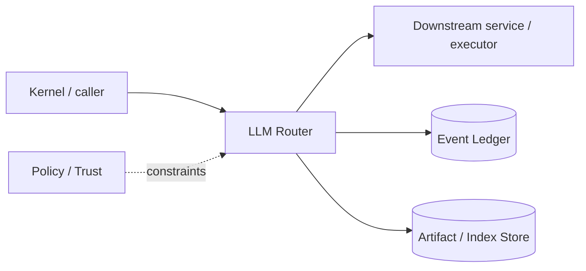

# Architecture — LLM Router

## 1. Responsibility

Normalize provider APIs and select models using hard capability/privacy constraints plus versioned quality/cost/latency policy, with safe fallback and complete usage accounting.

## 2. Boundaries and non-responsibilities

- Router does not decide task decomposition or permissions.
- Provider adapters do not own prompt business logic; Prompt Runtime compiles model-specific envelope.
- Price tables are versioned/configurable and never silently guessed.

## 3. Component architecture

- `ProviderRegistry` — OpenAI-compatible, Anthropic, Gemini, local/custom adapters.
- `ModelCatalog` — capability/context/price/region metadata.
- `RouteFilter` — hard constraints.
- `RouteScorer` — versioned weighted policy.
- `FallbackController` — retry/fallback state machine.
- `UsageNormalizer` — input/output/cache/reasoning/tool token accounting.
- `RateLimiter` — provider/model concurrency and backoff.
- `CircuitBreaker` — transient provider health.

### Component diagram description



The diagram is intentionally generic at the boundary: the bullets above are normative component ownership. Cross-module calls MUST use the contracts listed below rather than importing another module's internal storage or implementation types.

## 4. Interfaces and contracts

- `route(RouteRequest) -> RouteDecision`.
- `complete(ModelRequest, RouteDecision) -> ModelStream`.
- Context Engine asks for embedding service through separate `EmbeddingProvider`.
- Eval harness can inject mock/replay providers.

Cross-module errors use `ErrorEnvelope` from `crates/protocol`; cancellation is explicit and propagated. Any API that may return more than a small bounded payload MUST return an artifact/cursor reference.

## 5. Data models

- `ModelDescriptor { provider, model, capabilities, context_limit, max_output, prices, regions, data_policy_tags, latency_class }`
- `RouteRequest { required_caps, input_tokens, output_reserve, budget, latency, privacy, user_pin, fallback }`
- `RouteDecision { model, policy_version, candidate_scores, hard_rejections, fallback_chain }`.

Canonical shared types belong in `crates/protocol` only when two or more modules need a stable serialized representation. Storage-only fields remain private to this module.

## 6. Main runtime flow

1. Caller submits a typed request with actor/session/trace context.
2. Module validates schema, IDs, preconditions, and cancellation state.
3. If the operation can cause side effects, it obtains/validates a Capability Lease before the side effect.
4. Work is executed with explicit time/output/resource bounds.
5. Large evidence/output is written to Artifact Store and referenced by digest.
6. Durable state changes are appended to Event Ledger before success acknowledgement.
7. Result returns normalized status, evidence references, metrics, and trace ID.

## 7. Failure modes and recovery

- **Rate limit/transient 5xx** → bounded exponential backoff then allowed fallback.
- **Authentication/config error** → no blind fallback to a provider that may violate privacy/billing intent.
- **Context too large** → ask Context Compiler to compact/recompile; router does not truncate messages.
- **Unknown usage** → mark cost unknown, never zero.

General rule: transient infrastructure failure may be retried only when the action is proven idempotent or guarded by an idempotency key. Security ambiguity fails closed. Runtime failure of autonomous work pauses/blocks the task rather than pretending completion.

## 8. Security considerations

- Provider eligibility filtered by data policy before scoring.
- API keys are secret handles resolved in transport layer.
- Provider error bodies redacted before model/context/log exposure.
- Fallback cannot cross prohibited region/provider boundary.

All attacker-controlled strings are treated as data. A model request, repository file, browser page, MCP result, hook output, or scanner output can never grant itself more privilege.

## 9. Implementation notes

- Deterministic route rules first; optional learned router may only rank already-eligible candidates.
- Preserve stable tool ordering and static prompt prefix within session/model.
- Record route features and outcome metrics for offline evaluation.

### Example code pattern

```rust
pub fn select(req: &RouteRequest, models: &[ModelDescriptor], policy: &RoutePolicy) -> Result<RouteDecision> {
    let eligible = models.iter().filter(|m| hard_constraints(req, m).is_ok());
    eligible.map(|m| (m, policy.score(req, m)))
        .max_by(|a,b| a.1.total_cmp(&b.1))
        .map(|(m,s)| RouteDecision::new(m, s, policy.version()))
        .ok_or(RouteError::NoEligibleModel)
}
```

The example demonstrates the intended boundary/style, not copy-paste-complete production code. Concrete implementation MUST use typed IDs/errors/cancellation and emit trace/event metadata.

## 10. Observability

Every operation SHOULD emit a span with: `trace_id`, `session_id`, actor/agent ID, operation kind, result class, latency, and bounded resource/token counters where applicable. Never use raw prompt/code/secret content as metric labels.

## 11. Tests and acceptance evidence

- [ ] Provider adapter conformance fixtures.
- [ ] Privacy constraint beats lower-cost candidate.
- [ ] Fallback chain never crosses denied provider.
- [ ] Usage/cost normalization golden tests.
- [ ] Prompt-cache stable tool ordering test.

## 12. Performance expectations

The module MUST define benchmarks for its hot paths before v1 stabilization. Regressions above 15% p95 latency or 10% memory/token overhead on fixed fixtures require explicit review or an accepted trade-off ADR.

## 13. Evolution rules

- Public/wire/event schema changes require `contract-first` skill and compatibility tests.
- Security behavior changes require threat-model update.
- New dependencies/backends require an ADR if they change trust boundary or deployment footprint.
- Do not add frontend-specific behavior to this module; expose state/contracts and let frontends render it.
