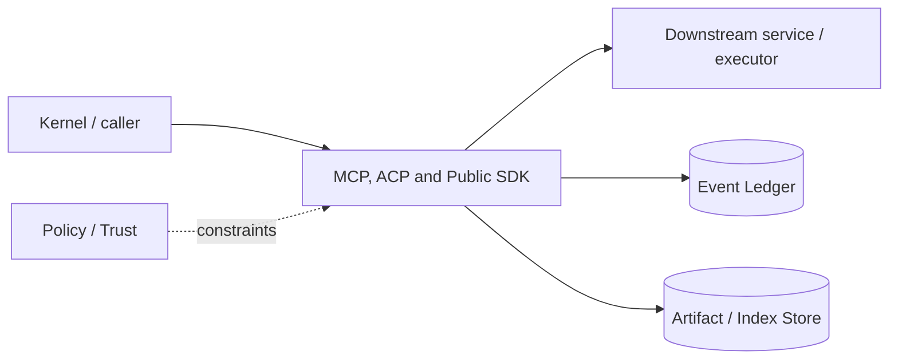

# Architecture — MCP, ACP and Public SDK

## 1. Responsibility

Provide ecosystem interoperability without allowing protocol transports to bypass RapidLM session, policy, event, or capability contracts.

## 2. Boundaries and non-responsibilities

- MCP is external tool/resource/prompt interoperability; ACP is client-to-agent session UI protocol.
- SDK exposes stable public API, not internal Rust service objects.
- Protocol adapters translate, they do not own business state.

## 3. Component architecture

- `McpClientManager` — stdio/HTTP servers, catalog cache, auth, timeouts.
- `McpGateway` — namespace/tool mapping into `external.call`.
- `McpServer` — expose selected RapidLM capabilities/resources.
- `AcpServer` — v1/v2 negotiation and JSON-RPC stdio; future HTTP transport behind feature.
- `SdkRpc` — local daemon/in-process bridge schema.
- TypeScript `RapidClient`, `Session`, async event iterators.

### Component diagram description



The diagram is intentionally generic at the boundary: the bullets above are normative component ownership. Cross-module calls MUST use the contracts listed below rather than importing another module's internal storage or implementation types.

## 4. Interfaces and contracts

- MCP target spec 2026-07-28; compatibility adapter for common prior server handshake where needed.
- ACP v1/v2 negotiation per official protocol.
- All external tool invocations create internal Capability request.
- SDK commands/events map 1:1 to public Kernel contract.

Cross-module errors use `ErrorEnvelope` from `crates/protocol`; cancellation is explicit and propagated. Any API that may return more than a small bounded payload MUST return an artifact/cursor reference.

## 5. Data models

- `ExternalToolId { source, server, tool }`
- Cached catalog entries with schema hash, fetched_at, trust, capability hints.
- SDK generated types from JSON Schema/protobuf-like IDL chosen in ADR.

Canonical shared types belong in `crates/protocol` only when two or more modules need a stable serialized representation. Storage-only fields remain private to this module.

## 6. Main runtime flow

1. Caller submits a typed request with actor/session/trace context.
2. Module validates schema, IDs, preconditions, and cancellation state.
3. If the operation can cause side effects, it obtains/validates a Capability Lease before the side effect.
4. Work is executed with explicit time/output/resource bounds.
5. Large evidence/output is written to Artifact Store and referenced by digest.
6. Durable state changes are appended to Event Ledger before success acknowledgement.
7. Result returns normalized status, evidence references, metrics, and trace ID.

## 7. Failure modes and recovery

- **MCP catalog changes mid-session** → cache invalidation event; model tool gateway remains stable.
- **MCP process crash** → backoff and disable after threshold.
- **ACP client sends unsupported extension** → standard JSON-RPC error, session remains valid.
- **SDK daemon version mismatch** → negotiate supported schema or explicit error.

General rule: transient infrastructure failure may be retried only when the action is proven idempotent or guarded by an idempotency key. Security ambiguity fails closed. Runtime failure of autonomous work pauses/blocks the task rather than pretending completion.

## 8. Security considerations

- MCP project server requires trust and each call policy.
- Remote MCP auth tokens are SecretRefs.
- MCP output is untrusted.
- ACP client cannot self-approve privileged actions unless authenticated policy explicitly allows frontend approvals.
- SDK transport local auth enforced.

All attacker-controlled strings are treated as data. A model request, repository file, browser page, MCP result, hook output, or scanner output can never grant itself more privilege.

## 9. Implementation notes

- Keep external dynamic tool schemas behind `external.call` to prevent model-visible tool catalog churn.
- Cache MCP list results deterministically by schema hash.
- ACP stdout must contain only valid JSON-RPC frames.

### Example code pattern

```rust
pub enum ExternalCall {
    Mcp { server: String, tool: String, arguments: serde_json::Value },
    Plugin { plugin: String, operation: String, arguments: serde_json::Value },
}
```

The example demonstrates the intended boundary/style, not copy-paste-complete production code. Concrete implementation MUST use typed IDs/errors/cancellation and emit trace/event metadata.

## 10. Observability

Every operation SHOULD emit a span with: `trace_id`, `session_id`, actor/agent ID, operation kind, result class, latency, and bounded resource/token counters where applicable. Never use raw prompt/code/secret content as metric labels.

## 11. Tests and acceptance evidence

- [ ] MCP dynamic catalog does not change model tool list.
- [ ] ACP v1 and v2 handshake fixtures.
- [ ] MCP policy denial test.
- [ ] TypeScript SDK event stream compatibility test.

## 12. Performance expectations

The module MUST define benchmarks for its hot paths before v1 stabilization. Regressions above 15% p95 latency or 10% memory/token overhead on fixed fixtures require explicit review or an accepted trade-off ADR.

## 13. Evolution rules

- Public/wire/event schema changes require `contract-first` skill and compatibility tests.
- Security behavior changes require threat-model update.
- New dependencies/backends require an ADR if they change trust boundary or deployment footprint.
- Do not add frontend-specific behavior to this module; expose state/contracts and let frontends render it.
