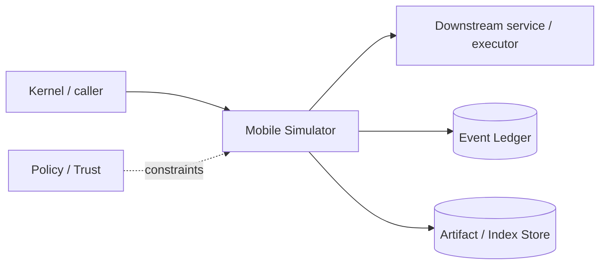

# Architecture — Mobile Simulator

## 1. Responsibility

Supervise reproducible Android Emulator and iOS Simulator environments and expose normalized observe/act/verify operations to agents/evals.

## 2. Boundaries and non-responsibilities

- Not a general device farm in v1.
- iOS local backend exists only on macOS with Xcode runtimes; other hosts use remote mac worker.
- Model never gets raw adb/simctl shell authority through `mobile.act`; advanced raw commands route through `shell.exec` and policy.

## 3. Component architecture

- `DevicePool` — allocate/release clean device instances.
- `AndroidBackend` — emulator CLI, AVD, adb, logcat, snapshots.
- `IosBackend` — `xcrun simctl` lifecycle/install/launch/log/screenshot.
- `MobileObserver` — accessibility/UI tree + screenshot + app/process state.
- `MobileActor` — tap/type/swipe/back/home/deeplink/rotate/permissions.
- `ArtifactCapture` — screenshots, video, logs, crash reports.
- `ReadinessProbe` — boot complete/app foreground checks.

### Component diagram description



The diagram is intentionally generic at the boundary: the bullets above are normative component ownership. Cross-module calls MUST use the contracts listed below rather than importing another module's internal storage or implementation types.

## 4. Interfaces and contracts

- `allocate(DeviceSpec) -> DeviceLease`.
- `install`, `launch`, `observe`, `act`, `capture`, `reset`, `release`.
- Uses Process Supervisor for emulator processes and Computer Use action/evidence schema.
- Remote worker can satisfy device request by capability (`ios-simulator`).

Cross-module errors use `ErrorEnvelope` from `crates/protocol`; cancellation is explicit and propagated. Any API that may return more than a small bounded payload MUST return an artifact/cursor reference.

## 5. Data models

- `DeviceSpec { platform, os_version, device_type, locale, orientation, clean_state }`
- `DeviceLease { device_id, worker_id?, expires_at, baseline_snapshot? }`
- `MobileObservation { ui_nodes, screenshot_ref, app_state, logs_cursor }`.

Canonical shared types belong in `crates/protocol` only when two or more modules need a stable serialized representation. Storage-only fields remain private to this module.

## 6. Main runtime flow

1. Caller submits a typed request with actor/session/trace context.
2. Module validates schema, IDs, preconditions, and cancellation state.
3. If the operation can cause side effects, it obtains/validates a Capability Lease before the side effect.
4. Work is executed with explicit time/output/resource bounds.
5. Large evidence/output is written to Artifact Store and referenced by digest.
6. Durable state changes are appended to Event Ledger before success acknowledgement.
7. Result returns normalized status, evidence references, metrics, and trace ID.

## 7. Failure modes and recovery

- **AVD/simulator boot timeout** → collect diagnostics, destroy/recreate once, then block.
- **Stale device lease** → reject action.
- **App install mismatch** → digest/architecture error.
- **iOS unavailable on host** → explicit Unsupported with remote-worker hint, never emulate via undocumented hack.
- **Snapshot restore failure** → cold reset and mark run non-comparable if baseline changes.

General rule: transient infrastructure failure may be retried only when the action is proven idempotent or guarded by an idempotency key. Security ambiguity fails closed. Runtime failure of autonomous work pauses/blocks the task rather than pretending completion.

## 8. Security considerations

- Apps are untrusted; simulator processes run under sandbox/worker policy.
- ADB over network is disabled unless explicitly required.
- Captured notifications/clipboard/auth screens are sensitive artifacts.
- Real device identifiers/accounts are out of scope for default local evals.

All attacker-controlled strings are treated as data. A model request, repository file, browser page, MCP result, hook output, or scanner output can never grant itself more privilege.

## 9. Implementation notes

- Android uses emulator snapshots for fast deterministic reset.
- On iOS use supported simctl lifecycle; if full state snapshot semantics are not available, clone/erase and fixture setup scripts establish baseline.
- UI automation should prefer accessibility identifiers/text and verify after every state-changing action.

### Example code pattern

```rust
#[async_trait]
pub trait MobileBackend {
    async fn allocate(&self, spec: DeviceSpec) -> Result<DeviceLease>;
    async fn observe(&self, lease: &DeviceLease) -> Result<MobileObservation>;
    async fn act(&self, lease: &DeviceLease, action: MobileAction) -> Result<ActionEvidence>;
}
```

The example demonstrates the intended boundary/style, not copy-paste-complete production code. Concrete implementation MUST use typed IDs/errors/cancellation and emit trace/event metadata.

## 10. Observability

Every operation SHOULD emit a span with: `trace_id`, `session_id`, actor/agent ID, operation kind, result class, latency, and bounded resource/token counters where applicable. Never use raw prompt/code/secret content as metric labels.

## 11. Tests and acceptance evidence

- [ ] Android clean-snapshot determinism test.
- [ ] iOS host capability detection test.
- [ ] Lease expiry prevents actions.
- [ ] Install/launch/screenshot/log artifact integration tests.

## 12. Performance expectations

The module MUST define benchmarks for its hot paths before v1 stabilization. Regressions above 15% p95 latency or 10% memory/token overhead on fixed fixtures require explicit review or an accepted trade-off ADR.

## 13. Evolution rules

- Public/wire/event schema changes require `contract-first` skill and compatibility tests.
- Security behavior changes require threat-model update.
- New dependencies/backends require an ADR if they change trust boundary or deployment footprint.
- Do not add frontend-specific behavior to this module; expose state/contracts and let frontends render it.

## V2 addendum — visual Computer Use integration

Android and iOS simulators are now registered as Computer Use surfaces in addition to deterministic command channels.

Android workflow:

```text
clean AVD snapshot → adb install/start/log setup → Computer Use visual flow
→ assertions → annotated video/screenshot/log evidence → reset snapshot
```

Use ADB/Espresso/UIAutomator for deterministic setup/assertion whenever possible and Computer Use for the user-visible flow that must be proven visually. The runtime can correlate logcat timestamps with ComputerAction events.

For iOS, `simctl`/XCTest/accessibility handles deterministic operations and the simulator window can be controlled through a macOS Computer Use worker. Non-mac hosts route this work through the Remote Worker/Handoff contracts.
