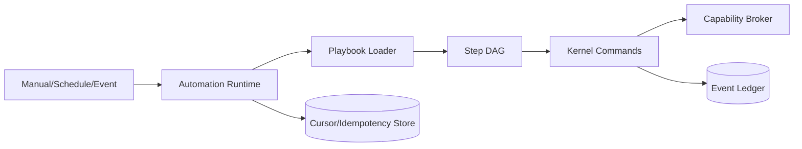

# Architecture — Playbooks and Automations

## 1. Responsibility

Define versioned repeatable engineering workflows that can coordinate agents, tools, approvals, evidence gates and scheduled/event-triggered execution. A Playbook is an orchestration artifact; a Skill is a reusable procedure/instruction bundle.

## 2. Playbook model

```yaml
apiVersion: rapidlm.dev/v1
kind: Playbook
metadata:
  name: fix-failing-ci
  version: 3
spec:
  inputs:
    pr: PullRequestRef
  steps:
    - id: inspect
      agent: explorer
      objective: "Identify failing checks and likely ownership"
      access: read_only
    - id: patch
      agent: coder
      depends_on: [inspect]
      workspace: isolated_write
    - id: verify
      depends_on: [patch]
      run: ["cargo", "test", "--workspace"]
    - id: security
      depends_on: [patch]
      scanner: changed_files
    - id: publish
      depends_on: [verify, security]
      capability: vcs.pr.update
      approval: when_external_write
```

## 3. Automation model

An Automation binds a playbook to a trigger and durable cursor/state:

- schedule/cron;
- Git event;
- CI check failure;
- webhook/event bus;
- manual invocation;
- future connector sources.

Recurring executions retain a bounded `AutomationState` such as last processed revision/date/item IDs. They do not reuse an unbounded conversation transcript.

## 4. Safety

- Event payloads are untrusted data.
- Public-repository/comment triggers are high prompt-injection risk and must have narrow filters.
- A playbook may request capabilities but cannot grant them.
- Scheduled execution must use explicit non-interactive approval policy; any `ask` requirement blocks rather than auto-approves.
- Playbook versions are immutable after publish; changes create a new version.

## 5. Interfaces

```rust
pub trait PlaybookRegistry {
    async fn validate(&self, src: PlaybookSource) -> Result<ValidatedPlaybook>;
    async fn publish(&self, pb: ValidatedPlaybook) -> Result<PlaybookRef>;
    async fn resolve(&self, name: &str, version: VersionSelector) -> Result<Playbook>;
}

pub trait AutomationScheduler {
    async fn register(&self, automation: AutomationSpec) -> Result<AutomationId>;
    async fn trigger(&self, id: AutomationId, event: TriggerEvent) -> Result<SessionId>;
}
```

## 6. Relationship to Goal DAG

Each playbook run materializes a Goal/Task DAG. The playbook is not itself mutable runtime state. Evidence gates and retries occur in the runtime DAG and are linked back to playbook step/version.

## 7. Failure modes

- invalid playbook dependency cycle → reject at publish;
- trigger duplicates → idempotency key prevents duplicate run;
- scheduled run needs approval → block and notify, never silently escalate;
- step repeatedly fails → retry policy then blocked run with evidence;
- playbook references removed skill → resolution error before side effects;
- event storms → queue quotas and deduplication.

## 8. Observability

Metrics: trigger rate, successful runs, blocked runs, mean cost, token usage, human interventions, step failure distribution, time-to-evidence, stale state size.

## 9. Acceptance evidence

- same playbook input produces same DAG shape/version;
- duplicate webhook does not duplicate side effects;
- scheduled playbook cannot cross an approval gate automatically;
- automation cursor prevents reprocessing already handled items;
- playbook cannot embed secret values or capability grants.


## 10. Component architecture and implementation pattern



```rust
#[async_trait]
pub trait PlaybookRunner {
    async fn validate(&self, spec: PlaybookSpec) -> Result<ValidationReport>;
    async fn start(&self, req: PlaybookRunRequest) -> Result<PlaybookRunId>;
    async fn resume(&self, run: PlaybookRunId) -> Result<PlaybookRunState>;
}
```

Implementation notes: compile declarative steps into ordinary Goal/Kernel commands rather than adding a bypass executor. Persist trigger cursor and idempotency key before external side effects. Treat repository/connector event payloads as untrusted data. If a non-interactive run reaches `ask`, park and notify instead of inventing approval.
