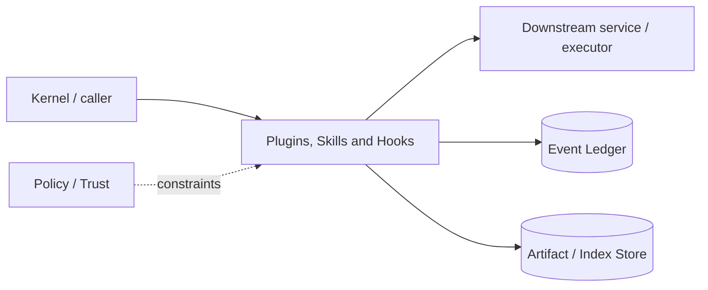

# Architecture — Plugins, Skills and Hooks

## 1. Responsibility

Enable reusable agent knowledge and lifecycle extensions with explicit trust, capability declarations, deterministic discovery, and sandboxed execution.

## 2. Boundaries and non-responsibilities

- Skills are instructions/resources only and cannot grant capabilities.
- WASM plugins use declared WIT capabilities.
- Native hooks are out-of-process and cannot override security policy.
- MCP servers are managed by MCP module though plugins may declare them.

## 3. Component architecture

- `ExtensionDiscovery` — project/user/marketplace paths.
- `SkillLoader` — frontmatter, activation rules, resources.
- `WasmPluginHost` — component runtime, capability imports, quotas.
- `HookManager` — lifecycle event matching and bounded execution.
- `MarketplaceManager` — signed/source-pinned plugin metadata.
- `TrustVerifier` — source/digest/signature and project trust.

### Component diagram description



The diagram is intentionally generic at the boundary: the bullets above are normative component ownership. Cross-module calls MUST use the contracts listed below rather than importing another module's internal storage or implementation types.

## 4. Interfaces and contracts

- Skills compile into Prompt Runtime attachments.
- Hooks receive redacted event DTO and return advisory/block decision only on documented blocking events.
- Plugin calls route through `external.call` and broker.
- Install/update/uninstall emits audit events.

Cross-module errors use `ErrorEnvelope` from `crates/protocol`; cancellation is explicit and propagated. Any API that may return more than a small bounded payload MUST return an artifact/cursor reference.

## 5. Data models

- `PluginManifest { id, version, digest, publisher, wit_version, requested_caps, skills, hooks, mcp_servers }`
- `SkillManifest { name, description, paths, user_invocable, model_invocable, resources }`
- `HookSpec { event, matcher, command/http/plugin, timeout, failure_policy }`.

Canonical shared types belong in `crates/protocol` only when two or more modules need a stable serialized representation. Storage-only fields remain private to this module.

## 6. Main runtime flow

1. Caller submits a typed request with actor/session/trace context.
2. Module validates schema, IDs, preconditions, and cancellation state.
3. If the operation can cause side effects, it obtains/validates a Capability Lease before the side effect.
4. Work is executed with explicit time/output/resource bounds.
5. Large evidence/output is written to Artifact Store and referenced by digest.
6. Durable state changes are appended to Event Ledger before success acknowledgement.
7. Result returns normalized status, evidence references, metrics, and trace ID.

## 7. Failure modes and recovery

- **Plugin trap/quota** → call failure, host survives.
- **Hook timeout** → apply declared failure policy; security hooks default fail-closed, passive hooks fail-open.
- **Marketplace unavailable** → existing pinned extensions continue.
- **Signature mismatch** → quarantine install.

General rule: transient infrastructure failure may be retried only when the action is proven idempotent or guarded by an idempotency key. Security ambiguity fails closed. Runtime failure of autonomous work pauses/blocks the task rather than pretending completion.

## 8. Security considerations

- WASM no ambient filesystem/network; only host capability imports.
- Project extensions disabled until trust.
- Hooks receive minimum event fields and secret-redacted values.
- `allowed-tools` metadata is descriptive/narrowing only, never a permission grant.

All attacker-controlled strings are treated as data. A model request, repository file, browser page, MCP result, hook output, or scanner output can never grant itself more privilege.

## 9. Implementation notes

- Use WASI Preview 2/component model if ecosystem support at implementation time passes spike; otherwise a minimal WIT host with Wasmtime.
- Keep skill text token-budgeted and activate by path/task metadata rather than always injecting.

### Example code pattern

```rust
interface rapidlm:plugin/tool@1.0.0 {
  record request { operation: string, args-json: string }
  record response { result-json: string, evidence-refs: list<string> }
  call: func(req: request) -> result<response, string>
}
```

The example demonstrates the intended boundary/style, not copy-paste-complete production code. Concrete implementation MUST use typed IDs/errors/cancellation and emit trace/event metadata.

## 10. Observability

Every operation SHOULD emit a span with: `trace_id`, `session_id`, actor/agent ID, operation kind, result class, latency, and bounded resource/token counters where applicable. Never use raw prompt/code/secret content as metric labels.

## 11. Tests and acceptance evidence

- [ ] Plugin cannot access undeclared filesystem/network.
- [ ] Hook timeout behavior by failure policy.
- [ ] Untrusted project extension not loaded.
- [ ] Skill activation/token budget tests.

## 12. Performance expectations

The module MUST define benchmarks for its hot paths before v1 stabilization. Regressions above 15% p95 latency or 10% memory/token overhead on fixed fixtures require explicit review or an accepted trade-off ADR.

## 13. Evolution rules

- Public/wire/event schema changes require `contract-first` skill and compatibility tests.
- Security behavior changes require threat-model update.
- New dependencies/backends require an ADR if they change trust boundary or deployment footprint.
- Do not add frontend-specific behavior to this module; expose state/contracts and let frontends render it.
