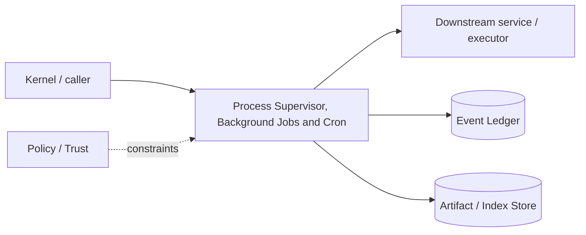

# Architecture — Process Supervisor, Background Jobs and Cron

## 1. Responsibility

Own process trees, bounded IO, timeouts, cancellation, persistent job metadata, and scheduled/background execution while making process state observable and recoverable.

## 2. Boundaries and non-responsibilities

- Containment comes from Sandbox; authorization from Broker.
- Supervisor never parses model intent; it executes normalized `ExecSpec`.
- Cron jobs run only while daemon/worker is active in v1.

## 3. Component architecture

- `ProcessSupervisor` — spawn/track/kill groups.
- `StreamSpooler` — bounded ring + artifact spill.
- `JobManager` — durable foreground/background jobs.
- `JobScheduler` — queued/scheduled cron-like triggers.
- `Heartbeat/Reaper` — orphan and zombie cleanup.
- OS adapters — Unix process groups/cgroups, Windows Job Objects.

### Component diagram description



The diagram is intentionally generic at the boundary: the bullets above are normative component ownership. Cross-module calls MUST use the contracts listed below rather than importing another module's internal storage or implementation types.

## 4. Interfaces and contracts

- `exec(ExecSpec, SandboxHandle, Lease) -> ExecResult`.
- `start_job(JobSpec) -> JobId`; `attach`, `tail`, `cancel`.
- `schedule(ScheduleSpec)` in daemon mode.
- Emits process/job/output-cursor/resource events.

Cross-module errors use `ErrorEnvelope` from `crates/protocol`; cancellation is explicit and propagated. Any API that may return more than a small bounded payload MUST return an artifact/cursor reference.

## 5. Data models

- `ExecSpec { argv, cwd, env_handles, stdin, timeout, output_limit, tty, expected_side_effects }`
- `JobState = queued|running|sleeping|completed|failed|cancelled|orphaned`
- `OutputRef { inline_excerpt, artifact_id?, truncated, cursor }`.

Canonical shared types belong in `crates/protocol` only when two or more modules need a stable serialized representation. Storage-only fields remain private to this module.

## 6. Main runtime flow

1. Caller submits a typed request with actor/session/trace context.
2. Module validates schema, IDs, preconditions, and cancellation state.
3. If the operation can cause side effects, it obtains/validates a Capability Lease before the side effect.
4. Work is executed with explicit time/output/resource bounds.
5. Large evidence/output is written to Artifact Store and referenced by digest.
6. Durable state changes are appended to Event Ledger before success acknowledgement.
7. Result returns normalized status, evidence references, metrics, and trace ID.

## 7. Failure modes and recovery

- **Child ignores SIGTERM** → grace period then hard kill process tree.
- **Output flood** → spool/cap, never unbounded memory.
- **Daemon crash** → recovered job marked orphaned unless backend provides reattach token.
- **Schedule missed while daemon down** → default skip with event; catch-up behavior must be explicit per schedule.

General rule: transient infrastructure failure may be retried only when the action is proven idempotent or guarded by an idempotency key. Security ambiguity fails closed. Runtime failure of autonomous work pauses/blocks the task rather than pretending completion.

## 8. Security considerations

- Environment is allowlisted plus secret handles.
- Shell string mode discouraged; prefer argv. Shell mode records parsed AST/risk.
- TTY attachment is a user action and cannot expose hidden secret stdin.
- Background jobs retain original capability scope/expiry semantics; renewals require policy.

All attacker-controlled strings are treated as data. A model request, repository file, browser page, MCP result, hook output, or scanner output can never grant itself more privilege.

## 9. Implementation notes

- Use structured process group ownership on every OS.
- Do not rely on parent PID alone for descendant cleanup.
- Artifacts capture full bounded output up to configured disk cap; model gets excerpts.

### Example code pattern

```rust
pub struct ExecResult {
    pub exit: ProcessExit,
    pub stdout: OutputRef,
    pub stderr: OutputRef,
    pub usage: ResourceUsage,
    pub mutations: Vec<WorkspacePath>,
}
```

The example demonstrates the intended boundary/style, not copy-paste-complete production code. Concrete implementation MUST use typed IDs/errors/cancellation and emit trace/event metadata.

## 10. Observability

Every operation SHOULD emit a span with: `trace_id`, `session_id`, actor/agent ID, operation kind, result class, latency, and bounded resource/token counters where applicable. Never use raw prompt/code/secret content as metric labels.

## 11. Tests and acceptance evidence

- [ ] Descendant kill tests Unix/Windows.
- [ ] Output flood memory-bound test.
- [ ] Timeout race test.
- [ ] Daemon recovery orphan classification.
- [ ] Scheduled job policy scope test.

## 12. Performance expectations

The module MUST define benchmarks for its hot paths before v1 stabilization. Regressions above 15% p95 latency or 10% memory/token overhead on fixed fixtures require explicit review or an accepted trade-off ADR.

## 13. Evolution rules

- Public/wire/event schema changes require `contract-first` skill and compatibility tests.
- Security behavior changes require threat-model update.
- New dependencies/backends require an ADR if they change trust boundary or deployment footprint.
- Do not add frontend-specific behavior to this module; expose state/contracts and let frontends render it.
