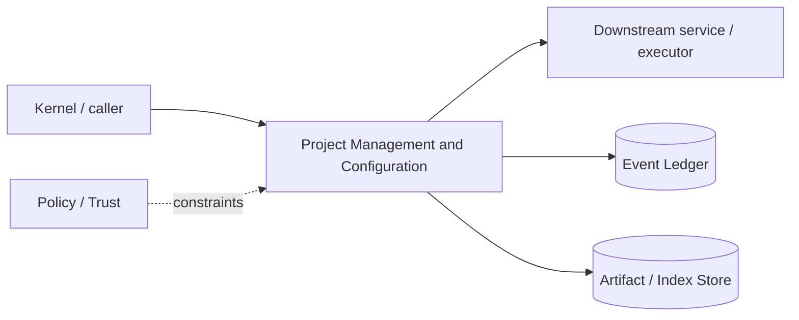

# Architecture — Project Management and Configuration

## 1. Responsibility

Detect projects, load multi-repo manifests and layered configuration, establish project trust, and expose deterministic effective settings with origin/provenance.

## 2. Boundaries and non-responsibilities

- Configuration may declare tools/policy but executable project elements remain disabled until trust.
- Config loader does not start MCP/hooks/LSP processes; owning services do after trust/policy.

## 3. Component architecture

- `ProjectDetector` — root markers and repo identity.
- `WorkspaceManifest` — multi-repo aliases/root/write policy.
- `ConfigLoader` — defaults/org/user/project/local/session layers.
- `ConfigMerger` — schema-aware merge with origin.
- `TrustStore` — content/root identity and trust decision.
- `ConfigInspector` — effective config + source display.

### Component diagram description



The diagram is intentionally generic at the boundary: the bullets above are normative component ownership. Cross-module calls MUST use the contracts listed below rather than importing another module's internal storage or implementation types.

## 4. Interfaces and contracts

- `load(cwd) -> EffectiveConfig`.
- `project.inspect` command and TUI `/inspect`.
- Publishes config-change events to services; hot reload only for declared-safe settings.

Cross-module errors use `ErrorEnvelope` from `crates/protocol`; cancellation is explicit and propagated. Any API that may return more than a small bounded payload MUST return an artifact/cursor reference.

## 5. Data models

- `rapidlm.toml` schema documented in `data-models/config-schema.md`.
- `ConfigValue<T> { value, origin, trust, locked_by? }`
- `ProjectIdentity { canonical_root, vcs_remote_fingerprint?, inode/device hints, manifest_hash }`.

Canonical shared types belong in `crates/protocol` only when two or more modules need a stable serialized representation. Storage-only fields remain private to this module.

## 6. Main runtime flow

1. Caller submits a typed request with actor/session/trace context.
2. Module validates schema, IDs, preconditions, and cancellation state.
3. If the operation can cause side effects, it obtains/validates a Capability Lease before the side effect.
4. Work is executed with explicit time/output/resource bounds.
5. Large evidence/output is written to Artifact Store and referenced by digest.
6. Durable state changes are appended to Event Ledger before success acknowledgement.
7. Result returns normalized status, evidence references, metrics, and trace ID.

## 7. Failure modes and recovery

- **Invalid project config** → diagnostics and ignore invalid section; executable declarations remain disabled.
- **Config changes requiring restart** → mark pending restart, do not partially apply.
- **Moved project** → trust re-evaluation based on identity policy.
- **Conflicting repo aliases** → hard error.

General rule: transient infrastructure failure may be retried only when the action is proven idempotent or guarded by an idempotency key. Security ambiguity fails closed. Runtime failure of autonomous work pauses/blocks the task rather than pretending completion.

## 8. Security considerations

- Project cannot override locked org/user security settings.
- Environment interpolation supports allowlisted vars and secret refs; no arbitrary shell substitution.
- Trust is required before project hooks/MCP/LSP/plugins run.
- Config paths canonicalized to prevent include traversal.

All attacker-controlled strings are treated as data. A model request, repository file, browser page, MCP result, hook output, or scanner output can never grant itself more privilege.

## 9. Implementation notes

- Support AGENTS.md/CLAUDE.md/rules compatibility through Prompt Runtime as data sources, not raw config execution.
- Effective config inspector is essential for debugging precedence.

### Example code pattern

```rust
pub struct ConfigValue<T> {
    pub value: T,
    pub origin: ConfigOrigin,
    pub trust: TrustLevel,
    pub locked_by: Option<ConfigOrigin>,
}
```

The example demonstrates the intended boundary/style, not copy-paste-complete production code. Concrete implementation MUST use typed IDs/errors/cancellation and emit trace/event metadata.

## 10. Observability

Every operation SHOULD emit a span with: `trace_id`, `session_id`, actor/agent ID, operation kind, result class, latency, and bounded resource/token counters where applicable. Never use raw prompt/code/secret content as metric labels.

## 11. Tests and acceptance evidence

- [ ] Precedence matrix.
- [ ] Project attempted privilege broadening ignored.
- [ ] Untrusted executable config not started.
- [ ] Hot-reload vs restart-required tests.

## 12. Performance expectations

The module MUST define benchmarks for its hot paths before v1 stabilization. Regressions above 15% p95 latency or 10% memory/token overhead on fixed fixtures require explicit review or an accepted trade-off ADR.

## 13. Evolution rules

- Public/wire/event schema changes require `contract-first` skill and compatibility tests.
- Security behavior changes require threat-model update.
- New dependencies/backends require an ADR if they change trust boundary or deployment footprint.
- Do not add frontend-specific behavior to this module; expose state/contracts and let frontends render it.
