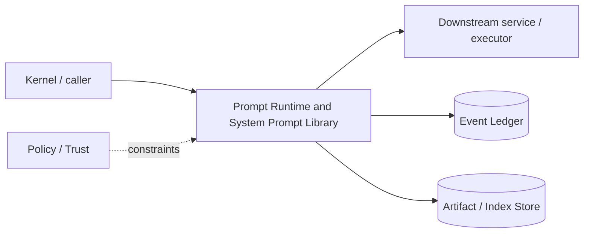

# Architecture — Prompt Runtime and System Prompt Library

## 1. Responsibility

Compile stable, model-adapted system/developer instructions, rules, skills, goal state, trust labels, context packets, and tool guidance with explicit precedence and token accounting.

## 2. Boundaries and non-responsibilities

- Prompt text cannot grant capabilities or override external policy.
- System prompt library is versioned and eval-gated.
- Context Engine supplies content blocks; Prompt Runtime decides placement/precedence/format.

## 3. Component architecture

- `PromptRegistry` — versioned prompt fragments.
- `RuleResolver` — system/org/user/project/directory rules with trust/precedence.
- `SkillResolver` — activated skills.
- `PromptCompiler` — stable prefix + variable suffix.
- `ModelPromptAdapter` — provider/model-specific formatting.
- `Compactor` — structured session summary with retained references.
- `PromptBudgeter` — token allocation and truncation at block boundaries.

### Component diagram description



The diagram is intentionally generic at the boundary: the bullets above are normative component ownership. Cross-module calls MUST use the contracts listed below rather than importing another module's internal storage or implementation types.

## 4. Interfaces and contracts

- Consumes `ContextPacket`, goal snapshot, policy summary, tool catalog hash, session summary.
- Produces `CompiledPrompt { messages, tools, token_estimate, fragment_versions, context_refs }`.
- LLM Router sends compiled prompt unchanged except transport conversion.

Cross-module errors use `ErrorEnvelope` from `crates/protocol`; cancellation is explicit and propagated. Any API that may return more than a small bounded payload MUST return an artifact/cursor reference.

## 5. Data models

- `PromptFragment { id, version, trust_level, cache_class, content_template }`
- `Rule { scope, priority, glob, source, trust, content }`
- `CompiledPromptManifest` records order and token cost per fragment.

Canonical shared types belong in `crates/protocol` only when two or more modules need a stable serialized representation. Storage-only fields remain private to this module.

## 6. Main runtime flow

1. Caller submits a typed request with actor/session/trace context.
2. Module validates schema, IDs, preconditions, and cancellation state.
3. If the operation can cause side effects, it obtains/validates a Capability Lease before the side effect.
4. Work is executed with explicit time/output/resource bounds.
5. Large evidence/output is written to Artifact Store and referenced by digest.
6. Durable state changes are appended to Event Ledger before success acknowledgement.
7. Result returns normalized status, evidence references, metrics, and trace ID.

## 7. Failure modes and recovery

- **Rule file malformed** → skip with diagnostic; do not concatenate unparsed frontmatter as trusted metadata.
- **Prompt exceeds model context** → invoke context compaction/rebudget; never truncate system safety fragment.
- **Model adapter missing feature** → route model ineligible or use tested fallback format.

General rule: transient infrastructure failure may be retried only when the action is proven idempotent or guarded by an idempotency key. Security ambiguity fails closed. Runtime failure of autonomous work pauses/blocks the task rather than pretending completion.

## 8. Security considerations

- Static system safety/policy instructions highest precedence.
- Repo/web/MCP content wrapped/labeled untrusted and placed after trusted instructions.
- Skills/rules never alter tool permission state.
- Prompt injection is mitigated by policy externalization, trust labels, and context isolation—not by prompt wording alone.

All attacker-controlled strings are treated as data. A model request, repository file, browser page, MCP result, hook output, or scanner output can never grant itself more privilege.

## 9. Implementation notes

- Order static fragments before variable content for cache stability.
- Keep model-visible gateway tool definitions deterministic.
- Compaction summary is structured: decisions, open tasks, evidence refs, read-set refs, not a free-form replacement of all history.

### Example code pattern

```rust
let compiled = PromptBuilder::new(model)
    .static_fragment(core_system)
    .static_fragment(tool_policy)
    .trusted_rules(resolved_rules)
    .goal(goal_snapshot)
    .context(context_packet)
    .recent_turn(user_turn)
    .build_with_budget(budget)?;
```

The example demonstrates the intended boundary/style, not copy-paste-complete production code. Concrete implementation MUST use typed IDs/errors/cancellation and emit trace/event metadata.

## 10. Observability

Every operation SHOULD emit a span with: `trace_id`, `session_id`, actor/agent ID, operation kind, result class, latency, and bounded resource/token counters where applicable. Never use raw prompt/code/secret content as metric labels.

## 11. Tests and acceptance evidence

- [ ] Prompt fragment order golden test.
- [ ] Untrusted repo instruction cannot outrank system rule.
- [ ] Tool catalog deterministic order.
- [ ] Compaction retains required evidence refs.
- [ ] Prompt/token regression eval on representative sessions.

## 12. Performance expectations

The module MUST define benchmarks for its hot paths before v1 stabilization. Regressions above 15% p95 latency or 10% memory/token overhead on fixed fixtures require explicit review or an accepted trade-off ADR.

## 13. Evolution rules

- Public/wire/event schema changes require `contract-first` skill and compatibility tests.
- Security behavior changes require threat-model update.
- New dependencies/backends require an ADR if they change trust boundary or deployment footprint.
- Do not add frontend-specific behavior to this module; expose state/contracts and let frontends render it.
