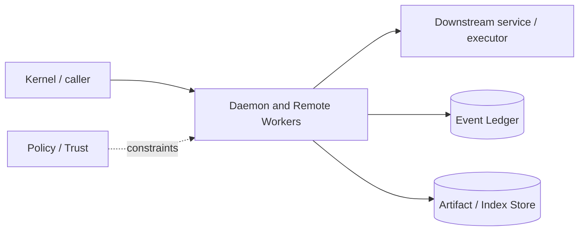

# Architecture — Daemon and Remote Workers

## 1. Responsibility

Allow persistent local sessions/background work and policy-controlled execution on specialized remote workers without changing core session/tool contracts.

## 2. Boundaries and non-responsibilities

- Daemon is a host for Kernel, not a second orchestration implementation.
- Remote workers execute leased work; controller owns goals/sessions/policy authority.
- Hosted fleet management is post-v1 beyond reference worker enrollment.

## 3. Component architecture

- `DaemonServer` — local IPC command/event transport.
- `ClientSession` — auth and event cursor.
- `WorkerRegistry` — capabilities/health/certs.
- `WorkLeaseIssuer` — signed task/sandbox/artifact inputs and expiry.
- `WorkerAgent` — sandbox/process execution and artifact uploader.
- `ArtifactTransport` — content-addressed resumable transfer.
- `HeartbeatScheduler` — liveness/capacity.

### Component diagram description



The diagram is intentionally generic at the boundary: the bullets above are normative component ownership. Cross-module calls MUST use the contracts listed below rather than importing another module's internal storage or implementation types.

## 4. Interfaces and contracts

- Local daemon socket/named pipe; optional loopback transport.
- Worker mTLS RPC `lease -> status/events -> result`.
- Remote backend implements Sandbox/Device capabilities.
- Controller verifies artifact hashes and lease ID before import.

Cross-module errors use `ErrorEnvelope` from `crates/protocol`; cancellation is explicit and propagated. Any API that may return more than a small bounded payload MUST return an artifact/cursor reference.

## 5. Data models

- `WorkerDescriptor { id, platform, arch, backends, device_caps, gpu?, labels, health }`
- `WorkLease { id, subject, task_digest, sandbox_spec, capability_scope, artifact_inputs, expires_at, nonce, signature }`
- `WorkResult { lease_id, status, artifact_outputs, resource_usage, worker_attestation }`.

Canonical shared types belong in `crates/protocol` only when two or more modules need a stable serialized representation. Storage-only fields remain private to this module.

## 6. Main runtime flow

1. Caller submits a typed request with actor/session/trace context.
2. Module validates schema, IDs, preconditions, and cancellation state.
3. If the operation can cause side effects, it obtains/validates a Capability Lease before the side effect.
4. Work is executed with explicit time/output/resource bounds.
5. Large evidence/output is written to Artifact Store and referenced by digest.
6. Durable state changes are appended to Event Ledger before success acknowledgement.
7. Result returns normalized status, evidence references, metrics, and trace ID.

## 7. Failure modes and recovery

- **Daemon client disconnect** → session continues only for background/goal commands whose ownership mode permits.
- **Worker heartbeat lost** → lease uncertain; do not double-execute non-idempotent task until expiry/reconciliation.
- **Artifact transfer interrupted** → resume by chunk/hash.
- **Result after lease expiry** → quarantine; controller may accept only through explicit reconciliation rule.

General rule: transient infrastructure failure may be retried only when the action is proven idempotent or guarded by an idempotency key. Security ambiguity fails closed. Runtime failure of autonomous work pauses/blocks the task rather than pretending completion.

## 8. Security considerations

- mTLS mutual identity and cert rotation.
- Worker never receives broader repo/secrets than lease scope.
- No controller secrets at worker except target-scoped ephemeral material.
- Remote output is untrusted and scanned before workspace import.

All attacker-controlled strings are treated as data. A model request, repository file, browser page, MCP result, hook output, or scanner output can never grant itself more privilege.

## 9. Implementation notes

- Design for idempotent work units where possible.
- Use content-addressed repo snapshots/patches, not arbitrary shared network filesystem.
- macOS workers enable iOS simulator; Linux KVM workers can enable Firecracker.

### Example code pattern

```rust
pub struct WorkLease {
    pub lease_id: WorkLeaseId,
    pub task_digest: Digest,
    pub sandbox: SandboxSpec,
    pub capability_scope: CapabilitySet,
    pub expires_at: DateTime<Utc>,
    pub signature: Signature,
}
```

The example demonstrates the intended boundary/style, not copy-paste-complete production code. Concrete implementation MUST use typed IDs/errors/cancellation and emit trace/event metadata.

## 10. Observability

Every operation SHOULD emit a span with: `trace_id`, `session_id`, actor/agent ID, operation kind, result class, latency, and bounded resource/token counters where applicable. Never use raw prompt/code/secret content as metric labels.

## 11. Tests and acceptance evidence

- [ ] Daemon reconnect from event cursor.
- [ ] mTLS wrong worker rejected.
- [ ] Expired lease result quarantined.
- [ ] Artifact hash mismatch rejected.
- [ ] Non-idempotent uncertain lease not duplicated.

## 12. Performance expectations

The module MUST define benchmarks for its hot paths before v1 stabilization. Regressions above 15% p95 latency or 10% memory/token overhead on fixed fixtures require explicit review or an accepted trade-off ADR.

## 13. Evolution rules

- Public/wire/event schema changes require `contract-first` skill and compatibility tests.
- Security behavior changes require threat-model update.
- New dependencies/backends require an ADR if they change trust boundary or deployment footprint.
- Do not add frontend-specific behavior to this module; expose state/contracts and let frontends render it.

## V2 addendum — Handoff and interactive worker capabilities

Remote workers additionally advertise:

```text
platform: linux|windows|macos
sandbox_tiers: [...]
computer_use: browser|desktop|tui|android|ios
interactive_display: true|false
handoff_protocol_versions: [...]
attestation: ...
data_regions: [...]
```

Execution Handoff uses `architecture/execution-handoff.md`; ordinary task delegation remains a managed-agent operation. A handoff moves session execution ownership, while a managed worker executes a child task and returns `AgentResult`.

Daemon mode owns `SessionExecutionLease` locally. Detaching the TUI does not transfer execution ownership. A remote handoff does.
