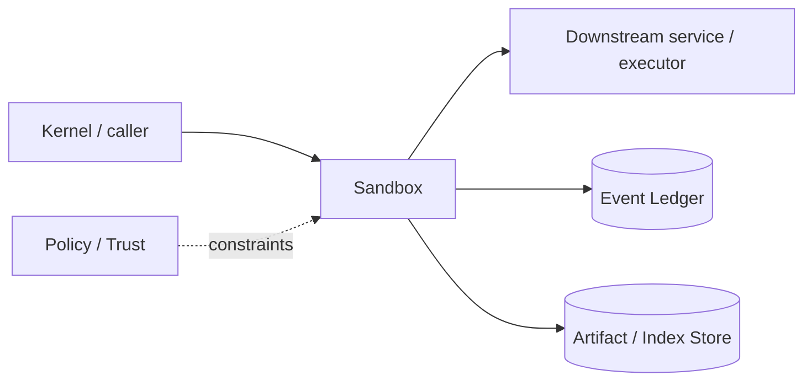

# Architecture — Sandbox

## 1. Responsibility

Execute untrusted or risky processes with explicit filesystem, network, resource, secret, and lifetime boundaries across multiple backend tiers.

## 2. Boundaries and non-responsibilities

- Sandbox enforces a `SandboxSpec`; it does not decide whether a capability should be granted.
- Capability Broker authorizes; Sandbox validates lease and materializes the environment.
- Workspace content is mounted from a view; sandbox never owns canonical source state.

## 3. Component architecture

- `SandboxManager` — backend selection and lifecycle.
- `SandboxBackend` trait — host/container/gVisor/remote/Firecracker.
- `MountPlanner` — read-only/read-write/temp mounts.
- `NetworkPolicy` — none/allowlist/proxy modes.
- `SecretInjector` — ephemeral env/file/fd injection.
- `ResourceController` — CPU/memory/pids/time/output.
- `SandboxProcess` — process tree and structured exit.

### Component diagram description



The diagram is intentionally generic at the boundary: the bullets above are normative component ownership. Cross-module calls MUST use the contracts listed below rather than importing another module's internal storage or implementation types.

## 4. Interfaces and contracts

- `create(SandboxSpec, CapabilityLease) -> SandboxHandle`.
- `exec(handle, ExecSpec, Lease) -> ExecResult`.
- Process Supervisor owns stream/cancellation behavior; Sandbox owns containment.
- Remote Worker implements same backend trait through RPC.

Cross-module errors use `ErrorEnvelope` from `crates/protocol`; cancellation is explicit and propagated. Any API that may return more than a small bounded payload MUST return an artifact/cursor reference.

## 5. Data models

- `SandboxSpec { tier, image, mounts, cwd, env_allowlist, network, cpu, memory_mb, pids, timeout, output_limit, secrets }`
- `SandboxExit { code?, signal?, reason, oom, timeout, policy_violation, usage }`.

Canonical shared types belong in `crates/protocol` only when two or more modules need a stable serialized representation. Storage-only fields remain private to this module.

## 6. Main runtime flow

1. Caller submits a typed request with actor/session/trace context.
2. Module validates schema, IDs, preconditions, and cancellation state.
3. If the operation can cause side effects, it obtains/validates a Capability Lease before the side effect.
4. Work is executed with explicit time/output/resource bounds.
5. Large evidence/output is written to Artifact Store and referenced by digest.
6. Durable state changes are appended to Event Ledger before success acknowledgement.
7. Result returns normalized status, evidence references, metrics, and trace ID.

## 7. Failure modes and recovery

- **Backend unavailable** → choose only an explicitly policy-allowed fallback; otherwise block.
- **Mount setup partial failure** → destroy sandbox, never continue.
- **Network proxy failure** → fail closed when network was constrained.
- **OOM/timeout** → terminate full process group and report structured reason.
- **Cleanup failure** → quarantine resource and schedule janitor; never reuse unknown state.

General rule: transient infrastructure failure may be retried only when the action is proven idempotent or guarded by an idempotency key. Security ambiguity fails closed. Runtime failure of autonomous work pauses/blocks the task rather than pretending completion.

## 8. Security considerations

- Default isolated network is none.
- Mount paths are canonicalized and symlink-resolved before authorization.
- Rootless container where practical; no Docker socket passthrough.
- gVisor selected for untrusted Linux workloads when available.
- Firecracker is remote/hosted reference tier; jailer/KVM configuration belongs to worker hardening.
- Secrets never baked into images/snapshots.

All attacker-controlled strings are treated as data. A model request, repository file, browser page, MCP result, hook output, or scanner output can never grant itself more privilege.

## 9. Implementation notes

- Backend selection is a policy mapping, not model choice.
- Cache package registries through explicit read-only/cache mounts or egress proxy.
- Record backend/version/kernel/container image digest in evidence for reproducibility.

### Example code pattern

```rust
#[async_trait]
pub trait SandboxBackend: Send + Sync {
    async fn create(&self, spec: &SandboxSpec, lease: &CapabilityLease)
        -> Result<Box<dyn SandboxHandle>, SandboxError>;
    fn capabilities(&self) -> SandboxCapabilities;
}
```

The example demonstrates the intended boundary/style, not copy-paste-complete production code. Concrete implementation MUST use typed IDs/errors/cancellation and emit trace/event metadata.

## 10. Observability

Every operation SHOULD emit a span with: `trace_id`, `session_id`, actor/agent ID, operation kind, result class, latency, and bounded resource/token counters where applicable. Never use raw prompt/code/secret content as metric labels.

## 11. Tests and acceptance evidence

- [ ] Symlink escape tests.
- [ ] No-network exfiltration tests.
- [ ] Secret does not persist after teardown.
- [ ] PID-tree cancellation and OOM tests.
- [ ] Backend conformance suite runs identical behavior contract.

## 12. Performance expectations

The module MUST define benchmarks for its hot paths before v1 stabilization. Regressions above 15% p95 latency or 10% memory/token overhead on fixed fixtures require explicit review or an accepted trade-off ADR.

## 13. Evolution rules

- Public/wire/event schema changes require `contract-first` skill and compatibility tests.
- Security behavior changes require threat-model update.
- New dependencies/backends require an ADR if they change trust boundary or deployment footprint.
- Do not add frontend-specific behavior to this module; expose state/contracts and let frontends render it.

## V2 addendum — GUI/Computer-Use sandboxing

Computer Use does not bypass sandboxing. A desktop/browser session is a resource **inside** an execution worker trust boundary.

### GUI sandbox profile

```rust
pub struct GuiSandboxSpec {
    pub sandbox: SandboxSpec,
    pub display_backend: DisplayBackend,
    pub resolution: (u32, u32),
    pub clipboard: ClipboardPolicy,
    pub allowed_apps: Vec<AppRef>,
    pub file_chooser_roots: Vec<RepoPathOrArtifactRoot>,
    pub screen_recording: RecordingPolicy,
    pub input_injection: InputPolicy,
}
```

Rules:

- browser/desktop network inherits Sandbox network policy;
- no host Docker socket, password manager, keychain, SSH agent or arbitrary home-directory mount by default;
- GUI file picker sees only approved workspace/artifact roots;
- virtual desktop workers are disposable for eval/untrusted workloads;
- secrets are injected at the final UI/command boundary and excluded from snapshots/recordings;
- remote Windows/macOS Computer Use workers must advertise platform/security capabilities and are selected through WorkerConstraints;
- if a required GUI isolation backend is unavailable, RapidLM fails closed instead of silently controlling the user's ambient desktop with broader privileges.
