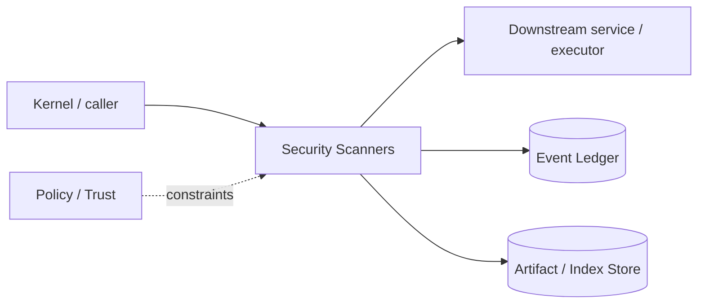

# Architecture — Security Scanners

## 1. Responsibility

Normalize pre-action and post-change security analysis into actionable findings and policy gates without coupling the runtime to a single scanner vendor.

## 2. Boundaries and non-responsibilities

- Scanner results inform policy/evidence; scanner does not directly mutate files.
- External scanners run through Process/Sandbox and are untrusted executables.
- A failed scanner is `unknown/error`, never `clean`.

## 3. Component architecture

- `ScannerRegistry` — native and external scanner adapters.
- `SecretScanner` — entropy/pattern/key format baseline.
- `CommandRiskScanner` — shell AST + dangerous primitive classification.
- `PatchScanner` — suspicious permission/network/credential changes.
- `SastAdapter` / `ScaAdapter` / `ContainerAdapter` — SARIF or normalized adapters.
- `FindingNormalizer` — dedupe/fingerprint/severity/confidence.
- `SecurityGate` — policy rules for block/ask/warn/pass.

### Component diagram description



The diagram is intentionally generic at the boundary: the bullets above are normative component ownership. Cross-module calls MUST use the contracts listed below rather than importing another module's internal storage or implementation types.

## 4. Interfaces and contracts

- `scan(ScanRequest) -> ScanReport`.
- PreTool hook from Capability Broker; post-change hook from Workspace/Goal verifier.
- Exports SARIF 2.1.0-compatible artifacts plus internal typed findings.

Cross-module errors use `ErrorEnvelope` from `crates/protocol`; cancellation is explicit and propagated. Any API that may return more than a small bounded payload MUST return an artifact/cursor reference.

## 5. Data models

- `Finding { id, rule_id, category, severity, confidence, location, evidence_ref, remediation, scanner, fingerprint }`
- `ScanReport { status, findings, coverage, scanner_versions, errors }`.

Canonical shared types belong in `crates/protocol` only when two or more modules need a stable serialized representation. Storage-only fields remain private to this module.

## 6. Main runtime flow

1. Caller submits a typed request with actor/session/trace context.
2. Module validates schema, IDs, preconditions, and cancellation state.
3. If the operation can cause side effects, it obtains/validates a Capability Lease before the side effect.
4. Work is executed with explicit time/output/resource bounds.
5. Large evidence/output is written to Artifact Store and referenced by digest.
6. Durable state changes are appended to Event Ledger before success acknowledgement.
7. Result returns normalized status, evidence references, metrics, and trace ID.

## 7. Failure modes and recovery

- **Scanner process timeout/crash** → report error and apply policy for unknown coverage.
- **Malformed SARIF** → adapter error, preserve raw artifact.
- **Duplicate findings** → stable fingerprint dedupe.
- **Rule update unavailable offline** → use pinned local bundle and report age.

General rule: transient infrastructure failure may be retried only when the action is proven idempotent or guarded by an idempotency key. Security ambiguity fails closed. Runtime failure of autonomous work pauses/blocks the task rather than pretending completion.

## 8. Security considerations

- Scanner binaries/config from project require trust and capability policy.
- Never pass secrets to cloud scanners unless policy explicitly permits.
- Security gate cannot be weakened by repository text/prompt.
- Scanner output may contain attacker strings; render/summarize as data.

All attacker-controlled strings are treated as data. A model request, repository file, browser page, MCP result, hook output, or scanner output can never grant itself more privilege.

## 9. Implementation notes

- Keep native baseline small and deterministic.
- Prefer adapters for mature ecosystems rather than reimplementing every SAST/SCA engine.
- Store scanner version/rule bundle digest in evidence.

### Example code pattern

```rust
pub enum ScanStatus { Clean, Findings, Error, Partial }

pub trait Scanner {
    fn id(&self) -> &'static str;
    async fn scan(&self, req: ScanRequest) -> Result<ScanReport, ScanError>;
}
```

The example demonstrates the intended boundary/style, not copy-paste-complete production code. Concrete implementation MUST use typed IDs/errors/cancellation and emit trace/event metadata.

## 10. Observability

Every operation SHOULD emit a span with: `trace_id`, `session_id`, actor/agent ID, operation kind, result class, latency, and bounded resource/token counters where applicable. Never use raw prompt/code/secret content as metric labels.

## 11. Tests and acceptance evidence

- [ ] Known-secret corpus detection.
- [ ] Scanner crash cannot yield Clean.
- [ ] SARIF roundtrip fixture.
- [ ] Pre-action dangerous command gate tests.
- [ ] Cloud scanner data-policy denial test.

## 12. Performance expectations

The module MUST define benchmarks for its hot paths before v1 stabilization. Regressions above 15% p95 latency or 10% memory/token overhead on fixed fixtures require explicit review or an accepted trade-off ADR.

## 13. Evolution rules

- Public/wire/event schema changes require `contract-first` skill and compatibility tests.
- Security behavior changes require threat-model update.
- New dependencies/backends require an ADR if they change trust boundary or deployment footprint.
- Do not add frontend-specific behavior to this module; expose state/contracts and let frontends render it.
