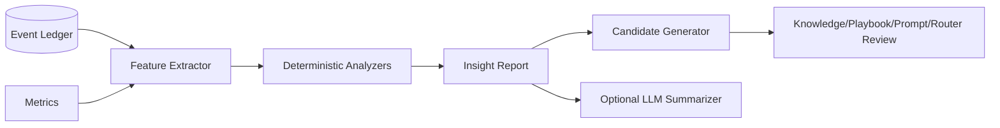

# Architecture — Session Insights

## 1. Responsibility

Analyze completed or paused sessions and produce actionable, evidence-linked observations about engineering outcome, agent coordination, context efficiency, permissions, verification, cost and user collaboration. Inspired by Devin Session Insights, but grounded entirely in RapidLM's Event Ledger and measurable runtime signals.

## 2. Outputs

`SessionInsightReport` contains:

- task classification and outcome;
- timeline summary;
- root causes of failure/blocking;
- repeated-read/context waste analysis;
- model routing anomalies;
- unnecessary tool calls/retries;
- agent over/under-delegation;
- merge/conflict overhead;
- approval friction / overly broad requested scopes;
- missing or weak evidence;
- Computer Use action inefficiency and coordinate-fallback rate;
- prompt/knowledge/playbook improvement candidates;
- reproducibility and supporting event/evidence references.

## 3. Analyzer architecture

Deterministic analyzers run first:

- `ContextWasteAnalyzer`
- `ToolLoopAnalyzer`
- `BudgetAnalyzer`
- `AgentTopologyAnalyzer`
- `PolicyFrictionAnalyzer`
- `VerificationGapAnalyzer`
- `ComputerUseAnalyzer`
- `RecoveryAnalyzer`

An optional LLM summarizer may turn structured findings into readable recommendations, but cannot invent unsupported conclusions. Every recommendation links to evidence/events.

## 4. Improvement proposals

Insights may emit candidates, never silent changes:

```rust
pub enum ImprovementCandidate {
    Knowledge(KnowledgeCandidate),
    Playbook(PlaybookPatchCandidate),
    Prompt(PromptExperimentCandidate),
    ContextPolicy(ContextExperimentCandidate),
    Router(RouterExperimentCandidate),
    ProjectRule(RuleCandidate),
}
```

Promotion routes through the appropriate owner/approval/eval workflow.

## 5. Example report

```text
Session: s_123 — blocked after 47m
Outcome: tests pass; required browser verification missing

Findings:
1. HIGH — agent marked implementation complete before UI criterion had evidence.
   Evidence: goal criterion C4, events 882-901.
2. MEDIUM — 18,420 unchanged source tokens were resent after compaction.
   Evidence: read-set hashes + context packets 7-9.
3. MEDIUM — three sibling agents searched the same auth module.
   Recommendation: keep Explorer background agent warm for this repo class.
4. LOW — 22/31 desktop actions used coordinate fallback although AX nodes existed.
   Recommendation: adjust semantic target resolver threshold.
```

## 6. Security/privacy

- Insights inherit the session data policy.
- Reports default to metadata and references; raw code/prompt excerpts require access.
- No hidden reasoning reconstruction.
- Sensitive URLs, user data, screenshots and secrets remain redacted.

## 7. Failure modes

- incomplete ledger → report `analysis_partial`, list missing sequence range;
- analyzer disagreement → preserve individual findings/confidence;
- LLM summarizer unavailable → deterministic report remains valid;
- stale Knowledge proposal → owner review resolves; never auto-publish.

## 8. Acceptance evidence

- known fixture with redundant reads yields expected context-waste finding;
- missing evidence criterion is detected even if final assistant text says complete;
- prompt improvement includes exact trace/eval reason;
- report generation works fully offline without an LLM;
- cross-session aggregation uses anonymized/authorized metrics only.


## 9. Component architecture, interfaces and implementation notes



```rust
#[async_trait]
pub trait SessionInsightsService {
    async fn analyze(&self, session: SessionId, policy: InsightPolicy) -> Result<SessionInsightReport>;
    async fn propose(&self, report: InsightReportId) -> Result<Vec<ImprovementCandidate>>;
}
```

Implementation notes: analyzers operate on typed events/metrics and emit confidence plus evidence references. The optional summarizer receives structured findings rather than the entire raw session where possible. Proposal generation only creates candidates; promotion is delegated to the owning subsystem and its normal approval/eval gate.
