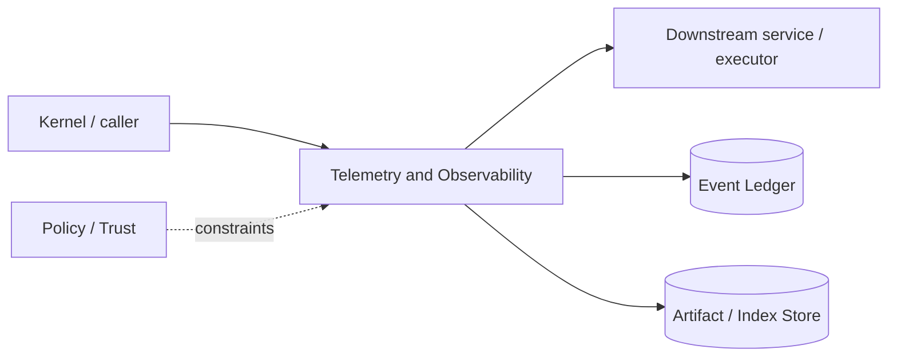

# Architecture — Telemetry and Observability

## 1. Responsibility

Make runtime behavior diagnosable through structured logs, metrics, traces, event correlation, and user-visible inspectors while preserving privacy and redaction.

## 2. Boundaries and non-responsibilities

- Durable user/security facts belong in Event Ledger; telemetry is not authoritative state.
- Telemetry export is independent of local diagnostics.
- No hidden chain-of-thought is collected.

## 3. Component architecture

- `TraceContext` — trace/span IDs propagated through kernel/model/tool/process.
- `StructuredLogger` — JSON logs with redaction.
- `Metrics` — counters/histograms/gauges.
- `OTelExporter` — optional OpenTelemetry.
- `TraceArtifactBuilder` — local support bundle.
- `RedactionPipeline` — field classification + secret fingerprints.
- `InspectorProjection` — user-facing trace timelines.

### Component diagram description



The diagram is intentionally generic at the boundary: the bullets above are normative component ownership. Cross-module calls MUST use the contracts listed below rather than importing another module's internal storage or implementation types.

## 4. Interfaces and contracts

- Every event carries trace ID.
- LLM Router, Tool Gateway, Context, Sandbox emit spans/metrics.
- `rapid diagnostics export` creates redacted bundle.

Cross-module errors use `ErrorEnvelope` from `crates/protocol`; cancellation is explicit and propagated. Any API that may return more than a small bounded payload MUST return an artifact/cursor reference.

## 5. Data models

- Common dimensions: build_version, platform, backend, provider/model alias, task class, result class; never raw prompt/code as metric labels.
- Span attributes use bounded cardinality.

Canonical shared types belong in `crates/protocol` only when two or more modules need a stable serialized representation. Storage-only fields remain private to this module.

## 6. Main runtime flow

1. Caller submits a typed request with actor/session/trace context.
2. Module validates schema, IDs, preconditions, and cancellation state.
3. If the operation can cause side effects, it obtains/validates a Capability Lease before the side effect.
4. Work is executed with explicit time/output/resource bounds.
5. Large evidence/output is written to Artifact Store and referenced by digest.
6. Durable state changes are appended to Event Ledger before success acknowledgement.
7. Result returns normalized status, evidence references, metrics, and trace ID.

## 7. Failure modes and recovery

- **Exporter unavailable** → bounded local queue then drop telemetry with counter; never block critical execution.
- **Log disk full** → rotate/drop diagnostics, ledger remains priority.
- **Redaction uncertain on sensitive class** → omit payload.

General rule: transient infrastructure failure may be retried only when the action is proven idempotent or guarded by an idempotency key. Security ambiguity fails closed. Runtime failure of autonomous work pauses/blocks the task rather than pretending completion.

## 8. Security considerations

- Opt-in external telemetry for consumer mode.
- No prompt/code/secret bodies by default.
- Enterprise exporter policy can lock destination and fields.
- Support bundle preview before user shares.

All attacker-controlled strings are treated as data. A model request, repository file, browser page, MCP result, hook output, or scanner output can never grant itself more privilege.

## 9. Implementation notes

- OpenTelemetry semantic conventions where useful, with RapidLM namespace.
- Metrics to track token efficiency, context bytes/tokens, cache hits, approvals, sandbox failures, recovery, agent concurrency.

### Example code pattern

```rust
let span = tracing::info_span!("tool.invoke",
    tool = %tool_name,
    agent_id = %agent_id,
    capability = %capability.kind(),
    trace_id = %trace_id);
let _guard = span.enter();
```

The example demonstrates the intended boundary/style, not copy-paste-complete production code. Concrete implementation MUST use typed IDs/errors/cancellation and emit trace/event metadata.

## 10. Observability

Every operation SHOULD emit a span with: `trace_id`, `session_id`, actor/agent ID, operation kind, result class, latency, and bounded resource/token counters where applicable. Never use raw prompt/code/secret content as metric labels.

## 11. Tests and acceptance evidence

- [ ] Secret fixture absent from exported bundle.
- [ ] Exporter outage does not block kernel.
- [ ] Trace IDs correlate model->tool->process events.
- [ ] Metric cardinality guard test.

## 12. Performance expectations

The module MUST define benchmarks for its hot paths before v1 stabilization. Regressions above 15% p95 latency or 10% memory/token overhead on fixed fixtures require explicit review or an accepted trade-off ADR.

## 13. Evolution rules

- Public/wire/event schema changes require `contract-first` skill and compatibility tests.
- Security behavior changes require threat-model update.
- New dependencies/backends require an ADR if they change trust boundary or deployment footprint.
- Do not add frontend-specific behavior to this module; expose state/contracts and let frontends render it.
