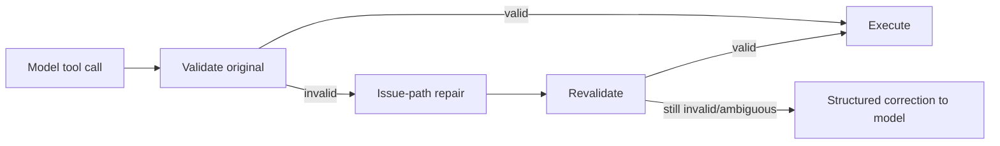

# Tool Contract, Repair and Recovery Engineering

## Core rule

A tool call is **never normalized first**. RapidLM validates the original call against the exact versioned schema. Only a failed validation can invoke bounded repair, and only fields implicated by validator issues may change.

## Repair classes

Safe candidates include optional-null elision, stringified JSON collection decode, bare-value-to-singleton collection, clearly parseable numeric/boolean scalars, enum aliases explicitly declared by schema and legacy field aliases. Repairs are schema-versioned and model/tool telemetry records frequency/success.

Never repair an ambiguous path, command, network target, secret identifier, destructive flag, approval choice or semantic value merely to make schema validation pass.

## RepairRecord

`model_family, tool_id, schema_version, issue_paths, original_hash, repair_rules, repaired_hash, confidence_class`.

The model receives concise feedback that a call was repaired so it can improve subsequent calls; secrets/raw sensitive args are not echoed.

## Cross-tool invariant engine

Field schema is insufficient for relational state. Examples:
- write/patch requires current preimage/read revision;
- coordinate action requires current Observation generation;
- follow-up page cursor must belong to same query/catalog revision;
- MCP call tool id must belong to current catalog revision;
- process input requires ownership/current PTY generation;
- resource release must match active lease generation;
- goal completion evidence must match current workspace/graph revisions.

The invariant engine sees normalized invocation + execution-state refs and returns Allow/Recoverable/Reject.

## Universal ToolOutcome

All first-party tools return Success, Recovered, Partial, Retryable, Denied or Failed. Partial/Retryable must include a machine-readable continuation/recovery hint when one exists. Large bodies are CAS artifacts with bounded excerpts.

## Tool reliability evals

A model×tool matrix tracks invalid-call rate, repair type, repair success, retry turns, semantic corruption escapes and valid-input mutation rate (target zero). Release suite includes malformed-call corpora for smaller/open models.
