# Architecture — Trajectory Learning and Optimization

## 1. Responsibility

Convert observable RapidLM executions into privacy-governed, replayable trajectory datasets used to evaluate and improve prompts, context retrieval, compaction, routing, delegation and optional specialist models.

This subsystem is inspired by Muse Code / Muse Spark's published harness co-training and self-improvement loop. It does **not** require storage of hidden chain-of-thought.

## 2. Principle: observable trajectory, not private reasoning

A trajectory records what the runtime can legitimately observe:

```text
Task/environment → prompt bundle IDs → context items/provenance
→ model request/response messages allowed by data policy
→ tool calls/results → policy decisions → workspace patches
→ agent spawn/result → compactions → verifications → final outcome/metrics
```

The system MUST NOT create a requirement to store private model chain-of-thought. Model-provider hidden reasoning tokens may be counted as usage if exposed numerically but are not reconstructed.

## 3. Trajectory schema

```rust
pub struct TrainingTrajectory {
    pub trajectory_id: TrajectoryId,
    pub scenario_or_session: SourceRef,
    pub environment: EnvironmentManifestRef,
    pub prompt_bundle: PromptBundleRef,
    pub model_routes: Vec<ModelRouteRecord>,
    pub context_selections: Vec<ContextSelectionRecord>,
    pub observable_events: ArtifactRef,
    pub changeset: Option<ChangeSetRef>,
    pub evidence: Vec<EvidenceId>,
    pub outcome: OutcomeLabel,
    pub rewards: RewardVector,
    pub privacy: DataPolicyLabel,
    pub reproducibility: ReproducibilityInfo,
}
```

`ContextSelectionRecord` should optionally include top rejected candidates and their scores so rankers can be improved without re-indexing the original repository.

## 4. Reward vector

Use multi-objective rewards, never a single opaque score:

```text
correctness
verification_pass
security_compliance
user_acceptance
patch_quality
context_precision
token_efficiency
tool_efficiency
latency
autonomy
cost_efficiency
```

Hard security violations set a non-negotiable failure label even if code tests pass.

## 5. Pipeline

```mermaid
flowchart LR
  RUN[Production/Eval Run] --> COL[Trajectory Collector]
  COL --> RED[Redaction + Data Policy]
  RED --> GR[Deterministic Graders]
  GR --> RANK[Rank / Compare Candidates]
  RANK --> DATA[Versioned Dataset]
  DATA --> EXP[Experiment Registry]
  EXP --> OPT[Prompt / Router / Context / Specialist optimization]
  OPT --> EVAL[Matched Eval Gate]
  EVAL -->|pass| RELEASE[Versioned runtime policy]
```



## 6. Self-generated task environments

The harness MAY create synthetic coding environments/tasks to expand coverage:

1. generator proposes repo/task/acceptance specification;
2. builder materializes deterministic fixture and hidden verifier;
3. adversarial validator checks task is solvable and nontrivial;
4. multiple candidate agents run;
5. deterministic tests/security/evidence grade them;
6. only reproducible cases enter benchmark/training pools.

Generated tasks cannot be used as proof of production quality unless separated from held-out human-authored suites.

## 7. Long-horizon training/evaluation

Maintain dedicated endurance suites at approximately:

- 1 hour / >=100 tool calls;
- 4 hours / >=300 tool calls;
- 12 hours / >=700 tool calls;
- 24 hours / >=1,000 tool calls.

Inject:

- process restart;
- daemon/client disconnect;
- provider rate limit;
- compaction cycles;
- background-agent restart;
- remote-worker handoff;
- sandbox restart;
- context index refresh;
- flaky test retries.

Measure goal drift, forgotten constraints, repeated reads, context inflation, unverified completion, recovery fidelity and cost.

## 8. Optimization targets

V2 supports offline experiments for:

- system prompt variants;
- Context Engine weights/MMR/budget allocation;
- compaction strategies;
- model routing/scoring;
- delegation/spawn policy;
- risk classifier thresholds;
- verifier/ranker specialist models;
- optional fine-tuning datasets when data policy permits.

Every promoted variant has an immutable version and matched baseline report.

## 9. Privacy and governance

- default `training_export = false` for user/project sessions;
- eval fixtures can be explicitly marked reusable;
- external training export requires policy + consent + redaction;
- secret-bearing artifacts are rejected;
- proprietary code can remain referenced by local content digest instead of copied into dataset;
- deletion requests propagate to derived datasets where technically possible and are tracked by lineage.

## 10. Failure modes

- grader bug → version graders and recompute; never overwrite old score provenance;
- data contamination → quarantine dataset split and rotate benchmark IDs;
- test leakage → hold-out verifier and hidden evaluation corpora;
- reward hacking → multi-objective gates + adversarial review;
- stochastic noise → repeated seeds/paired trials/confidence intervals;
- privacy label missing → fail closed: trajectory cannot leave local store.

## 11. Example experiment

```yaml
experiment: context-ranker-2026-08-b
baseline: context-ranker-17
candidate: context-ranker-18
suite: repo-refactor-heldout-v4
repetitions: 5
promote_if:
  task_success_delta: ">= 0"
  context_tokens_delta: "<= -12%"
  security_violations: 0
  p95_latency_delta: "<= +5%"
```

## 12. Acceptance evidence

- identical replay fixture produces same observable trajectory digest;
- privacy-disallowed session cannot be exported;
- ranker can distinguish injected 20% token waste with equal correctness;
- 24h endurance runner survives injected restart/handoff without losing required goal constraints;
- prompt/router/context variants cannot promote without matched baseline gate.


## 13. Interfaces and implementation pattern

```rust
#[async_trait]
pub trait TrajectoryStore {
    async fn begin(&self, manifest: TrajectoryManifest) -> Result<TrajectoryId>;
    async fn append_observable(&self, id: TrajectoryId, event: ObservableTrajectoryEvent) -> Result<()>;
    async fn finalize(&self, id: TrajectoryId, outcome: OutcomeLabel, reward: RewardVector) -> Result<TrainingTrajectory>;
    async fn export(&self, id: TrajectoryId, policy: ExportPolicy) -> Result<DatasetArtifact>;
}

#[async_trait]
pub trait ExperimentRegistry {
    async fn register(&self, spec: ExperimentSpec) -> Result<ExperimentId>;
    async fn compare(&self, id: ExperimentId) -> Result<MatchedBaselineReport>;
    async fn promote(&self, id: ExperimentId, approval: PromotionApproval) -> Result<VersionRef>;
}
```

Component boundary: the collector subscribes to observable Event Ledger/tool/model boundary records; it must not access a provider's hidden reasoning channel. Data export is a separate policy-enforced operation from local collection. Store large event streams/content as artifact references and content digests.
