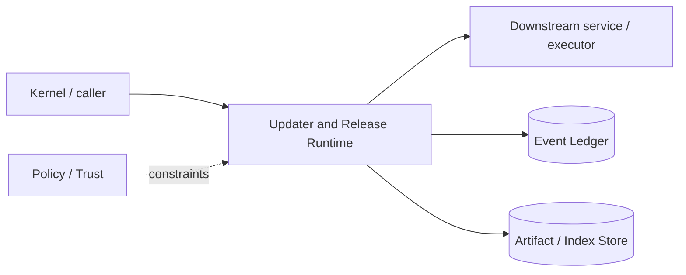

# Architecture — Updater and Release Runtime

## 1. Responsibility

Distribute signed binaries safely, support rollback, report versions, and keep auto-update behavior outside agent control.

## 2. Boundaries and non-responsibilities

- Agents cannot self-update the runtime through ordinary shell/tool permissions without explicit user action.
- Release signing keys are never present in build/test agents.

## 3. Component architecture

- `VersionReporter`; `UpdateChecker`; `ManifestVerifier`; `BinaryInstaller`; `RollbackManager`.

### Component diagram description



The diagram is intentionally generic at the boundary: the bullets above are normative component ownership. Cross-module calls MUST use the contracts listed below rather than importing another module's internal storage or implementation types.

## 4. Interfaces and contracts

- `rapid update check|apply|rollback`; optional background check only.
- Signed release manifest contains platform artifact digests and minimum schema compatibility.

Cross-module errors use `ErrorEnvelope` from `crates/protocol`; cancellation is explicit and propagated. Any API that may return more than a small bounded payload MUST return an artifact/cursor reference.

## 5. Data models

- `ReleaseManifest { version, channel, artifacts, min_db_schema, signatures }`.

Canonical shared types belong in `crates/protocol` only when two or more modules need a stable serialized representation. Storage-only fields remain private to this module.

## 6. Main runtime flow

1. Caller submits a typed request with actor/session/trace context.
2. Module validates schema, IDs, preconditions, and cancellation state.
3. If the operation can cause side effects, it obtains/validates a Capability Lease before the side effect.
4. Work is executed with explicit time/output/resource bounds.
5. Large evidence/output is written to Artifact Store and referenced by digest.
6. Durable state changes are appended to Event Ledger before success acknowledgement.
7. Result returns normalized status, evidence references, metrics, and trace ID.

## 7. Failure modes and recovery

- **Signature/digest failure** → abort and quarantine download.
- **Install interruption** → atomic swap/rollback.
- **Schema too new** → updater coordinates migration backup.

General rule: transient infrastructure failure may be retried only when the action is proven idempotent or guarded by an idempotency key. Security ambiguity fails closed. Runtime failure of autonomous work pauses/blocks the task rather than pretending completion.

## 8. Security considerations

- TUF-like signed metadata pattern or equivalent; HTTPS alone is insufficient.
- Project config cannot redirect update source unless enterprise policy explicitly locks a mirror.

All attacker-controlled strings are treated as data. A model request, repository file, browser page, MCP result, hook output, or scanner output can never grant itself more privilege.

## 9. Implementation notes

- Start manual update in v1; enable auto-check later.
- Generate SBOM and provenance at release.

### Example code pattern

```rust
pub fn verify_release(manifest: &[u8], sig: &Signature, roots: &TrustedKeys) -> Result<ReleaseManifest> {
    roots.verify(manifest, sig)?;
    serde_json::from_slice(manifest).map_err(Into::into)
}
```

The example demonstrates the intended boundary/style, not copy-paste-complete production code. Concrete implementation MUST use typed IDs/errors/cancellation and emit trace/event metadata.

## 10. Observability

Every operation SHOULD emit a span with: `trace_id`, `session_id`, actor/agent ID, operation kind, result class, latency, and bounded resource/token counters where applicable. Never use raw prompt/code/secret content as metric labels.

## 11. Tests and acceptance evidence

- [ ] Tampered manifest rejected.
- [ ] Interrupted install rollback test.
- [ ] Wrong-platform artifact rejected.

## 12. Performance expectations

The module MUST define benchmarks for its hot paths before v1 stabilization. Regressions above 15% p95 latency or 10% memory/token overhead on fixed fixtures require explicit review or an accepted trade-off ADR.

## 13. Evolution rules

- Public/wire/event schema changes require `contract-first` skill and compatibility tests.
- Security behavior changes require threat-model update.
- New dependencies/backends require an ADR if they change trust boundary or deployment footprint.
- Do not add frontend-specific behavior to this module; expose state/contracts and let frontends render it.
