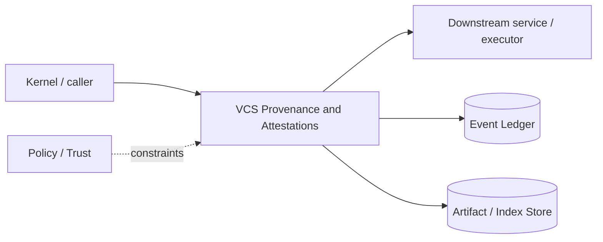

# Architecture — VCS Provenance and Attestations

## 1. Responsibility

Layer goal/agent/model/evidence attribution on top of Git-compatible changes and produce auditable session/change attestations.

## 2. Boundaries and non-responsibilities

- Does not replace Git object model in v1.
- Attestation records facts/links and cryptographic digests, not model hidden reasoning.
- Signing is optional local v1 and can be organization-managed later.

## 3. Component architecture

- `ProvenanceGraph` — typed causal edges.
- `ChangeAttributor` — link PatchOps/external mutations to agent/tool/goal.
- `AttestationBuilder` — summarize session/change coverage, usage, verification.
- `Signer` — optional key-backed signature.
- `GitNotesExporter` / JSON exporter — interoperability.

### Component diagram description



The diagram is intentionally generic at the boundary: the bullets above are normative component ownership. Cross-module calls MUST use the contracts listed below rather than importing another module's internal storage or implementation types.

## 4. Interfaces and contracts

- Consumes ledger events, ChangeSets, Evidence, router usage.
- Produces `Attestation` artifact and event.
- Workspace apply/review surfaces provenance per hunk/change.

Cross-module errors use `ErrorEnvelope` from `crates/protocol`; cancellation is explicit and propagated. Any API that may return more than a small bounded payload MUST return an artifact/cursor reference.

## 5. Data models

- `ProvenanceNode = Goal|Task|Evidence|DecisionRecord|ChangeSet|Verification|ModelStep`
- `ProvenanceEdge { from, to, kind }`
- `Attestation { session, covered_changes, evidence, models, tokens, cost, policy_digest, prompt_versions, signature? }`.

Canonical shared types belong in `crates/protocol` only when two or more modules need a stable serialized representation. Storage-only fields remain private to this module.

## 6. Main runtime flow

1. Caller submits a typed request with actor/session/trace context.
2. Module validates schema, IDs, preconditions, and cancellation state.
3. If the operation can cause side effects, it obtains/validates a Capability Lease before the side effect.
4. Work is executed with explicit time/output/resource bounds.
5. Large evidence/output is written to Artifact Store and referenced by digest.
6. Durable state changes are appended to Event Ledger before success acknowledgement.
7. Result returns normalized status, evidence references, metrics, and trace ID.

## 7. Failure modes and recovery

- **Missing attribution on external mutation** → attestation coverage incomplete and apply may be gated.
- **Evidence artifact missing** → attestation references broken; rebuild/check or mark partial.
- **Signing unavailable** → unsigned attestation with explicit status, never fake signature.

General rule: transient infrastructure failure may be retried only when the action is proven idempotent or guarded by an idempotency key. Security ambiguity fails closed. Runtime failure of autonomous work pauses/blocks the task rather than pretending completion.

## 8. Security considerations

- Attestation excludes secret payloads and hidden chain-of-thought.
- Signatures bind canonical digest of referenced metadata/artifacts.
- Do not trust agent-supplied attribution without matching runtime event IDs.

All attacker-controlled strings are treated as data. A model request, repository file, browser page, MCP result, hook output, or scanner output can never grant itself more privilege.

## 9. Implementation notes

- Inspired by semantic change/provenance graph ideas while preserving Git compatibility.
- Use canonical JSON/CBOR serialization for digest/signature.

### Example code pattern

```rust
pub struct Attestation {
    pub session_id: SessionId,
    pub change_sets: Vec<ChangeSetId>,
    pub evidence: Vec<EvidenceId>,
    pub usage: UsageSummary,
    pub manifest_digest: Digest,
    pub signature: Option<Signature>,
}
```

The example demonstrates the intended boundary/style, not copy-paste-complete production code. Concrete implementation MUST use typed IDs/errors/cancellation and emit trace/event metadata.

## 10. Observability

Every operation SHOULD emit a span with: `trace_id`, `session_id`, actor/agent ID, operation kind, result class, latency, and bounded resource/token counters where applicable. Never use raw prompt/code/secret content as metric labels.

## 11. Tests and acceptance evidence

- [ ] Coverage calculation test.
- [ ] Tampered artifact invalidates signature/digest.
- [ ] No secret fields in export fixture.

## 12. Performance expectations

The module MUST define benchmarks for its hot paths before v1 stabilization. Regressions above 15% p95 latency or 10% memory/token overhead on fixed fixtures require explicit review or an accepted trade-off ADR.

## 13. Evolution rules

- Public/wire/event schema changes require `contract-first` skill and compatibility tests.
- Security behavior changes require threat-model update.
- New dependencies/backends require an ADR if they change trust boundary or deployment footprint.
- Do not add frontend-specific behavior to this module; expose state/contracts and let frontends render it.
