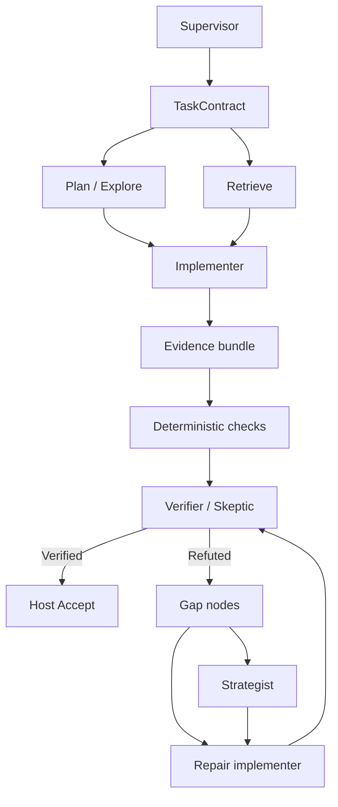
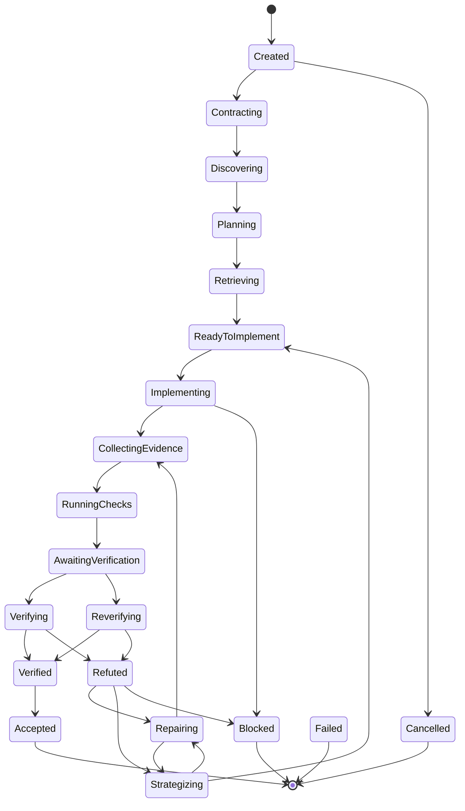

# Verified Agent Orchestration Substrate

**Status:** implemented, **dormant by default**
**Activation:** `orchestration.mode = "verified"` in `RapidConfig` (`off` is the documented default). There is no public CLI flag; internal/test construction of `Supervisor::start` is the supported entry until V3.
**Owner:** `crates/agent-runtime/src/orchestration` (behavior) with `crates/harness` as the eval-facing re-export and ledger sink.

## Provenance

The design is informed in part by **host-controlled independent verification** patterns observed in agentic coding systems such as Grok Build's goal workflow. RapidLM does **not** copy those sources. It extends the concept with Task Contracts, Requirement Nodes, Evidence Nodes, Verification Edges, Gap Nodes, Attestations, deterministic checks, context isolation, workspace-bound verification, policy-governed role capabilities, stagnation detection, and strategy escalation.

## Purpose

A host-owned verified-orchestration engine for substantial tasks:

The implementing model may emit `completion_claim: done`. That claim **cannot** transition the task to `Accepted`. Only `Supervisor::accept` can, and only from `Verified` after:

- a `Verified` verdict (strict policy; inconclusive is not accepted);
- every mandatory requirement has a **recorded** `EvidenceNode` (a dangling evidence id on the candidate is not evidence);
- the attestation’s workspace identity matches the current workspace identity.

## Current activation

- Default `RapidConfig.orchestration.mode` is `off`.
- `Supervisor::from_config` returns `None` unless mode is `verified`.
- `apps/rapid` and `run_turn` do **not** construct the supervisor. Ordinary interactive/headless turns keep using the existing agent/turn loop.

## What is not wired until V3

- Default coding workflow, TUI graph inspector, live LLM workers.
- Runtime Graph scheduler (this substrate is a linear supervisor over typed roles, not a revisioned Node/Edge graph).
- Remote workers, distributed multi-implementer merge.
- Process-supervisor-backed CheckRunner (tests inject `CheckRunner`; production wiring is a V3 seam).
- Context-engine retrieval inside Explorer/Retriever (contracts are separate; implementations may share a model).

## State machine

Invalid transitions fail closed (`TransitionError`). Terminal states reject further work except that cancel is rejected once already terminal.

## Roles

| Orchestration role | Existing `AgentRole` | Writes |
|---|---|---|
| Planner | Planner | no |
| Explorer | Explorer | no |
| Retriever | ContextCurator | no |
| Implementer | Coder | yes |
| Verifier | Verifier | **no** (verify ≠ repair) |
| Strategist | Reviewer | no |

Role-aware model assignment uses `RoleModelResolver` over existing `ModelPolicyName` (default `balanced`). No second provider catalog.

Verifier context is an `AgentContextPacket` (contract, requirements, evidence summaries, gaps, workspace identity). It does **not** include the implementer transcript.

## Contract, evidence, verification, gaps

- `TaskContract` with stable `REQ-*` / `AC-*` ids, budgets, `VerificationPolicy`, complexity (`trivial`/`standard`/`substantial`/`critical`).
- Evidence nodes map onto existing `EvidenceKind` / `EvidenceStore` (single evidence authority).
- Verification edges (`Supports`, `Contradicts`, `Verifies`, `Refutes`, `Resolves`, …).
- Append-only `Attestation` bound to `WorkspaceIdentity` (digest is SHA-256). Later attestations supersede by appending, never by overwrite.
- Deterministic `VerificationCheck` / `CheckResult` with bounded summaries; full output is referenced, not dumped into model context.
- Structured `GapNode` with stable ids across repair rounds; `RepairDirective` for the next implementer.
- `StagnationDetector` is a reusable tracker (repeated gaps, oscillating files, repeated failed checks, no new evidence).
- `VerifierPanel` is 1..N with `AnyRefutationFails` / `Unanimous` / … aggregation. Default substantial tasks run one skeptic.

## Ledger

Transitions emit `orchestration.*` kinds on the **existing** event-ledger registry (`EventKind` family `Orchestration`). `harness::LedgerEventSink` appends; there is no second log.

## Isolation and security

- Capability profiles: verifier/strategist/explorer/planner/retriever cannot write production files (`profile_allows_writes`).
- Policy still flows through the existing capability broker when tools run; this substrate does not bypass leases.
- Budgets (`max_verification_rounds`, repair/strategist/token/wall-clock/tool) yield `Blocked` rather than infinite loops.

## Failures

Handled as host transitions: invalid structured output, missing evidence, stale workspace identity, budget exceeded, verifier unavailable, forbidden writes, agent/sink errors, cancel.

## V3 integration seams

1. Harness: `Supervisor::from_config` when mode is verified.
2. Context packet: Explorer/Retriever should call `context-engine` instead of fakes.
3. Event ledger: already the append path (`orchestration.*`).
4. Sandbox/check runner: implement `CheckRunner` with process-supervisor.
5. Workspace identity: bind to `workspace` transaction/snapshot hash.
6. Role model resolver: feed `llm-router` policies per `OrchestrationRole`.
7. Runtime Graph: lift this linear supervisor into graph node executors (`Agent` / `Verifier` / `Check`) without replacing it.

## Tests

In-crate `#[cfg(test)]` fakes drive the public `Supervisor` API (happy path, refute→repair, strategist, max-rounds block, stale identity, missing evidence, invalid/terminal transitions). `crates/harness` appends an orchestration event through `EventLedger`.
