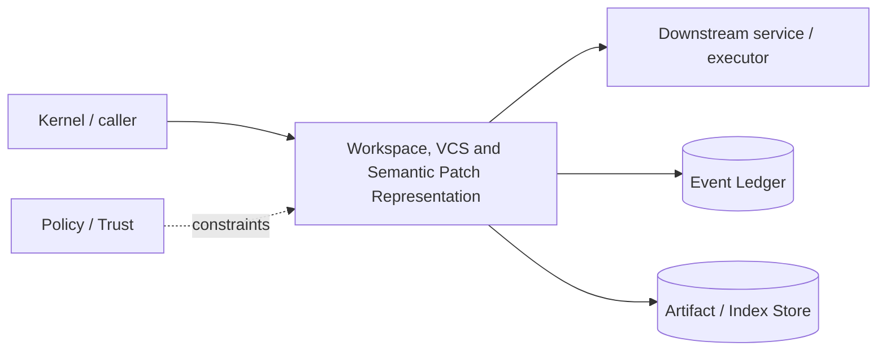

# Architecture — Workspace, VCS and Semantic Patch Representation

## 1. Responsibility

Provide isolated logical views, reversible file transactions, Git interoperability, semantic patch operations, merge/conflict handling, and per-change provenance.

## 2. Boundaries and non-responsibilities

- Git is interoperability/storage mechanism; RapidLM provenance is separate metadata.
- First-party edits use Workspace API; shell mutations are detected after execution.
- Direct base checkout writes are allowed only in explicit interactive mode.

## 3. Component architecture

- `WorkspaceManager` — view lifecycle.
- `GitAdapter` — status/diff/worktree/commit metadata.
- `PatchEngine` — semantic/text operations with preconditions.
- `MutationDetector` — before/after hashes around shell tools.
- `ChangeSetBuilder` — group operations + attribution.
- `MergeEngine` — apply child view to parent staging view.
- `CheckpointManager` — rewind/apply/rollback.

### Component diagram description



The diagram is intentionally generic at the boundary: the bullets above are normative component ownership. Cross-module calls MUST use the contracts listed below rather than importing another module's internal storage or implementation types.

## 4. Interfaces and contracts

- `create_view(ViewSpec) -> WorkspaceView`.
- `apply_patch(view, PatchSet, Lease) -> ChangeSet`.
- `diff(view, base)`, `merge(child,parent)`, `rollback(checkpoint)`.
- Emits change/provenance events and context invalidation events.

Cross-module errors use `ErrorEnvelope` from `crates/protocol`; cancellation is explicit and propagated. Any API that may return more than a small bounded payload MUST return an artifact/cursor reference.

## 5. Data models

- `PatchOp = ReplaceRange|InsertBefore|InsertAfter|CreateFile|DeleteFile|MoveFile` with preimage hash.
- `SemanticLocator { language, symbol_fq_name?, syntax_path?, line_hint }`
- `ChangeSet { id, view, ops, external_mutations, goal/task refs, producer, verification_refs }`.

Canonical shared types belong in `crates/protocol` only when two or more modules need a stable serialized representation. Storage-only fields remain private to this module.

## 6. Main runtime flow

1. Caller submits a typed request with actor/session/trace context.
2. Module validates schema, IDs, preconditions, and cancellation state.
3. If the operation can cause side effects, it obtains/validates a Capability Lease before the side effect.
4. Work is executed with explicit time/output/resource bounds.
5. Large evidence/output is written to Artifact Store and referenced by digest.
6. Durable state changes are appended to Event Ledger before success acknowledgement.
7. Result returns normalized status, evidence references, metrics, and trace ID.

## 7. Failure modes and recovery

- **Preimage hash mismatch** → conflict, never fuzzy-apply silently.
- **Git worktree creation fails on dirty/untracked state** → snapshot/replicate working state according to defined algorithm or block.
- **Shell changes unknown file** → record ExternalMutation and include in review.
- **Merge conflict** → staging view remains isolated; parent unmodified.

General rule: transient infrastructure failure may be retried only when the action is proven idempotent or guarded by an idempotency key. Security ambiguity fails closed. Runtime failure of autonomous work pauses/blocks the task rather than pretending completion.

## 8. Security considerations

- Path normalization and write capability checked per operation.
- .git directory writes require dedicated git capability, not generic fs.write.
- Symlink replacement cannot redirect authorized writes outside root.
- Never auto-commit/push without explicit git.write policy.

All attacker-controlled strings are treated as data. A model request, repository file, browser page, MCP result, hook output, or scanner output can never grant itself more privilege.

## 9. Implementation notes

- Represent semantics where parser support exists; always retain textual patch for interoperability.
- Use content-addressed preimages in artifact store for rollback of large/binary files.
- Diff review groups by goal/task/agent provenance.

### Example code pattern

```rust
pub struct ReplaceRange {
    pub path: WorkspacePath,
    pub expected_file_hash: ContentHash,
    pub range: ByteRange,
    pub expected_text_hash: ContentHash,
    pub replacement: String,
    pub semantic_locator: Option<SemanticLocator>,
}
```

The example demonstrates the intended boundary/style, not copy-paste-complete production code. Concrete implementation MUST use typed IDs/errors/cancellation and emit trace/event metadata.

## 10. Observability

Every operation SHOULD emit a span with: `trace_id`, `session_id`, actor/agent ID, operation kind, result class, latency, and bounded resource/token counters where applicable. Never use raw prompt/code/secret content as metric labels.

## 11. Tests and acceptance evidence

- [ ] Preimage conflict tests.
- [ ] Symlink escape write test.
- [ ] Dirty worktree replication fixture.
- [ ] Rollback byte-identical test including binary file.
- [ ] Parallel child merge conflict leaves parent unchanged.

## 12. Performance expectations

The module MUST define benchmarks for its hot paths before v1 stabilization. Regressions above 15% p95 latency or 10% memory/token overhead on fixed fixtures require explicit review or an accepted trade-off ADR.

## 13. Evolution rules

- Public/wire/event schema changes require `contract-first` skill and compatibility tests.
- Security behavior changes require threat-model update.
- New dependencies/backends require an ADR if they change trust boundary or deployment footprint.
- Do not add frontend-specific behavior to this module; expose state/contracts and let frontends render it.
