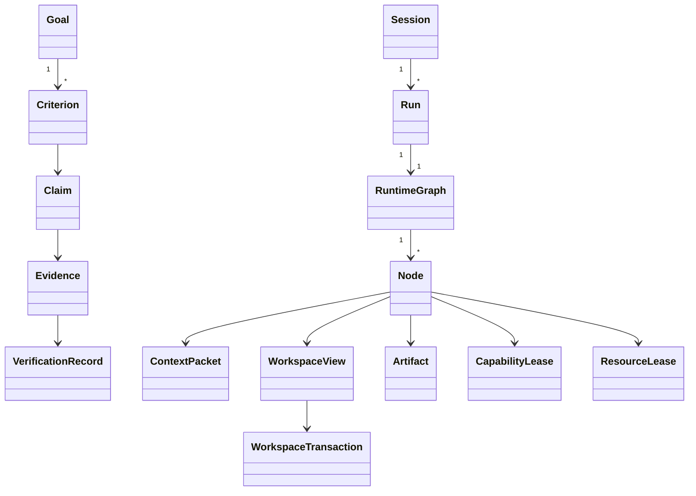

# Canonical Domain Model

Operational IDs are UUIDv7 newtypes; immutable artifacts use SHA-256 digests. Canonical enums/types are defined in module contracts and must not be duplicated by frontends. Models see aliases/handles where raw IDs add no semantics.

Key entities: Session, Run, RuntimeGraph/Revision/Node/Attempt/Edge, Goal/Criterion, Claim/Evidence/Verification, ContextPacket/ReadObservation, Workspace/View/Transaction, Process/Monitor/Trigger/JobLease, Capability/Policy/Lease/Approval, Observation/Action/ControlLease, Artifact/Provenance, AgentExecution, Knowledge/Decision/Preference, Handoff/WorkLease.
