# RapidLM V3 Development Plan and Roadmap

V3 is delivered through gated migration phases. Phase numbering follows `tasks.md`; tasks within a phase can run in parallel when their explicit dependencies and workspace isolation permit. No calendar estimate is normative—the gates are evidence-based.

```mermaid
flowchart LR
  P0[P0 Repository Audit & V2→V3 Migration] --> P1
  P1[P1 Kernel, Durability, Artifacts & Sessions] --> P2
  P2[P2 Dynamic Runtime Graph] --> P3
  P3[P3 Context Fabric, Code Intelligence & Knowledge] --> P4
  P4[P4 Workspace, Tool Gateway, Repair, Policy & Secrets] --> P5
  P5[P5 Agent Harness, Prompts, Models & Skills] --> P6
  P6[P6 Goals, Evidence & Independent Verification] --> P7
  P7[P7 Process, Sandbox, Resource Pool, Jobs & Triggers] --> P8
  P8[P8 Browser, Computer Use, Mobile & Preview] --> P9
  P9[P9 MCP, ACP, SDK, Plugins, Hooks, External Agents & Handoff] --> P10
  P10[P10 CLI, TUI, Daemon, Inspectors & Time Travel] --> P11
  P11[P11 Eval Harness, Trajectories, Preferences & Optimization] --> P12
  P12[P12 Security, Reliability & Adversarial Hardening] --> P13
  P13[P13 Build, Release, Documentation & GA Migration]
```

## Phase gates

### P0 — Repository Audit & V2→V3 Migration
- Scope: 20 implementation tasks + `P0-GATE`.
- Entry: previous phase gate green (P0 has no predecessor).
- Exit: all task evidence current; phase integration/eval/security checks pass; no unresolved blocker; ledger and migration docs updated.

### P1 — Kernel, Durability, Artifacts & Sessions
- Scope: 24 implementation tasks + `P1-GATE`.
- Entry: previous phase gate green (P0 has no predecessor).
- Exit: all task evidence current; phase integration/eval/security checks pass; no unresolved blocker; ledger and migration docs updated.

### P2 — Dynamic Runtime Graph
- Scope: 32 implementation tasks + `P2-GATE`.
- Entry: previous phase gate green (P0 has no predecessor).
- Exit: all task evidence current; phase integration/eval/security checks pass; no unresolved blocker; ledger and migration docs updated.

### P3 — Context Fabric, Code Intelligence & Knowledge
- Scope: 32 implementation tasks + `P3-GATE`.
- Entry: previous phase gate green (P0 has no predecessor).
- Exit: all task evidence current; phase integration/eval/security checks pass; no unresolved blocker; ledger and migration docs updated.

### P4 — Workspace, Tool Gateway, Repair, Policy & Secrets
- Scope: 34 implementation tasks + `P4-GATE`.
- Entry: previous phase gate green (P0 has no predecessor).
- Exit: all task evidence current; phase integration/eval/security checks pass; no unresolved blocker; ledger and migration docs updated.

### P5 — Agent Harness, Prompts, Models & Skills
- Scope: 32 implementation tasks + `P5-GATE`.
- Entry: previous phase gate green (P0 has no predecessor).
- Exit: all task evidence current; phase integration/eval/security checks pass; no unresolved blocker; ledger and migration docs updated.

### P6 — Goals, Evidence & Independent Verification
- Scope: 24 implementation tasks + `P6-GATE`.
- Entry: previous phase gate green (P0 has no predecessor).
- Exit: all task evidence current; phase integration/eval/security checks pass; no unresolved blocker; ledger and migration docs updated.

### P7 — Process, Sandbox, Resource Pool, Jobs & Triggers
- Scope: 30 implementation tasks + `P7-GATE`.
- Entry: previous phase gate green (P0 has no predecessor).
- Exit: all task evidence current; phase integration/eval/security checks pass; no unresolved blocker; ledger and migration docs updated.

### P8 — Browser, Computer Use, Mobile & Preview
- Scope: 32 implementation tasks + `P8-GATE`.
- Entry: previous phase gate green (P0 has no predecessor).
- Exit: all task evidence current; phase integration/eval/security checks pass; no unresolved blocker; ledger and migration docs updated.

### P9 — MCP, ACP, SDK, Plugins, Hooks, External Agents & Handoff
- Scope: 28 implementation tasks + `P9-GATE`.
- Entry: previous phase gate green (P0 has no predecessor).
- Exit: all task evidence current; phase integration/eval/security checks pass; no unresolved blocker; ledger and migration docs updated.

### P10 — CLI, TUI, Daemon, Inspectors & Time Travel
- Scope: 30 implementation tasks + `P10-GATE`.
- Entry: previous phase gate green (P0 has no predecessor).
- Exit: all task evidence current; phase integration/eval/security checks pass; no unresolved blocker; ledger and migration docs updated.

### P11 — Eval Harness, Trajectories, Preferences & Optimization
- Scope: 30 implementation tasks + `P11-GATE`.
- Entry: previous phase gate green (P0 has no predecessor).
- Exit: all task evidence current; phase integration/eval/security checks pass; no unresolved blocker; ledger and migration docs updated.

### P12 — Security, Reliability & Adversarial Hardening
- Scope: 26 implementation tasks + `P12-GATE`.
- Entry: previous phase gate green (P0 has no predecessor).
- Exit: all task evidence current; phase integration/eval/security checks pass; no unresolved blocker; ledger and migration docs updated.

### P13 — Build, Release, Documentation & GA Migration
- Scope: 24 implementation tasks + `P13-GATE`.
- Entry: previous phase gate green (P0 has no predecessor).
- Exit: all task evidence current; phase integration/eval/security checks pass; no unresolved blocker; ledger and migration docs updated.

## Parallel development rules

- Graph/context/tool contracts land before broad consumers.
- Parallel writers use isolated worktrees/views and integrate transactionally.
- Protocol/schema changes keep fixtures and generated SDK types in the same task or an explicitly dependent task.
- Security/eval tasks are not deferred to the end; each phase owns its negative/recovery tests.
- Performance/token baselines are captured before optimization and compared on unchanged fixtures.

## GA gate

P13-GATE additionally requires requirements traceability complete; upgrade/rollback tested; signed artifacts/SBOM/provenance available; supported platforms green; long-horizon/adversarial suites green; unresolved limitations documented rather than hidden.
