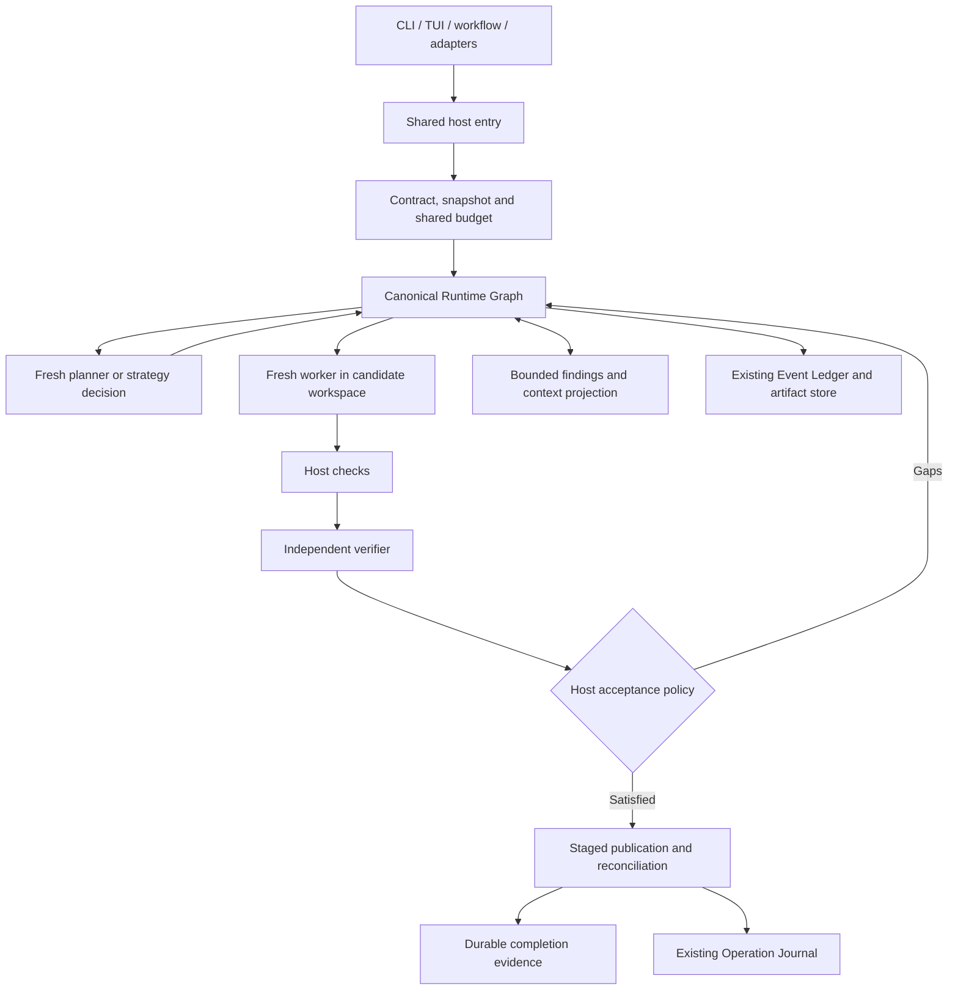

# Goal: deliver adaptive, verified orchestration in RapidLM

**Goal ID:** `GVS-RAPIDLM-01`  
**Created:** 2026-09-15  
**Planning baseline:** `bc87a89b696234c48065eb45e2f67cbffbca34fd`  
**Status:** Phase 0 complete (2026-09-17: [baseline audit](gvs5h-phase0-baseline-2026-09-17.md), [ADR 0021](../adrs/0021-verified-orchestration-extends-graph-and-supervisor.md), [preregistration](../evaluation-specs/gvs5h-experiment-preregistration.md)). Phase 1's first two slices landed 2026-09-18 ([delivery record](../goal-delivery-2026-09-18.md)): the production caller (`rapid run --orchestration verified` drives a playbook through `GraphService`/`GraphBackedRun`, the host supervisor's acceptance as the verdict), payload-complete graph events with a `GraphService::replay` reducer that rebuilds a session's graphs from its durable events, and single-event acceptance (GVS-006 core — one `orchestration.task_accepted` record both projections reduce from, replacing the old transition-plus-a-write-per-node shape). GVS-004, GVS-006's publication receipts, real identities (GVS-007) and recovery (GVS-008) remain pending. The audit supersedes this document's platform note (Windows tests are a gate since 2026-09-17) and reorders Phase 1 (production caller first — see the audit's §6).  
**Design basis:** [GVS5H integration research](</Users/mohsin/projects/RapidLM CLI/docs/research/gvs5h-integration-2026-09-15.md>)  
**Execution worklist:** [34 tasks with dependencies and evidence requirements](</Users/mohsin/projects/RapidLM CLI/docs/goals/gvs5h-implementation-tasks.json>)

## 1. Objective and completed user experience

Deliver an opt-in, production-integrated RapidLM workflow that improves the reliability of substantial coding tasks through bounded fresh-context workers, persistent working knowledge, preserved candidate patches, independent verification and adaptive effort. Implement the workflow in the existing Rust runtime and its host-owned Runtime Graph. Measure its quality, total cost and latency against the existing RapidLM workflow under controlled conditions.

A user can enable verified orchestration, give RapidLM a multi-file engineering task, see its plan and progress, interrupt or resume it, and receive a patch with evidence explaining which requirements passed. RapidLM retains useful findings across context resets, repairs failed candidates without losing a better one, and changes approach when repeated failures justify it. It never reports verified completion solely because a worker says it is done.

The workflow operates through CLI/headless execution, the existing workflow runner and the terminal interface. Daemon, ACP and SDK surfaces use the same execution and state contracts when exposing this feature. Unsupported operations are explicit rather than silently emulated.

### Scope boundaries

- Implement orchestration, state, execution, verification, workspace integration, observability, compatibility, evaluation and release documentation end to end.
- Reuse the existing graph, supervisor, context compiler, evidence store, Event Ledger, Operation Journal, workspace transactions, tools and provider adapters.
- Support a single configured model first, then existing profile-based role routing and selective concurrency. Model names are configuration, not hard-coded dependencies.
- Preserve ordinary execution when orchestration is off. Verified mode remains opt-in unless a separate product decision and evidence justify changing the default.
- Model training, GPU provisioning, new cloud infrastructure, live computer-use drivers and unrelated product-parity work are outside this goal.
- Do not add a Python coordinator, another authoritative workflow engine, or a second general-purpose memory database.
- This document and its JSON worklist are planning artifacts, not runtime configuration and not a replacement for the existing project goal snapshot or task system.

## 2. Governing invariants

1. Models propose tasks, findings and candidates. The host validates graph changes, permissions, budgets, publication and completion.
2. One durable event/reducer path determines accepted state; in-memory projections and UI cannot independently advance it.
3. Acknowledged state survives restart. Unknown external effects are reconciled rather than blindly retried.
4. Every candidate and attestation identifies the exact workspace snapshot, patch and verification inputs.
5. Changed code, test definitions or relevant environment identity invalidate dependent evidence.
6. Parallel writers use different mutable workspace views. Candidate publication uses a staged, recoverable transaction.
7. Worker output is a claim until checked. A check must establish the required behavior; exit zero alone is insufficient where test discovery, coverage or other evidence is required.
8. Workers and verifiers receive bounded role-specific context, not the complete parent transcript. Repository instructions and user constraints survive every reset.
9. All attempts share finite run ceilings. Planning, retries, failed work, compaction and verification consume the same accounting budget.
10. Approval and capability policy remain enforced at the executor boundary. Delegation, notes and retrieved content cannot expand authority.
11. Cancelled or recovered work cannot secretly publish a candidate. Active runs recover paused unless an already-authorized automation starts a new run.
12. Quality claims require live external grading. Scripted models and gold patches establish mechanical correctness only.

## 3. Architecture and data contracts



### Canonical ownership

| Concern | Existing owner and starting point |
|---|---|
| Graph proposals, scheduling and replay | [scheduler](</Users/mohsin/projects/RapidLM CLI/crates/scheduler/src/service.rs>), including `proposal.rs`, `graph.rs`, `orch.rs` and `playbook.rs` |
| Role contracts, candidate/verification policy | [agent runtime](</Users/mohsin/projects/RapidLM CLI/crates/agent-runtime/src/orchestration/supervisor.rs>) and `agent_executor.rs` |
| Durable events and effect reconciliation | [Event Ledger](</Users/mohsin/projects/RapidLM CLI/crates/event-ledger/src/ledger.rs>) and kernel recovery |
| Findings selection, source freshness and context packets | [context engine](</Users/mohsin/projects/RapidLM CLI/crates/context-engine/src/compile.rs>), memory and retrieval components |
| Snapshot, isolated views, staged merge and publication | [workspace transactions](</Users/mohsin/projects/RapidLM CLI/crates/workspace/src/transaction.rs>) and [live agent views](</Users/mohsin/projects/RapidLM CLI/apps/rapid/src/agent_views.rs>) |
| Model profiles and capability-aware role routing | [LLM router](</Users/mohsin/projects/RapidLM CLI/crates/llm-router/src/phase.rs>) and live model composition |
| Production wiring and surfaces | [host](</Users/mohsin/projects/RapidLM CLI/apps/rapid/src/host.rs>), `interactive.rs`, `workflow.rs`, `goal_claim.rs`, headless and adapter hosts |
| External evaluation and provenance | [evaluation runner](</Users/mohsin/projects/RapidLM CLI/apps/rapid/src/eval_serve.rs>), `crates/harness`, `eval/` and CI |

New modules may be added within these owners. Avoid making a new crate unless a concrete dependency or ownership boundary warrants it.

### Required additive records

Resolve exact Rust names and reuse existing identifier types during GVS-002/GVS-004. Version serialized shapes and generated schemas.

- **Run execution:** graph/session/goal references, effective configuration digest, contract, baseline snapshot, lifecycle, attempts, shared budget, incumbent and latest durable sequence.
- **Task proposal:** stable task and requirement references, expected graph revision, role, dependencies, permitted workspace scope, evidence obligations and requested resources.
- **Finding:** stable ID, statement, source/attempt references, evidence references, dependency hashes, supported/refuted/superseded status and supersession lineage. Model confidence is advisory.
- **Candidate:** immutable artifact and patch references, baseline and resulting workspace digests, requirement coverage, predecessor, checks, verdicts and publication status.
- **Check receipt:** candidate, check-definition and environment digests; process outcome; test discovery/count where relevant; duration; bounded output references; evidence IDs.
- **Verification verdict:** selected requirements, supporting/refuting receipt references, gaps, candidate identity, verifier role/profile and verdict. A verifier cannot write production code.
- **Budget reservation:** run/attempt/request identity, finite reservation, actual settlement, reconciliation state and unknown-usage marker. Settlements are idempotent.
- **Decision event:** selected next action, evidence references, reason category and budget state. Store concise decision explanations; raw hidden reasoning is not required.

Human-readable plan and notes files are rebuildable exports of these records. They do not grant capabilities or directly mutate acceptance state.

### Lifecycle and publication ordering

Use existing lifecycle types where possible. Semantically support planning, working, checking, verifying, repairing, waiting for approval/input, paused, cancelled, blocked, failed and completed states.

A candidate can be verified before it is published. Completion requires publication to the intended workspace, or an explicitly requested patch-artifact deliverable, plus fresh evidence. For workspace publication:

1. Freeze the candidate and verification inputs.
2. Produce check receipts and an independent verdict for that candidate.
3. Prepare a transaction against an expected parent snapshot.
4. Recheck parent identity and policy immediately before publication.
5. Apply through existing transaction/journal machinery and record a publication receipt.
6. Append the authoritative completion record only after the required effect is confirmed.

The filesystem and database are not assumed to share an atomic transaction. Journal prepared/applied/reconciled outcomes and resolve uncertain effects after a crash. A failed append cannot leave the UI or goal projection claiming completion. Repeating an acceptance or publication request must not apply a patch twice.

## 4. Delivery phases

Task IDs, exact prerequisites, required outputs and verification for each item are in the accompanying JSON worklist. Every task begins pending; dependency ordering indicates permissible work order, not instructions to spawn additional agents.

### Phase 0 — baseline and frozen implementation contracts

**GVS-001–003.** Recheck current source and dirty state; map existing functionality and the original V3 worklist to avoid duplicate work. Record actual supported-platform guarantees. Write the architecture decision, state/schema compatibility rules and source ownership. Register the experiment design, baseline build, task split and promotion gates before tuning.

Current research leads include incomplete graph reconstruction, split acceptance transitions, goal identity derived from metadata rather than the candidate, child views based on HEAD, and incomplete write-triggered evidence invalidation. Confirm each before implementing. Retain already-delivered evaluation fixes and detached-child functionality.

**Exit:** baseline and ownership are recorded, interfaces are coherent, and no implementation claim relies solely on an older assessment.

### Phase 1 — replay, acceptance and freshness

**GVS-004–008.** Add the versioned records. Persist graph definitions/proposals or immutable references containing enough data to reconstruct them. Rebuild graph and orchestration projections from the same durable stream. Refactor acceptance so transitions are event-derived and idempotent. Replace placeholder identities with canonical snapshot/test/environment identities. Connect real workspace changes to evidence invalidation. Recover attempts, reservations and prepared effects with explicit paused/reconciliation states.

Missing historical graph payloads must produce a documented migration or unsupported-recovery outcome, never an invented reconstruction. Corrupt artifacts cannot satisfy requirements.

**Exit:** kill/restart, stale-data and append-failure cases preserve the same truth across graph, goal and UI projections.

### Phase 2 — snapshots, candidates and working knowledge

**GVS-009–012.** Capture the actual authorized starting workspace, including relevant staged, unstaged and untracked files. Preserve user edits. Assign genuine attempt/agent/view IDs throughout. Keep an incumbent and separate immutable challengers. Stage patches, checks and publication receipts through existing workspace machinery. Implement versioned findings and a role-specific context projection.

A scope change or new evidence can make the incumbent stale; preserving a candidate does not mean treating it as eternally correct. Never publish stale evidence simply because no challenger is better. Read-only reviewers must not accidentally inherit a Coder write profile.

**Exit:** fresh workers can continue from the latest candidate and source-backed findings without sharing mutable workspaces or losing necessary facts during compaction.

### Phase 3 — live sequential implementation and verification

**GVS-013–017.** Implement production planner, explorer/retriever, implementer, verifier and strategist adapters around the existing executor. Use bounded structured results with schema validation and bounded repair feedback. Wire checks through the established process/sandbox/tool path, including cancellation and output draining. Connect strict evidence-based acceptance and a shared reservation/settlement budget.

Integrate one sequential workflow into the canonical graph path and existing `rapid run` surface. Refactor the existing workflow adapter as needed; do not wrap the old and new schedulers inside a third loop. Allow model calls only for actual reasoning/strategy decisions; deterministic transitions need no manager call.

**Exit:** a real multi-file task runs from request to verified patch using one configured model. Worker claims, failing checks, stale evidence and an unchecked finalizer cannot complete it.

### Phase 4 — adaptive effort, routing and bounded concurrency

**GVS-018–022.** Add a deterministic, inspectable effort policy. Routine work can use the existing direct path; substantial work uses the full workflow. Stagnation is based on failures, patches and evidence rather than repeated wording. Permit bounded fresh alternative attempts that omit previous proposed solutions while retaining instructions and verified facts. Route roles through existing profiles and `ModelPurpose`, respecting provider capabilities and explicit fallback configuration.

Introduce bounded parallel read-only tasks and isolated candidate attempts after sequential behavior is proven. Integrate composed results on a staging snapshot and recheck cross-file behavior. Share cancellation, permissions, resource ceilings and budget reservations across children. Repair rounds append graph revisions; they do not create executable cycles in historical graphs.

**Exit:** repeated failures produce a different justified action within budget; concurrency improves scheduling without breaking workspace, evidence or recovery invariants.

### Phase 5 — complete user and adapter surfaces

**GVS-023–026.** Add configuration and CLI entry, terminal status/control, consistent machine-readable events and adapter/SDK contracts. Provide run inspect, pause/cancel/resume and evidence retrieval through existing commands wherever possible. Expose current task, candidate/check state, remaining budget, meaningful strategy changes and unresolved gaps.

Proposed surface contract, to be implemented and documented:

- Preserve `orchestration.mode = off|verified`; default remains `off`.
- Add a strategy choice such as `sequential|adaptive` under the same configuration owner.
- Add a CLI orchestration override to existing execution commands; apply established managed-policy/config precedence rather than inventing a new precedence order.
- Resolve role profiles through existing routing configuration. No secret appears in status or events.
- Route interactive and headless execution through the same host implementation. Verified headless work cannot use the old unchecked child auto-integration path.
- Active runs retain their effective configuration digest; settings changed mid-run apply only at a recorded safe boundary or to the next run.

These are new planned surfaces, not claims that such flags or settings already work.

**Exit:** users and clients can operate the feature end to end without editing implementation files; old callers and ordinary off-mode behavior remain compatible.

### Phase 6 — external evaluation and release decision

**GVS-027–031.** Add controlled experiment arms, independent repository tasks, failure/recovery scenarios and a versioned reproducibility bundle. Use existing protected grading, mutation checks, dedicated health probes and all-attempt accounting. Run live comparisons only through configured, available providers under an explicit experiment spending ceiling; do not infer a dollar budget from this planning request. Credentials or a necessary spending decision must be reported as a concrete dependency while independent work continues.

Required comparisons:

| Arm | Question answered |
|---|---|
| Current RapidLM | What is the actual product baseline? |
| Sequential notes plus fresh workers | Does the core GVS-inspired method add value? |
| Full candidate preservation plus verification | Do the proposed improvements help? |
| Independent attempts with the same selector/checks | Is the gain simply additional sampling? |
| Mixed-profile adaptive workflow | Does routing improve the quality/cost frontier? |

Start with a 24-task development pilot. Reserve at least 100 independent repository tasks for the release evaluation, initially three trials per task/arm; use the development variance to preregister a larger sample if required. Account for the current 64-task loader limit through deterministic sharding and aggregate provenance or an intentional, tested limit change. Freeze held-out tasks and grader definitions; any previous model exposure or contamination concern is recorded. Do not tune against final test answers or provide hidden tests to workers/verifiers.

Include Rust, TypeScript and Python multi-file fixes; feature work; test authoring; long-context continuation; tool/provider failure; and merge/recovery scenarios. A pinned LiveCodeBench reproduction subset is secondary evidence and must identify grader differences. Existing public benchmark percentages are not interchangeable with these repository outcomes.

**Exit:** an externally graded, repeated live report supports an honest release decision, with no skipped arm counted as a passing comparison.

### Phase 7 — compatibility, release evidence and handoff

**GVS-032–034.** Complete required checks on supported platforms, schema and SDK compatibility, migration and rollback rehearsal, documentation and the evidence matrix. Keep failed or superseded evaluation attempts. Update stale architecture claims and link the feature into existing development tracking without replacing unrelated goals.

**Exit:** every required criterion below has traceable evidence at the delivered commit; operational and quality limits are explicit.

## 5. Completion criteria

| ID | Required outcome and evidence |
|---|---|
| AC-01 | Baseline, architecture ownership, migration decision and experiment preregistration are recorded and consistent with source. |
| AC-02 | Graph/task/candidate state reconstructs correctly after restart; old/missing/corrupt payloads have tested, truthful handling. |
| AC-03 | Completion is event-derived, append-failure safe and idempotent; partial publication is reconciled without double effects. |
| AC-04 | Candidate, checks and verdicts use real content identities; production workspace changes invalidate dependent evidence. |
| AC-05 | Active runs recover paused; attempts and uncertain effects are reconciled without unauthorized replay. |
| AC-06 | Worker snapshots include the intended dirty workspace; user changes and isolated view identities remain correct. |
| AC-07 | Failed challengers cannot overwrite a valid incumbent; staged publication detects concurrent parent changes and integration regressions. |
| AC-08 | Findings retain sources, negative results and supersession; stale findings are excluded and exports are advisory. |
| AC-09 | Role packets preserve instructions, constraints and mandatory evidence within token limits; reset/recovery does not leak parent transcripts. |
| AC-10 | Live role drivers and structured-output validation work through production executors; malformed output cannot mutate authority. |
| AC-11 | Checks run through bounded policy-governed processes; nonzero exits, timeouts and missing required tests cannot pass. |
| AC-12 | Independent verification uses the exact candidate and requirements; no self-claim, missing evidence or unchecked finalizer can complete a task. |
| AC-13 | All attempts/retries share finite budgets; concurrent reservations and idempotent settlements are tested; missing usage stays unknown. |
| AC-14 | A sequential same-model multi-file workflow works end to end through the canonical graph and production host. |
| AC-15 | Adaptive planning/stagnation logic is bounded, explainable and preserves the normal fast path. |
| AC-16 | Fresh alternatives reduce inherited-plan exposure while retaining user and repository constraints; evidence drives candidate selection. |
| AC-17 | Role routing reaches actual provider requests, respects capabilities and records fallback/usage provenance. |
| AC-18 | Concurrency uses isolated views, shared ceilings and integration checks; independent file edits cannot bypass behavioral checks. |
| AC-19 | Pause, cancellation, approval waits and resume propagate through parent/children and prevent late publication. |
| AC-20 | CLI/headless/workflow/TUI feature entry and status are complete; off-mode compatibility and config precedence are tested. |
| AC-21 | Exposed daemon/ACP/SDK behavior uses common contracts and truthful capabilities; additive schema fixtures and compatibility tests pass. |
| AC-22 | Experiment arms share declared budgets/tools/tasks; provenance, sharding, failures, usage coverage and all-attempt cost are complete. |
| AC-23 | Positive, negative, mutation, long-context and crash/concurrency scenarios test real behavior rather than mock success alone. |
| AC-24 | Held-out repeated live results, statistical uncertainty, cost/latency and an evidence-based release decision are delivered. Missing runs leave this criterion unmet. |
| AC-25 | Relevant Rust tests, formatting, lint, schema fixtures and SDK checks pass on the declared supported platform matrix. |
| AC-26 | User/API/architecture/migration/rollback docs and a commit-linked acceptance matrix accurately describe the delivered feature and limitations. |

### Functional completion versus measured improvement

Functional implementation is not sufficient to claim this is better than RapidLM's current workflow. Freeze the promotion rules before final evaluation:

- **Quality route:** at matched total budget, at least +5 percentage points verified success, with the paired 95% confidence interval excluding zero.
- **Efficiency route:** at least 20% lower total measured cost per verified success, with a preregistered two-percentage-point quality non-inferiority margin and uncertainty supporting the conclusion.
- **Latency guard:** predeclare an interactive p95 ceiling; the proposed default target is at most 1.5 times baseline p95 for substantial tasks. Routine off-mode tasks should have no material overhead; investigate more than 5% median regression under repeated matched local conditions.
- **Correctness guard:** all deterministic stale-evidence, false-acceptance, lost-candidate, policy and recovery cases pass. Report observed live false-acceptance rates and uncertainty separately.

These are product decision thresholds, not promised outcomes. Compute intervals at the task level, clustering repeated trials. Distinguish local compute estimates from measured provider charges. Do not pool different budget conditions or quietly exclude failures.

If benefit is not established, complete the engineering/evaluation deliverables with an explicit experimental-only or do-not-promote decision; keep the feature off by default and do not label the improvement proven. Missing credentials, missing live runs or incomplete supported-platform checks cannot be replaced with a negative-result decision. Required evidence must still exist. A default-on rollout is not authorized by this goal.

## 6. Required failure matrix

At minimum verify these paths against production boundaries:

1. Crash after graph append but before projection update; replay converges.
2. Append failure during verification/acceptance; no completed projection.
3. Crash during publication; reconcile applied versus unapplied without double application.
4. Parent edit during verification/publication; stale candidate refused and work retained.
5. Test definition, dependency or environment change; affected receipts invalidated.
6. Correct stdout with nonzero process exit; check fails.
7. Empty tests, zero discovery or weakened assertions; relevant test-authoring grader rejects them.
8. Worker says done without evidence; completion refused.
9. Finalizer changes code; candidate goes through all checks again.
10. Failed/worse challenger; valid incumbent remains retrievable.
11. Malformed proposal, stale revision or attempted dependency cycle; host rejects it.
12. Truncation/overflow; bounded context recovery retains requirements without replaying uncertain tools.
13. Simultaneous child budget reservation, retry and cancel; ceilings and settlements remain correct.
14. Parallel overlapping and non-overlapping patches; conflicts and cross-file regressions detected.
15. Retrieved instructions or findings request more authority; executor policy remains unchanged.
16. Verifier attempts writes; blocked at execution, not just hidden from its prompt.
17. Cancelled child finishes late; no publication or completion after cancellation.
18. Approval wait and restart; paused state, resources and subsequent authorization remain consistent.
19. Duplicate events/requests or missing artifact; idempotent handling or explicit failure.
20. Empty/incomplete evaluation arm or unknown usage; no fabricated success or zero-cost claim.

## 7. Validation and evidence management

Run targeted tests after each behavioral change. At integration boundaries and final delivery, run the repository's required checks without weakening assertions or gates:

```sh
cargo fmt --all -- --check
cargo clippy --workspace --all-targets --locked -- -D warnings
cargo test --workspace --locked --no-fail-fast
cargo test --locked -p protocol --test schema_fixtures
pnpm generate:check
pnpm typecheck
pnpm test
```

Use the declared platform contract. At the planning baseline, Windows builds/lints are required while its broad test step is informational; do not describe informational execution as a passing supported runtime guarantee. Add portable tests for new contracts and document platform-specific unsupported execution. A local test-launch problem can use equivalent retained CI evidence at the relevant commit, with the substitution stated.

Every completed task requires: changed-file/commit references; tests and commands with results; event/evidence assertions; any compatibility impact; and a link to retained artifacts. Long outputs live in artifacts rather than model context. Temporary-only files are insufficient as final release evidence.

The final report must map AC-01 through AC-26 to concrete evidence, list all worklist tasks and their status, identify the evaluated commit/configurations, show statistical and operational results, and distinguish measured capability from remaining limitations. Do not mark the active implementation goal complete merely because this plan or a prototype exists.

## 8. Execution order, dependencies and operating rules

Critical path: baseline/contracts → durable records/replay/identity → snapshots/candidates/context → live roles/checks/budget/verification → sequential pilot → adaptive/routing/concurrency → user surfaces → live evaluation → release evidence.

Evaluation tooling and fixture development can proceed once contracts and preregistration are stable; they do not need to wait for every UI feature. Implementation must respect each task's explicit prerequisites. Reassess source at the start of work because another task may already have completed part of a requirement.

- Preserve unrelated dirty files, goals and user work. Use an isolated checkout if necessary for implementation, following repository conventions.
- Do not commit secrets, benchmark answer keys into agent-visible fixtures, or raw sensitive transcripts.
- Use typed policy/permission paths already authorized for the task. Ask for missing credentials or spending constraints only when needed, with a concrete explanation; continue independent engineering work meanwhile.
- Do not silently expand scope to training, infrastructure purchases or external deployment.
- Preserve licensing attribution if incorporating upstream code or licensed artifacts; prefer a native implementation with newly authored prompts.
- Update the planning worklist with evidence as implementation progresses; it must not become a second runtime state authority.

**Final deliverable:** a complete opt-in orchestration feature, reproducible live evaluation, operational documentation and an evidence-backed release decision, with every required acceptance criterion accounted for.
