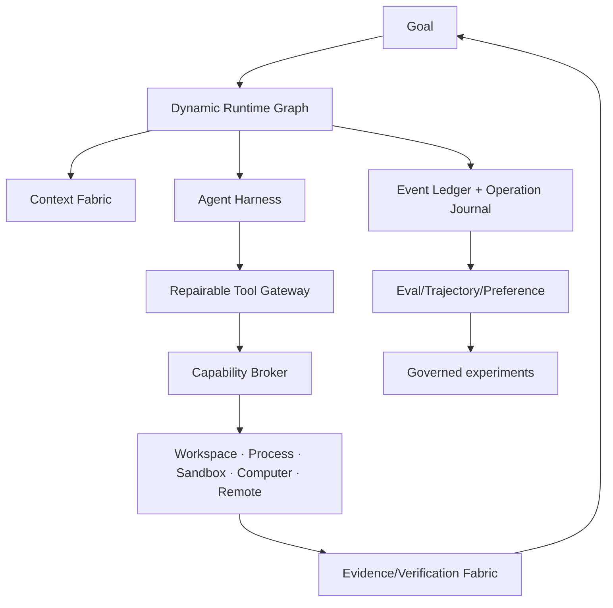

# Feature Inspiration / Research Matrix — RapidLM V3

**Rule:** inspiration is architectural. Do not copy closed/proprietary prompt text or code. When source code is reused from an open-source project, perform an explicit license/NOTICE review and record provenance. RapidLM keeps one coherent graph/context/policy/workspace/evidence architecture instead of accumulating competitor-shaped subsystems.

| Source | Pattern studied | RapidLM V3 adaptation |
|---|---|---|
| RapidLM V2 | Rust kernel, Event Ledger, CapabilityLease, WorkspaceView, Goal DAG/evidence, managed agents, handoff, Computer Use, eval trajectories | retained and migrated; V3 makes Runtime Graph the orchestration authority |
| Muse / Muse Spark materials supplied by user | evidence-first engineering, code/source truth, execution verification, independent oracle, concise CLI, goal/subagent/session tooling | Core Constitution, verification discipline, completion evidence, repository workflow |
| Augment/Auggie extracted bundle | semantic-first code retrieval, narrow read-only Context Scout, exhaustive references, checked negative findings, broaden zero hits | InformationNeed/ContextScoutReport, context lineage/freshness, scout protocol |
| Claude coding-agent materials supplied/studied | layered instructions, progressive tools, hooks/lifecycle, explicit permissions/user control | PromptComposer precedence, hook event model, clean role prompts, tool projection |
| Grok Build | Rust CLI/TUI, sandboxing, headless/ACP, skills/hooks/plugins, isolated subagents/worktrees, workflows/goals | graph template/playbook UX, Rust runtime ergonomics, ACP/sandbox/extension patterns |
| Kimi Code | modular agent core, isolated subagents, goal lifecycle, lifecycle hooks, skills/plugins/MCP, fast TUI | agent harness boundaries, goal active/paused/blocked semantics, hooks/ACP, UI ergonomics |
| Qwen Code | multi-provider coding CLI, isolated parallel/worktree patterns | provider-neutral execution and isolated writer patterns; evaluated rather than copied |
| Atomic / atomic-agent patterns | provenance/change attribution, loop detection, semantic history ideas | Workspace/Evidence graph attribution, loop guards, attestations |
| Cursor captured snapshot | typed Computer Use messages, coordinate transform, action batching, settle/screenshot-on-error mechanics | dedicated Computer Executor backend abstraction and observation generation |
| Devin public/control-plane patterns | durable remote sessions, managed workers, playbooks/schedules, human takeover, Knowledge, visual/mobile evidence | remote worker/handoff/control leases, daemon lifecycle, Knowledge/Session Insights |
| gstack materials in user data | specialized review/QA roles, background wake, argument-repair/loop-guard/compaction operational patterns | graph-native sprint/review templates, harness resilience, independent gates; prompts rewritten |
| Command Code docs | validate→localized repair→revalidate, 3-ceiling reads, read ledger/cross-tool invariants, recovery hints, context dedup, monitors, rewind, permission ladder, preference/taste concept | Tool Contract Repair Engine, Relationship Invariant Engine, visibility lineage, event monitors, time travel, Capability Projection, Preference Fabric |
| OpenVibeCoding | warm environment pool, session/workspace scopes, ACP runtime abstraction, durable ToolConfirm/AskUser suspension, preview telemetry/errors, STS credentials | ResourcePool, waiting nodes, ExternalAgentAdapter, PreviewSupervisor, CredentialBroker, Artifact events |
| MCP / ACP ecosystems | interoperable tools/editors | adapters under RapidLM policy/kernel; no bypass |

## RapidLM-only synthesis

No studied product is treated as an authority for RapidLM. Source/date assumptions are revalidated when an implementation task depends on them.
