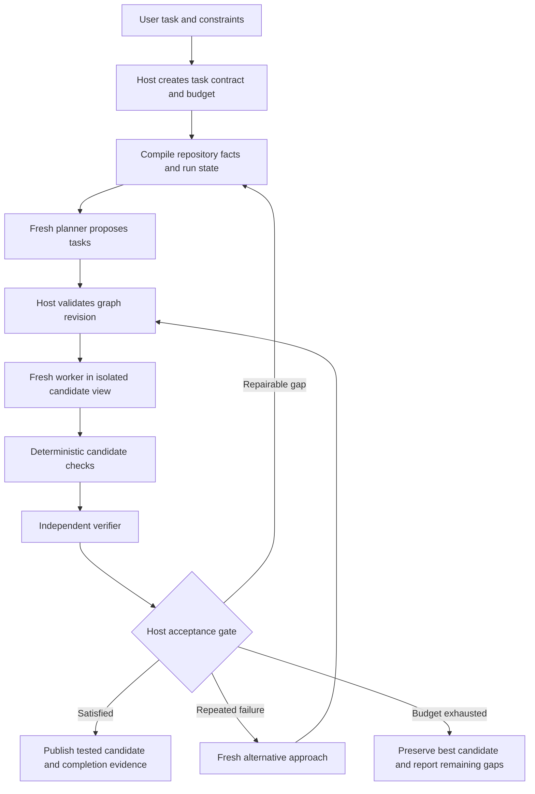

# GVS5H-inspired orchestration for RapidLM

**Date:** 2026-09-15  
**Status:** research and implementation proposal; runtime not changed  
**RapidLM source reviewed:** `bc87a89b696234c48065eb45e2f67cbffbca34fd`  
**GVS5H source reviewed:** `c3f49bec665809484ab2e2350f9044efed1bb719`

## Recommendation

Implement a GVS5H-inspired **adaptive, verified workflow inside RapidLM's existing Runtime Graph**. Reuse the current supervisor, agent executor, context compiler, workspace machinery, provider adapters and evaluation runner. The important addition is a compact, revisioned record of decisions, evidence and candidate solutions that fresh workers can use without inheriting the entire conversation.

Start with sequential execution and one configured model. Add independent alternative attempts and selective parallelism only after a controlled experiment shows their value. An always-on team of five would add unnecessary overhead to routine edits.

This is a promising integration, not an established quality improvement over RapidLM. GVS5H compares against a single call without tools or a repair loop. RapidLM already supplies those capabilities. Its incremental benefit must be measured against RapidLM itself.

## 1. What the upstream project actually implements

GVS5H's current solver follows this sequence:

1. A manager proposes a plan and seed tasks.
2. An ideation worker proposes alternative approaches.
3. The manager selects one task.
4. A fresh worker returns a complete candidate program and curated notes.
5. The host runs available public stdin samples and returns feedback.
6. The manager chooses whether to stop, repair or switch approaches.
7. A finalizer runs when the loop exits without manager sign-off.

The model roles use the same underlying model with separate contexts. Within a problem, the worker/manager loop is sequential. The current implementation allows ten worker rounds; it is not a fixed five-worker parallel ensemble. Benchmark repetitions are also distinct from worker counts. State is held in `task.md`, `plan.md`, `notes.md`, `tasks.json` and the current program. The plan and notes have character limits; task status is reconstructed from model output. See the pinned [solver implementation](https://github.com/slee-persis/GVS5H/blob/c3f49bec665809484ab2e2350f9044efed1bb719/codebase/v2-current/escalation/multiagent.py).

### Evidence and its limits

The authors report the following results on 100 hard LiveCodeBench problems, averaged over five passes in their pinned-backend condition:

| Arm | Reported pass@1 |
|---|---:|
| Qwen3.8-27B, single call | 69.2% |
| Qwen3.8-27B, orchestration | 92.4% |
| GPT-5.6-Terra, orchestration | 88.0% |
| Claude Fable 5, single call | 90.4% |

These are authors' results, not measurements produced by this review. The Qwen/Fable difference is not statistically established in the authors' comparison. The study does not equalize total inference compute, tests one benchmark family, and includes a Qwen single-call arm reconstructed by truncating longer generations. Only 73 problems receive the public stdin verifier. These qualifications matter when extrapolating to repository editing. Sources: [paper](https://github.com/slee-persis/GVS5H/blob/c3f49bec665809484ab2e2350f9044efed1bb719/paper/iclr2027_conference.tex), [comparison figure and statistical caption](https://github.com/slee-persis/GVS5H/blob/c3f49bec665809484ab2e2350f9044efed1bb719/paper/fig-4new-5pass.tex).

Orchestration also increases same-model spending: the published Terra example rises from $3.41 to $11.71 per 100-problem pass, approximately 3.43 times. The Qwen example rises from $20.44 to $51.75, approximately 2.53 times. The headline saving compares a cheaper orchestrated model with a more expensive model. Qwen's cost is a rate-based estimate despite local execution; it is not measured local hardware cost. Source: [published cost table](https://github.com/slee-persis/GVS5H/blob/c3f49bec665809484ab2e2350f9044efed1bb719/paper/fig-cost-tables.tex).

### Weaknesses RapidLM should address

| Upstream behavior | Improvement for RapidLM |
|---|---|
| Workers replace the current solution and rewrite notes | Keep immutable candidate patches and versioned findings; preserve a tested incumbent |
| Earlier notes influence every normal worker | Allow a separate attempt that sees requirements and repository facts without the earlier proposed solution |
| Public examples are the main in-loop correctness signal | Use requirement-linked checks, regression tests and independent review |
| Task status comes from parsed headings and bullets | Require typed proposals with stable IDs, revisions and validation |
| Exact repeated task wording stops the loop | Detect repeated failures, unchanged patches and lack of new evidence |
| Per-call caps and round limits bound execution | Reserve and settle a shared run budget across all calls, retries and checks |
| Workspace path is based on problem text and files are reset at startup | Use unique run/attempt IDs, immutable artifacts and explicit recovery |
| Finalization may write a new candidate after the loop | Require every changed candidate to pass the same acceptance gate |

These observations come from the [solver](https://github.com/slee-persis/GVS5H/blob/c3f49bec665809484ab2e2350f9044efed1bb719/codebase/v2-current/escalation/multiagent.py), rather than assumptions about multi-agent systems generally.

### Two local probes

With provider calls disabled and temporary workspaces, this review exercised two upstream paths:

- A program printing the expected output and then exiting with status 1 was counted as passing by `_run_samples`.
- With the worker-round budget set to zero, the finalizer returned a new candidate without invoking `_run_samples` afterward.

These are small control-flow probes, not a reproduction of the benchmark. The second does not mean the external hidden-test evaluator skips the final artifact; it means the orchestration loop itself does not recheck that final candidate. Probe results are in `/tmp/rapidlm-gvs5h-research/probe-results.json` and may disappear with temporary-file cleanup.

## 2. RapidLM already has much of the foundation

The distinction below is between code that exists and the particular end-to-end integration proposed here.

| Capability | Current source evidence | Integration work |
|---|---|---|
| Host-validated dynamic graph | [proposal validation](</Users/mohsin/projects/RapidLM CLI/crates/scheduler/src/proposal.rs>), [GraphService](</Users/mohsin/projects/RapidLM CLI/crates/scheduler/src/service.rs>) | Persist replay-complete graph data and bind each proposed task to an executable attempt |
| Supervisor and graph adapter | [GraphBackedRun](</Users/mohsin/projects/RapidLM CLI/crates/scheduler/src/orch.rs>), [Supervisor](</Users/mohsin/projects/RapidLM CLI/crates/agent-runtime/src/orchestration/supervisor.rs>) | Replace the coarse task/verification adapter with a full execution mapping; retain one orchestration authority |
| Live model execution | [agent executor](</Users/mohsin/projects/RapidLM CLI/crates/agent-runtime/src/agent_executor.rs>), [host](</Users/mohsin/projects/RapidLM CLI/apps/rapid/src/host.rs>) | Provide live planner, implementer, verifier and strategist drivers with typed outputs |
| Context budgeting and memory | [context compiler](</Users/mohsin/projects/RapidLM CLI/crates/context-engine/src/compile.rs>), [memory](</Users/mohsin/projects/RapidLM CLI/crates/context-engine/src/memory.rs>) | Compile role-specific packets from the current run record, including sources and freshness |
| Isolated child work | [live child runner](</Users/mohsin/projects/RapidLM CLI/apps/rapid/src/interactive.rs:2896>), [agent views](</Users/mohsin/projects/RapidLM CLI/apps/rapid/src/agent_views.rs>) | Bind children to the actual candidate snapshot; hold patches until verification |
| Patch validation and transactions | [merge preview](</Users/mohsin/projects/RapidLM CLI/crates/workspace/src/merge.rs>), [transactions](</Users/mohsin/projects/RapidLM CLI/crates/workspace/src/transaction.rs>) | Connect candidate staging, verification and publication on the live path |
| Evidence-based goal claims | [claim execution](</Users/mohsin/projects/RapidLM CLI/apps/rapid/src/goal_claim.rs:585>) | Extend the existing deterministic path with independent review and real workspace identity |
| Role selection and stagnation | [orchestration policy](</Users/mohsin/projects/RapidLM CLI/crates/agent-runtime/src/orchestration/policy.rs>), [delegation scoring](</Users/mohsin/projects/RapidLM CLI/crates/agent-runtime/src/delegation.rs>) | Supply measured signals and enforce decisions at dispatch; existing scoring is not an empirically calibrated benefit predictor |
| Model routing | [phase routing](</Users/mohsin/projects/RapidLM CLI/crates/llm-router/src/phase.rs>), [live request creation](</Users/mohsin/projects/RapidLM CLI/apps/rapid/src/model.rs:649>) | Carry role purpose and chosen profile into worker requests; ordinary request construction uses `Chat` |
| Evaluations | [live evaluation runner](</Users/mohsin/projects/RapidLM CLI/apps/rapid/src/eval_serve.rs>), [harness graders](</Users/mohsin/projects/RapidLM CLI/crates/harness/src/graders.rs>) | Add orchestration experiment arms and repository-scale cases; preserve the newer grading/accounting safeguards |

### Important source-level integration gaps

**Graph persistence is not yet sufficient in the inspected GraphService.** `open()` starts with empty graph/history maps. Creation and revision events contain identifiers and revision numbers rather than the complete graph or proposal. Those paths alone cannot reconstruct task labels, executable inputs and edges after restart. Add full versioned event payloads or immutable artifact references plus a replay reducer before advertising resumable adaptive orchestration. [Source](</Users/mohsin/projects/RapidLM CLI/crates/scheduler/src/service.rs:33>).

**Acceptance needs one recoverable commit boundary.** `Supervisor::accept()` updates its in-memory state before emitting its acceptance event. `GraphBackedRun::accept()` subsequently updates goal and verification nodes in separate calls. A failure between these operations can leave disagreement between components. Preserve the existing verification rules, but derive accepted state from one durable acceptance record and replay it into projections. [Supervisor](</Users/mohsin/projects/RapidLM CLI/crates/agent-runtime/src/orchestration/supervisor.rs:660>), [adapter](</Users/mohsin/projects/RapidLM CLI/crates/scheduler/src/orch.rs:95>).

**Goal verification is already connected, but is narrower than this design.** `run_claim()` executes real checks and uses the supervisor with host phase implementations and cached check results. Its contract sets zero skeptics and disables workspace-identity enforcement; the helper identity hashes the goal snapshot. That is not independent model review bound to the actual repository candidate. Extend it rather than treating it as either absent or already sufficient. [Contract and identity](</Users/mohsin/projects/RapidLM CLI/apps/rapid/src/goal_claim.rs:426>).

**Child execution needs stronger candidate semantics.** Current children build a new context and model, but use the active model and a Coder spec. Write-capable children start from the parent's HEAD. Headless success can call integration without a check command. GVS-style sequential repair needs the latest candidate, including relevant uncommitted work, and verification before publication. A child turn finishing is not candidate acceptance. [Child setup and integration](</Users/mohsin/projects/RapidLM CLI/apps/rapid/src/interactive.rs:2896>).

**Existing workflows are a useful delivery surface.** `workflow::execute_run` runs dependency-ready batches through injected model and command closures. It is based on a loaded step list and separate run state. Use that surface to expose a sequential pilot, then bridge it to the canonical graph revision/state path for adaptive replanning; do not add another scheduler loop beside both. [Workflow executor](</Users/mohsin/projects/RapidLM CLI/apps/rapid/src/workflow.rs:583>).

The older architecture document saying that `apps/rapid` never constructs a supervisor is stale relative to `goal_claim.rs`. Likewise, current evaluation source already includes protected-file checks, mutation checks, typed infrastructure outcomes, repeated trials, provenance and all-attempt accounting. Earlier assessment findings should not be copied into a new backlog without rechecking them.

## 3. Proposed runtime design



### A. A typed run record, backed by existing authorities

GVS5H calls mutable working files a ledger. RapidLM's Event Ledger is an append-only audit system. Keep those concepts distinct: the model sees a **projection of run state**, while the Event Ledger, graph, evidence store and artifact store retain authority for their respective facts.

Proposed additive records, reusing existing IDs where available:

```text
Finding:
  id, task_ref, attempt_ref, claim, source_refs, evidence_refs,
  status {proposed, supported, refuted, superseded},
  dependency_hashes, supersedes_ref

Candidate:
  id, attempt_ref, base_workspace_ref, patch_artifact_ref,
  workspace_digest, requirement_refs, check_refs,
  verdict_ref, predecessor_ref

RunProjection:
  graph_id, revision, contract_ref, selected_task_refs,
  active_findings, rejected_approaches, open_gaps,
  incumbent_candidate_ref, remaining_budget
```

Findings and candidates belong under existing orchestration/context/artifact ownership, not in a new top-level database. Human-readable plan and notes exports can be regenerated. Editing an export must not silently change graph state or prove a requirement.

Append revisions instead of deleting old findings. When code changes, invalidate affected observations using their dependency hashes. Keep negative findings with the failed check or counterexample that justified them; otherwise a later worker may repeat a disproven approach.

### B. Fresh context at useful task boundaries

Each attempt receives the objective, selected requirements, applicable repository instructions, relevant files, accepted findings, unresolved gaps, candidate reference, role tools and remaining budget. It does not inherit an unrestricted parent transcript.

Use the context compiler's token accounting and output reserve rather than copying upstream character truncation. Missing mandatory evidence should trigger retrieval or a blocked transition, not silent omission.

A fresh alternative attempt should omit earlier proposed plans and conclusions while retaining user constraints, repository rules and independently established facts. An independent verifier receives the requirements, candidate diff and check receipts, without the implementer's persuasive narrative. Independence of context reduces anchoring; it does not guarantee independent errors when the same model is used.

### C. Keep candidates until they are verified

Maintain an incumbent candidate and separate challengers. A failed challenger cannot overwrite the incumbent. Tests and verifier attestations must identify the precise candidate digest, test-definition digest and relevant environment/toolchain identity.

For composed changes, construct a staging view, apply proposed patches, run integration checks there, then publish only if the parent baseline still matches. Parent edits during verification invalidate publication and require reconciliation and rechecking. Apply the same rule to finalization and reviewer-requested repairs.

The initial workflow should use one write-capable worker at a time. Read-only exploration and independent review can be parallelized later. Parallel writers require isolated views and explicit integration checks even when their file sets do not overlap, because API and behavior dependencies can cross files.

### D. Adaptive effort with explicit stopping rules

Begin with a simple, inspectable policy:

- Routine local edit: existing RapidLM turn plus normal checks.
- Substantial or uncertain task: plan, fresh implementer, checks and verifier.
- Repeated unchanged failure: one fresh alternative attempt or an explicitly configured stronger route.
- Success: stop immediately after evidence satisfies the contract.
- Exhausted budget: preserve artifacts and explain unmet requirements; do not spend an unreserved finalizer call.

Use existing stagnation signals: gap fingerprints, failing-test fingerprints, patch changes and evidence growth. Only invoke the manager for a real decision such as decomposition, conflicting evidence or strategy change. Deterministic transitions do not need a model call.

Keep route selection separate from orchestration in the first experiment. Later, map planning, coding and review onto existing `ModelPurpose` and profile settings, with provider capability checks. Do not assume every backend supports the same reasoning settings or output schema.

### E. One run-wide budget

Reuse existing budget types and introduce a shared reservation/settlement path wherever it is missing. Reserve capacity before dispatch; record actual usage after completion. Account for planning, ideation, failed attempts, summarization, provider retries, tests and verification. Unknown charges remain unknown, not zero.

Reserve verification capacity before spending the whole budget on implementation. Expose token/cost, elapsed-time, tool and concurrency ceilings. For a local endpoint, also bound simultaneous requests and measure latency under the intended context lengths; a locally hostable weight file alone does not establish acceptable memory use or throughput.

### F. A small product surface

Expose the pilot through `rapid run` and the existing workflow mechanism, then add opt-in configuration to interactive/headless execution. A conceptual setting is `orchestration.mode = verified` plus a future adaptive-strategy option. The adaptive option and any new switches are proposed API, not currently usable commands.

Show the active task, candidate/check status, remaining budget and the reason for a strategy change. Users should not need to edit ledger files or manage five agents manually. Keep the current completion and approval paths; orchestration does not create new authority to perform external actions.

## 4. Implementation sequence and acceptance criteria

| Stage | Concrete work | Exit criteria |
|---|---|---|
| 0 — durability and identity | Replay-complete graph events/artifacts; durable acceptance boundary; real candidate digest; candidate snapshot binding | Crash/restart rebuilds the same state; failed append cannot leave accepted projections; stale workspace cannot be accepted |
| 1 — sequential pilot | Live role drivers around existing executor; role-specific packets; candidate/check/verifier flow exposed through existing workflow surface | One model completes a real multi-file task; a false done claim and failing finalizer are rejected; every call is charged to the run budget |
| 2 — durable working knowledge | Versioned findings, negative results, bounded run projection, context reset and resume | Required facts survive reset; changed dependencies invalidate evidence; replay matches uninterrupted execution |
| 3 — adaptive execution | Event-triggered replanning, incumbent preservation, independent alternative attempt, selective read concurrency | Repeated failure changes strategy within budget; a worse candidate cannot displace a tested incumbent |
| 4 — routing and release | Role-to-profile routing, configured escalation, user-facing status, broader comparative evaluations | Route provenance is complete; measured quality/cost/latency meets predeclared gates; ordinary edits do not regress |

These stages are dependencies, not calendar commitments. Stages 0–1 are the smallest useful implementation slice. Full adaptive graph execution, durable recovery and multiple writers are substantially more work than copying the Python coordinator.

Suggested new modules should live within existing owners: orchestration records and candidate policy under `agent-runtime`, live role adapters at the `apps/rapid` composition root, graph replay in `scheduler`/`event-ledger`, and context projection compilation in `context-engine`. New names are proposals; existing types should be extended where possible.

## 5. How to establish that it improves RapidLM

### Controlled experiment arms

| Arm | Purpose |
|---|---|
| A: current RapidLM | Actual product baseline, same model and tools |
| B: sequential plan/notes/fresh-worker workflow | Measure the core GVS-inspired change |
| C: B plus candidate preservation and independent verification | Measure the enhanced design |
| D: independent candidate sampling with the same selection checks | Determine whether additional attempts explain the gain |
| E: C with mixed-model routing | Measure routing separately, after the same-model experiment |

Run matched-total-budget experiments and a separate unrestricted quality/cost frontier. Match model/backend, tool permissions, context allowance, task snapshots and test definitions. Equal maximum output per call does not equalize the total budget. Do not tune on the final evaluation split.

Include a fixed phase pipeline as a lightweight ablation. [Agentless](https://arxiv.org/abs/2407.01489) provides relevant evidence that localization, repair and validation with simple control can be competitive; more complex coordination needs to earn its cost in this application.

### Tasks

1. A pinned LiveCodeBench subset to check the upstream mechanism, clearly separating its modified grader from the official [LiveCodeBench harness](https://github.com/LiveCodeBench/LiveCodeBench).
2. Fresh multi-file repository fixes and feature work, including Rust projects, with hidden behavioral checks.
3. Test-authoring tasks with mutation checks and protected grading assets.
4. Long-context tasks requiring continuation from saved findings.
5. Recovery cases: restart, provider truncation, cancelled children, stale evidence, concurrent user edits and patch conflicts.

SWE-bench Verified can be a secondary historical comparison, but should not be the sole quality gate. OpenAI's February 2026 analysis identifies contamination and test-design concerns and recommends SWE-bench Pro; combine an appropriate public suite with fresh held-out RapidLM tasks. [Primary analysis](https://openai.com/index/why-we-no-longer-evaluate-swe-bench-verified/).

The inspected RapidLM suite loader has a 64-task bound. A 100-task or larger experiment needs deterministic sharding with aggregate provenance or an intentional bound/schema change. Do not silently truncate a benchmark. Reuse current repeated-trial support and grader versioning.

### Metrics and release decisions

- Verified task success, with separate infrastructure failures and incomplete arms.
- Total measured tokens and cost across **all** attempts divided by verified successes, including usage coverage.
- Median and p95 elapsed time, manager overhead, retries and context rebuilds.
- False acceptance, lost successful candidates, evidence freshness violations and recovery failures.
- Per-task paired outcomes and confidence intervals, clustering repetitions by task instead of pretending repeats are new independent problems.

Start with a 20–30-task development pilot to establish functionality and estimate effect size. Use a larger held-out set with repeated trials for the release decision; size it based on observed variance and the minimum useful improvement.

Predeclare whether the target is better success at fixed budget or lower cost at a matched success rate. An illustrative product gate is a five-percentage-point success improvement at matched budget, or at least 20% lower cost per verified success at a predefined quality non-inferiority margin. Those are proposed decision thresholds, not predicted results. Set acceptable latency separately. Every deterministic correctness/recovery negative case must pass; zero observed false accepts in a small sample is not proof of a zero population error rate.

## 6. Reuse and validation scope

Prefer a native Rust implementation of the ideas with newly authored RapidLM role instructions. Upstream code is MIT-licensed; paper, figures and model-written run data are CC BY 4.0, while benchmark statements and some bundled material have separate terms. Preserve applicable attribution if copying material. See the upstream [NOTICE](https://github.com/slee-persis/GVS5H/blob/c3f49bec665809484ab2e2350f9044efed1bb719/NOTICE.md).

This review read upstream code, paper text and result captions; inspected the current RapidLM implementation; and ran two isolated upstream control-flow probes. It did not rerun published model benchmarks, audit every RapidLM subsystem, or execute a new paid-model evaluation. Existing local assessment documents were treated as leads and checked against current code. No application source or configuration was changed.

**Decision:** build the sequential, same-model pilot after resolving graph replay and candidate identity/acceptance boundaries. Its key improvements are preserved tested candidates, independent verification, revisioned working knowledge and adaptive spending. Promote it based on measured success per cost against current RapidLM.
