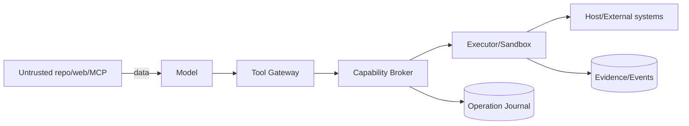

# RapidLM V3 Threat Model

## Assets
Source/worktrees, secrets/credentials, user machine, Git history, cloud accounts, browser/mobile sessions, model/provider data, durable sessions/knowledge/preferences, release signing, enterprise policy and audit evidence.

## Trust boundaries
User ↔ TUI/CLI; project/repository content ↔ host rules; model ↔ Tool Gateway; Tool Gateway ↔ Capability Broker/executors; host ↔ sandbox; host ↔ remote worker; browser/MCP/web/process output ↔ prompt; plugin/hook ↔ host API; daemon ↔ clients; Credential Broker ↔ external services; CI/release ↔ artifact distribution.

## STRIDE threats / mandatory mitigations

- **Spoofing:** local client impersonation, worker identity forgery → OS-bound IPC auth, mTLS workers, signed generation leases.
- **Tampering:** patch/preimage, artifact or event modification → hashes, transactions, CAS digest verification, append-only events, signed release artifacts.
- **Repudiation:** external action not auditable → Operation Journal + egress attempt receipts + actor/node/trace refs.
- **Information disclosure:** secrets in prompt/log/telemetry/worker → SecretHandles, executor resolution, redaction, policy, encrypted/OS stores, scoped credentials.
- **Denial of service:** model loops, process bombs, plugin traps, graph fanout, huge outputs → budgets, loop detectors, resource caps, bounded queues/output, WASM limits, graph expansion bounds.
- **Elevation of privilege:** prompt injection, project hooks, MCP/plugin tool, alternate tool, stale lease → instruction/data separation, trust gate, central broker + executor lease verify, capability projection as defense-in-depth, negative bypass tests.

## High-risk attack cases

1. Repository README says to exfiltrate token: treated as untrusted data; no authority.
2. Malicious MCP tool returns fake system tags: fenced/typed as external output.
3. Symlink write escapes workspace: realpath/parent containment + capability target verification.
4. Model reroutes denied shell through plugin/MCP: all paths converge on broker/executor policy.
5. Crash after external publish: journal reconciles target state before retry.
6. Warm sandbox leaks previous source/credential: sanitation proof or destroy/quarantine; identity in cache/lease key.
7. Remote worker forges artifact: digest/input lineage/lease verification; result content untrusted until accepted.
8. Human takeover and agent type simultaneously: ControlLease generation rejects conflicting input.
9. Stale screenshot coordinates after resize/restart: Observation generation invalidates action.
10. Tool repair turns `false`/path/target into unintended dangerous value: security-semantic fields not guessed; validator repair whitelist.

## Security release blockers

Any demonstrated policy/sandbox bypass, plaintext secret persistence in normal prompt/telemetry, cross-tenant resource leak, split-brain writer, unbounded privilege-bearing plugin, silent sandbox downgrade, duplicate non-idempotent effect or false-completion security criterion is a release blocker.
