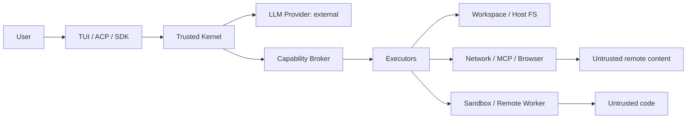

# Threat Model and Security Architecture

## 1. Security objective

RapidLM executes adversary-influenced content with powerful local capabilities. The system must assume that repository files, terminal output, web pages, browser DOM, MCP/plugin results, issue text, model output, dependencies, and even generated patches can be malicious. LLM judgment is never the security boundary.

## 2. Assets

Source code and unreleased IP; credentials/tokens/SSH keys; developer identity; local filesystem; Git history; cloud accounts; browser sessions; mobile simulator data; build/signing keys; organization policy; event/audit logs; model/provider data residency; user attention/approval.

## 3. Trust boundaries

The trusted computing base is kept small: kernel, policy normalizer/evaluator, lease validator, credential broker, workspace transaction layer, artifact integrity, updater/signature verifier. TUI rendering and model prompts are not authorization components.

## 4. Attacker models

- malicious repository or dependency author;
- prompt-injection content author on web/MCP/issues/docs;
- compromised or buggy LLM/provider;
- malicious plugin/skill/hook package;
- malicious remote worker;
- local same-user process attempting daemon/API abuse;
- supply-chain compromise of RapidLM dependencies/releases;
- accidental user approval or overly broad policy.

## 5. Threat register

| ID | Threat | Primary control | Verification |
|---|---|---|---|
| T-001 | repo/web prompt injection requests secret exfiltration | untrusted-data labels; capability broker; secret isolation; network deny | injection eval corpus |
| T-002 | command smuggling through shell strings | argv-first exec; shell is distinct high-risk capability | parser/property tests |
| T-003 | path traversal/symlink race escapes workspace | canonical path resolution; openat-style safe resolution; executor revalidation | symlink/TOCTOU tests |
| T-004 | lease approved for one command reused for another | normalized action hash + principal/scope/expiry/use count | mutation/fuzz tests |
| T-005 | DNS rebinding/SSRF reaches metadata/local services | origin/IP policy; resolution checks before connect; redirect revalidation | SSRF integration tests |
| T-006 | plugin escapes host | WASM sandbox, no ambient capabilities, signed/hashed grants | malicious plugin suite |
| T-007 | MCP server returns malicious tool description/result | server trust; result untrusted; external.call policy; bounded catalogs | adversarial MCP fixture |
| T-008 | browser page triggers credential/file disclosure | origin/file/clipboard capability classes; browser profile isolation | browser red-team eval |
| T-009 | sandbox escape | tiered isolation; seccomp/container/gVisor/remote microVM; least mounts | escape regression suite |
| T-010 | remote worker tampers with outputs | mTLS + signed work lease + content hashes + verification before merge | worker impersonation tests |
| T-011 | poisoned index retrieves stale/wrong source | content hashes; freshness; source canonicality; rebuildable indexes | corruption/rebuild tests |
| T-012 | secret stored in logs/events/traces | field-level redaction; secret types; telemetry content off by default | secret canary scan |
| T-013 | malicious terminal output injects control sequences | sanitize OSC/CSI; no raw escape rendering | terminal fuzz corpus |
| T-014 | unsafe patch silently lands | semantic preimages; isolated views; review/scanner/verification gates | patch conflict tests |
| T-015 | update binary compromised | signed manifests/artifacts, pinned CI provenance, rollback protection | release verification |
| T-016 | dependency confusion/typosquat | lockfiles, registry policy, cargo-deny/npm audit equivalents, provenance | supply-chain CI |
| T-017 | approval fatigue leads to blanket access | scoped presets, reasoned diffs, lease expiry, deny-by-default | UX eval + audit |
| T-018 | model claims goal complete without proof | runtime evidence requirements | goal harness eval |
| T-019 | session restart resumes costly autonomous work | active goal restores paused; jobs reconciled | crash/restart test |
| T-020 | subagent crosses main-agent authority | principal-scoped capabilities; top-level goal mutation rejected | agent isolation tests |

## 6. Policy layers

Effective permission is the intersection of host/org maximum policy, user policy, project trust, workspace policy, agent role, sandbox profile and one-time approval. A lower-trust layer cannot broaden authority.

Decisions are `allow`, `ask`, `deny`. “Ask” does not execute; after user approval the broker issues a concrete lease. There is no “approval=true” boolean passed directly to executors.

## 7. Secret handling

Secrets are held by OS keychain/credential providers or ephemeral environment handles. The model may refer to a secret by alias but does not receive its plaintext unless the user explicitly requests a model-visible secret operation and policy allows it. Command execution can inject a secret directly into child environment/stdin without round-tripping through model context. Secret values are registered with the redactor before any process starts.

## 8. Project trust

Before trust, RapidLM may read ordinary project files needed to describe the project but MUST NOT execute repository hooks, project MCP config, plugins, skills with executable helpers, shell startup scripts, or untrusted config that broadens behavior. Trust screen presents sources and requested capabilities.

## 9. Sandbox tiers

- `host_restricted`: fast; process + path/network policy, not a strong malicious-code boundary.
- `container`: rootless namespaces/cgroups/seccomp where available.
- `gvisor`: stronger syscall mediation for Linux workloads.
- `microvm_remote`: Firecracker-class isolated remote execution for hostile builds/secrets boundaries.

A job requiring a stronger tier never silently downgrades.

## 10. Security release gate

No release if there is an unmitigated critical/high vulnerability in the trusted core, a known lease bypass, secret canary leakage in standard traces, a sandbox downgrade bug, unsigned release artifact, or a regression below the security-eval thresholds in `evaluation-specs/security-evals.md`.

## V2 threat-model additions

### T-HANDOFF-01 — Split-brain session writers

**Attack/failure:** source and target both believe they own a handed-off session and mutate different workspace state.  
**Control:** generation-based `SessionExecutionLease`, transactional transfer, source quiescence, target cannot dispatch writes before committed generation.  
**Test:** fault injection at every handoff transition; assert maximum valid writer count = 1.

### T-HANDOFF-02 — Handoff bundle tampering/replay

**Control:** content digest, signature, expiry, source generation, target compatibility/attestation, encrypted transport, preimage verification. Capability leases and plaintext secrets excluded.

### T-AGENT-01 — Malicious/compromised child agent escalates parent

**Control:** child capability ceiling, isolated workspace, typed result/message schema, no transferable leases, top-level goal mutation rejected, evidence verification before merge.

### T-KNOW-01 — Prompt injection becomes durable organizational Knowledge

**Control:** untrusted content can only create a candidate; approval/owner/evidence required before shared Knowledge becomes active. Knowledge cannot grant capabilities.

### T-TRJ-01 — Proprietary code leaks through trajectory export

**Control:** default no-training export, data policy labels, redaction, local content-hash references, secret scanner and export gate.

### T-CU-01 — UI prompt injection triggers privileged action

**Attack:** web page/app text instructs the agent to upload code, reveal secrets or approve an OS dialog.  
**Control:** UI content is untrusted; action is normalized independently and must obtain capability. Sensitive UI classifier plus deterministic policy.  
**Test:** browser/desktop prompt-injection fixtures with canary secrets and fake permission/payment dialogs.

### T-CU-02 — Stale coordinate click hits destructive control

**Control:** coordinate TargetRef is bound to Observation ID/generation/geometry; any layout generation change invalidates it. Semantic targets re-resolve after observation.

### T-CU-03 — Secret leaks into screen recording

**Control:** SecretHandle final-boundary injection, target-region masking, metadata-only event, post-recording secret scanner.

### T-CU-04 — Agent bypasses CAPTCHA/MFA security control

**Control:** policy forbids challenge bypass. Agent requests human ControlLease; resumption re-observes state.

### T-CU-05 — GUI sandbox reaches host desktop/files

**Control:** isolated virtual desktop where required, approved file chooser roots, no ambient home/keychain/SSH-agent mounts, fail closed if required GUI isolation unavailable.
